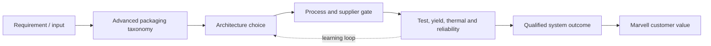
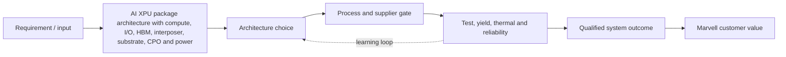
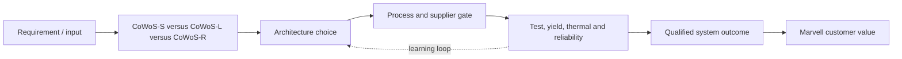
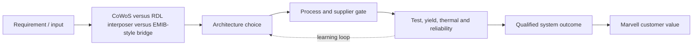
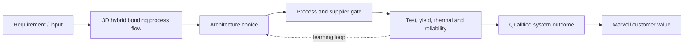
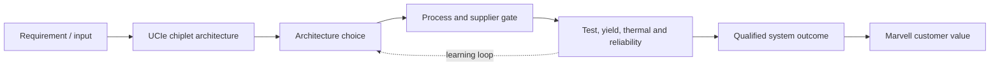
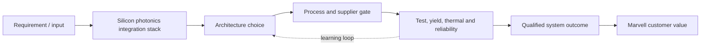
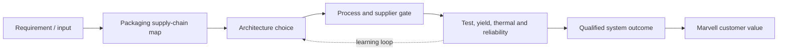

# Mermaid Visual Catalog


> **Section metadata**
> - **Section title:** Mermaid Visual Catalog
> - **Owner placeholder:** Advanced Packaging Intelligence Owner
> - **Last refreshed date:** 2026-06-10
> - **Refresh status:** Current baseline
> - **Source count:** 45
> - **Confidence level:** Medium-high; confirmed facts separated from announced and inferred roadmap items
> - **Key changes since last refresh:** Initial repository baseline
> - **Open questions:** Customer qualification timing, package-level yields, commercial terms, and capacity allocation
> - **Links to related sections:** [reports/advanced_packaging_main_report.md](../../reports/advanced_packaging_main_report.md), [data/figure_registry.yaml](../../data/figure_registry.yaml)
> - **Figures included:** FIG-MMD-001, FIG-MMD-002, FIG-MMD-003, FIG-MMD-004, FIG-MMD-005, FIG-MMD-006, FIG-MMD-007, FIG-MMD-008, FIG-MMD-009, FIG-MMD-010, FIG-MMD-011, FIG-MMD-012, FIG-MMD-013, FIG-MMD-014, FIG-MMD-015, FIG-MMD-016, FIG-MMD-017, FIG-MMD-018, FIG-MMD-019, FIG-MMD-020, FIG-MMD-021, FIG-MMD-022, FIG-MMD-023, FIG-MMD-024, FIG-MMD-025, FIG-MMD-026, FIG-MMD-027, FIG-MMD-028, FIG-MMD-029, FIG-MMD-030
> - **Tables included:** None
> - **Next suggested refresh date:** 2026-09-10


## FIG-MMD-001: Advanced packaging taxonomy



Author-created schematic. Evidence basis: [[SRC-MRVL-001]](../../data/source_database.yaml), [[SRC-TSMC-001]](../../data/source_database.yaml), and [[SRC-IEEE-001]](../../data/source_database.yaml).


## FIG-MMD-002: AI XPU package architecture with compute, I/O, HBM, interposer, substrate, CPO and power



Author-created schematic. Evidence basis: [[SRC-MRVL-001]](../../data/source_database.yaml), [[SRC-TSMC-001]](../../data/source_database.yaml), and [[SRC-IEEE-001]](../../data/source_database.yaml).


## FIG-MMD-003: CoWoS-S versus CoWoS-L versus CoWoS-R



Author-created schematic. Evidence basis: [[SRC-MRVL-001]](../../data/source_database.yaml), [[SRC-TSMC-001]](../../data/source_database.yaml), and [[SRC-IEEE-001]](../../data/source_database.yaml).


## FIG-MMD-004: CoWoS versus RDL interposer versus EMIB-style bridge



Author-created schematic. Evidence basis: [[SRC-MRVL-001]](../../data/source_database.yaml), [[SRC-TSMC-001]](../../data/source_database.yaml), and [[SRC-IEEE-001]](../../data/source_database.yaml).


## FIG-MMD-005: HBM subsystem architecture


Author-created schematic. Evidence basis: [[SRC-MRVL-001]](../../data/source_database.yaml), [[SRC-TSMC-001]](../../data/source_database.yaml), and [[SRC-IEEE-001]](../../data/source_database.yaml).


## FIG-MMD-006: Custom HBM base die concept


Author-created schematic. Evidence basis: [[SRC-MRVL-001]](../../data/source_database.yaml), [[SRC-TSMC-001]](../../data/source_database.yaml), and [[SRC-IEEE-001]](../../data/source_database.yaml).


## FIG-MMD-007: HBM thermal bottleneck map


Author-created schematic. Evidence basis: [[SRC-MRVL-001]](../../data/source_database.yaml), [[SRC-TSMC-001]](../../data/source_database.yaml), and [[SRC-IEEE-001]](../../data/source_database.yaml).


## FIG-MMD-008: 3D hybrid bonding process flow



Author-created schematic. Evidence basis: [[SRC-MRVL-001]](../../data/source_database.yaml), [[SRC-TSMC-001]](../../data/source_database.yaml), and [[SRC-IEEE-001]](../../data/source_database.yaml).


## FIG-MMD-009: UCIe chiplet architecture



Author-created schematic. Evidence basis: [[SRC-MRVL-001]](../../data/source_database.yaml), [[SRC-TSMC-001]](../../data/source_database.yaml), and [[SRC-IEEE-001]](../../data/source_database.yaml).


## FIG-MMD-010: Parallel versus serial die-to-die tradeoff


Author-created schematic. Evidence basis: [[SRC-MRVL-001]](../../data/source_database.yaml), [[SRC-TSMC-001]](../../data/source_database.yaml), and [[SRC-IEEE-001]](../../data/source_database.yaml).


## FIG-MMD-011: CPO-enabled XPU scale-up architecture


Author-created schematic. Evidence basis: [[SRC-MRVL-001]](../../data/source_database.yaml), [[SRC-TSMC-001]](../../data/source_database.yaml), and [[SRC-IEEE-001]](../../data/source_database.yaml).


## FIG-MMD-012: CPO-enabled switch ASIC architecture


Author-created schematic. Evidence basis: [[SRC-MRVL-001]](../../data/source_database.yaml), [[SRC-TSMC-001]](../../data/source_database.yaml), and [[SRC-IEEE-001]](../../data/source_database.yaml).


## FIG-MMD-013: Pluggable optics versus LPO versus CPO versus optical I/O


Author-created schematic. Evidence basis: [[SRC-MRVL-001]](../../data/source_database.yaml), [[SRC-TSMC-001]](../../data/source_database.yaml), and [[SRC-IEEE-001]](../../data/source_database.yaml).


## FIG-MMD-014: Silicon photonics integration stack



Author-created schematic. Evidence basis: [[SRC-MRVL-001]](../../data/source_database.yaml), [[SRC-TSMC-001]](../../data/source_database.yaml), and [[SRC-IEEE-001]](../../data/source_database.yaml).


## FIG-MMD-015: Package-level power delivery map


Author-created schematic. Evidence basis: [[SRC-MRVL-001]](../../data/source_database.yaml), [[SRC-TSMC-001]](../../data/source_database.yaml), and [[SRC-IEEE-001]](../../data/source_database.yaml).


## FIG-MMD-016: Advanced substrate roadmap


Author-created schematic. Evidence basis: [[SRC-MRVL-001]](../../data/source_database.yaml), [[SRC-TSMC-001]](../../data/source_database.yaml), and [[SRC-IEEE-001]](../../data/source_database.yaml).


## FIG-MMD-017: Glass substrate adoption decision tree


Author-created schematic. Evidence basis: [[SRC-MRVL-001]](../../data/source_database.yaml), [[SRC-TSMC-001]](../../data/source_database.yaml), and [[SRC-IEEE-001]](../../data/source_database.yaml).


## FIG-MMD-018: Packaging supply-chain map



Author-created schematic. Evidence basis: [[SRC-MRVL-001]](../../data/source_database.yaml), [[SRC-TSMC-001]](../../data/source_database.yaml), and [[SRC-IEEE-001]](../../data/source_database.yaml).


## FIG-MMD-019: OSAT versus foundry-led packaging ecosystem


Author-created schematic. Evidence basis: [[SRC-MRVL-001]](../../data/source_database.yaml), [[SRC-TSMC-001]](../../data/source_database.yaml), and [[SRC-IEEE-001]](../../data/source_database.yaml).


## FIG-MMD-020: Known-good-die and test flow


Author-created schematic. Evidence basis: [[SRC-MRVL-001]](../../data/source_database.yaml), [[SRC-TSMC-001]](../../data/source_database.yaml), and [[SRC-IEEE-001]](../../data/source_database.yaml).


## FIG-MMD-021: Yield compounding in multi-die packages

```mermaid
flowchart LR
    A["Requirement / input"] --> B["Yield compounding in multi-die packages"]
    B --> C["Architecture choice"]
    C --> D["Process and supplier gate"]
    D --> E["Test, yield, thermal and reliability"]
    E --> F["Qualified system outcome"]
    F --> G["Marvell customer value"]
    E -. learning loop .-> C
```

Author-created schematic. Evidence basis: [[SRC-MRVL-001]](../../data/source_database.yaml), [[SRC-TSMC-001]](../../data/source_database.yaml), and [[SRC-IEEE-001]](../../data/source_database.yaml).


## FIG-MMD-022: Hyperscaler XPU packaging requirement matrix

```mermaid
flowchart LR
    A["Requirement / input"] --> B["Hyperscaler XPU packaging requirement matrix"]
    B --> C["Architecture choice"]
    C --> D["Process and supplier gate"]
    D --> E["Test, yield, thermal and reliability"]
    E --> F["Qualified system outcome"]
    F --> G["Marvell customer value"]
    E -. learning loop .-> C
```

Author-created schematic. Evidence basis: [[SRC-MRVL-001]](../../data/source_database.yaml), [[SRC-TSMC-001]](../../data/source_database.yaml), and [[SRC-IEEE-001]](../../data/source_database.yaml).


## FIG-MMD-023: Marvell custom XPU packaging strategy map

```mermaid
flowchart LR
    A["Requirement / input"] --> B["Marvell custom XPU packaging strategy map"]
    B --> C["Architecture choice"]
    C --> D["Process and supplier gate"]
    D --> E["Test, yield, thermal and reliability"]
    E --> F["Qualified system outcome"]
    F --> G["Marvell customer value"]
    E -. learning loop .-> C
```

Author-created schematic. Evidence basis: [[SRC-MRVL-001]](../../data/source_database.yaml), [[SRC-TSMC-001]](../../data/source_database.yaml), and [[SRC-IEEE-001]](../../data/source_database.yaml).


## FIG-MMD-024: Marvell versus Broadcom competitive positioning

```mermaid
flowchart LR
    A["Requirement / input"] --> B["Marvell versus Broadcom competitive positioning"]
    B --> C["Architecture choice"]
    C --> D["Process and supplier gate"]
    D --> E["Test, yield, thermal and reliability"]
    E --> F["Qualified system outcome"]
    F --> G["Marvell customer value"]
    E -. learning loop .-> C
```

Author-created schematic. Evidence basis: [[SRC-MRVL-001]](../../data/source_database.yaml), [[SRC-TSMC-001]](../../data/source_database.yaml), and [[SRC-IEEE-001]](../../data/source_database.yaml).


## FIG-MMD-025: Marvell strategic option map: build versus partner versus acquire

```mermaid
flowchart LR
    A["Requirement / input"] --> B["Marvell strategic option map: build versus partner versus acquire"]
    B --> C["Architecture choice"]
    C --> D["Process and supplier gate"]
    D --> E["Test, yield, thermal and reliability"]
    E --> F["Qualified system outcome"]
    F --> G["Marvell customer value"]
    E -. learning loop .-> C
```

Author-created schematic. Evidence basis: [[SRC-MRVL-001]](../../data/source_database.yaml), [[SRC-TSMC-001]](../../data/source_database.yaml), and [[SRC-IEEE-001]](../../data/source_database.yaml).


## FIG-MMD-026: Corporate development watchlist map

```mermaid
flowchart LR
    A["Requirement / input"] --> B["Corporate development watchlist map"]
    B --> C["Architecture choice"]
    C --> D["Process and supplier gate"]
    D --> E["Test, yield, thermal and reliability"]
    E --> F["Qualified system outcome"]
    F --> G["Marvell customer value"]
    E -. learning loop .-> C
```

Author-created schematic. Evidence basis: [[SRC-MRVL-001]](../../data/source_database.yaml), [[SRC-TSMC-001]](../../data/source_database.yaml), and [[SRC-IEEE-001]](../../data/source_database.yaml).


## FIG-MMD-027: Full database refresh workflow

```mermaid
flowchart LR
    A["Requirement / input"] --> B["Full database refresh workflow"]
    B --> C["Architecture choice"]
    C --> D["Process and supplier gate"]
    D --> E["Test, yield, thermal and reliability"]
    E --> F["Qualified system outcome"]
    F --> G["Marvell customer value"]
    E -. learning loop .-> C
```

Author-created schematic. Evidence basis: [[SRC-MRVL-001]](../../data/source_database.yaml), [[SRC-TSMC-001]](../../data/source_database.yaml), and [[SRC-IEEE-001]](../../data/source_database.yaml).


## FIG-MMD-028: Section-specific refresh workflow

```mermaid
flowchart LR
    A["Requirement / input"] --> B["Section-specific refresh workflow"]
    B --> C["Architecture choice"]
    C --> D["Process and supplier gate"]
    D --> E["Test, yield, thermal and reliability"]
    E --> F["Qualified system outcome"]
    F --> G["Marvell customer value"]
    E -. learning loop .-> C
```

Author-created schematic. Evidence basis: [[SRC-MRVL-001]](../../data/source_database.yaml), [[SRC-TSMC-001]](../../data/source_database.yaml), and [[SRC-IEEE-001]](../../data/source_database.yaml).


## FIG-MMD-029: HBM4 qualification gates

```mermaid
flowchart LR
    A["Requirement / input"] --> B["HBM4 qualification gates"]
    B --> C["Architecture choice"]
    C --> D["Process and supplier gate"]
    D --> E["Test, yield, thermal and reliability"]
    E --> F["Qualified system outcome"]
    F --> G["Marvell customer value"]
    E -. learning loop .-> C
```

Author-created schematic. Evidence basis: [[SRC-MRVL-001]](../../data/source_database.yaml), [[SRC-TSMC-001]](../../data/source_database.yaml), and [[SRC-IEEE-001]](../../data/source_database.yaml).


## FIG-MMD-030: Optical I/O serviceability architecture

```mermaid
flowchart LR
    A["Requirement / input"] --> B["Optical I/O serviceability architecture"]
    B --> C["Architecture choice"]
    C --> D["Process and supplier gate"]
    D --> E["Test, yield, thermal and reliability"]
    E --> F["Qualified system outcome"]
    F --> G["Marvell customer value"]
    E -. learning loop .-> C
```

Author-created schematic. Evidence basis: [[SRC-MRVL-001]](../../data/source_database.yaml), [[SRC-TSMC-001]](../../data/source_database.yaml), and [[SRC-IEEE-001]](../../data/source_database.yaml).
