# Advanced Semiconductor Packaging for AI Infrastructure: 2024-2030

> **Section metadata**
> - **Section title:** Advanced Semiconductor Packaging for AI Infrastructure: 2024-2030
> - **Owner placeholder:** Advanced Packaging Intelligence Owner
> - **Last refreshed date:** 2026-06-10
> - **Refresh status:** Current baseline
> - **Source count:** 45
> - **Confidence level:** Medium-high; confirmed facts separated from announced and inferred roadmap items
> - **Key changes since last refresh:** Initial repository baseline
> - **Open questions:** Customer qualification timing, package-level yields, commercial terms, and capacity allocation
> - **Links to related sections:** [reports/executive_summary_for_marvell_leadership.md](../reports/executive_summary_for_marvell_leadership.md), [reports/marvell_xpu_implications.md](../reports/marvell_xpu_implications.md), [reports/corp_dev_and_partnership_watchlist.md](../reports/corp_dev_and_partnership_watchlist.md), [assets/diagrams/mermaid_catalog.md](../assets/diagrams/mermaid_catalog.md)
> - **Figures included:** FIG-MMD-001, FIG-SVG-001
> - **Tables included:** TBL-MAIN-001A
> - **Next suggested refresh date:** 2026-09-10

This report answers one question: **How will advanced packaging evolve from 2024 to 2030, and what does that mean for Marvell's ability to win hyperscaler custom XPU programs?** It distinguishes confirmed facts, vendor announcements, expected developments and speculative scenarios. Numerical claims should be read with the benchmark conditions and source caveats in the databases.

## 1. Executive summary

> **Section metadata**
> - **Section title:** Executive summary
> - **Owner placeholder:** Advanced Packaging Intelligence Owner
> - **Last refreshed date:** 2026-06-10
> - **Refresh status:** Current baseline
> - **Source count:** 4
> - **Confidence level:** Medium-high; confirmed facts separated from announced and inferred roadmap items
> - **Key changes since last refresh:** Initial repository baseline
> - **Open questions:** Customer qualification timing, package-level yields, commercial terms, and capacity allocation
> - **Links to related sections:** [reports/marvell_xpu_implications.md](../reports/marvell_xpu_implications.md), [data/technology_taxonomy.yaml](../data/technology_taxonomy.yaml), [data/source_database.yaml](../data/source_database.yaml)
> - **Figures included:** FIG-MMD-001
> - **Tables included:** TBL-MAIN-001A, TBL-MAIN-001B
> - **Next suggested refresh date:** 2026-09-10

Advanced packaging has become a primary scaling vector for AI infrastructure because memory bandwidth, package-level connectivity, power delivery and cooling now constrain useful compute before transistor density alone does. This section treats public vendor statements as evidence of direction, not as proof of customer-qualified volume. [[SRC-MRVL-001]](../data/source_database.yaml) [[SRC-TSMC-001]](../data/source_database.yaml) [[SRC-JEDEC-001]](../data/source_database.yaml) [[SRC-NVIDIA-002]](../data/source_database.yaml)

### Architecture

The architecture should be evaluated as a system partitioning decision, not as a package label. The decisive boundary is where bandwidth-intensive functions sit relative to compute, memory, I/O and power delivery. A package that minimizes one link may worsen another, so floorplanning must jointly optimize HBM escape routing, die-to-die reach, optical or electrical I/O placement, decoupling and coolant access. For **Executive summary**, the practical focal point is package-enabled differentiation. This is a decision variable because it changes the package contract among the XPU architecture, HBM subsystem, connectivity fabric and manufacturing flow. [[SRC-MRVL-001]](../data/source_database.yaml) [[SRC-TSMC-001]](../data/source_database.yaml) [[SRC-JEDEC-001]](../data/source_database.yaml) [[SRC-NVIDIA-002]](../data/source_database.yaml)

### Manufacturing flow

The manufacturing sequence determines accumulated yield and cycle time. Wafer sort, thinning, TSV reveal, redistribution, bump or hybrid-bond preparation, die placement, underfill or molding, substrate attach, lid attach and final test each create distinct defect opportunities. The commercially relevant metric is good systems per start and delivery predictability, not the yield of an isolated process module. For **Executive summary**, the practical focal point is HBM and interposer capacity. This is a decision variable because it changes the package contract among the XPU architecture, HBM subsystem, connectivity fabric and manufacturing flow. [[SRC-MRVL-001]](../data/source_database.yaml) [[SRC-TSMC-001]](../data/source_database.yaml) [[SRC-JEDEC-001]](../data/source_database.yaml) [[SRC-NVIDIA-002]](../data/source_database.yaml)

### Materials and process dependencies

Key dependencies include low-loss dielectrics, copper line and via control, ABF or alternative substrate capacity, temporary bonding materials, underfill, molding compound, thermal interface material and metrology. Material choices couple electrical loss, coefficient-of-thermal-expansion mismatch, moisture sensitivity and warpage; substituting a material therefore requires package requalification rather than a procurement-only change. For **Executive summary**, the practical focal point is thermal design power. This is a decision variable because it changes the package contract among the XPU architecture, HBM subsystem, connectivity fabric and manufacturing flow. [[SRC-MRVL-001]](../data/source_database.yaml) [[SRC-TSMC-001]](../data/source_database.yaml) [[SRC-JEDEC-001]](../data/source_database.yaml) [[SRC-NVIDIA-002]](../data/source_database.yaml)

### Metrics and benchmark discipline

Bandwidth density, energy per bit, latency and pitch are useful only when test conditions are explicit. A short-reach die-to-die demonstration cannot be compared directly with a rack-reach SerDes link, and a bonding-pitch claim does not reveal routable bandwidth after power, keep-out and redundancy are included. The database therefore records ranges and caveats instead of false point precision. For **Executive summary**, the practical focal point is optical scale-up. This is a decision variable because it changes the package contract among the XPU architecture, HBM subsystem, connectivity fabric and manufacturing flow. [[SRC-MRVL-001]](../data/source_database.yaml) [[SRC-TSMC-001]](../data/source_database.yaml) [[SRC-JEDEC-001]](../data/source_database.yaml) [[SRC-NVIDIA-002]](../data/source_database.yaml)

### Economics and yield

Cost is dominated by more than assembly price. Expensive known-good logic and HBM make scrap exposure material; larger interposers and substrates reduce units per panel or wafer; additional test insertions raise cost but can prevent higher downstream loss. The correct model values expected good-package cost, schedule risk and customer revenue exposure from missed ramps. For **Executive summary**, the practical focal point is known-good-die economics. This is a decision variable because it changes the package contract among the XPU architecture, HBM subsystem, connectivity fabric and manufacturing flow. [[SRC-MRVL-001]](../data/source_database.yaml) [[SRC-TSMC-001]](../data/source_database.yaml) [[SRC-JEDEC-001]](../data/source_database.yaml) [[SRC-NVIDIA-002]](../data/source_database.yaml)

### Thermal and power

Thermal design is becoming an architecture constraint. HBM, logic, optical engines and voltage conversion compete for package edge, vertical heat paths and coolant temperature budget. Hot spots, lateral gradients and thermo-mechanical cycling can reduce attainable frequency or lifetime even when average package power remains within a cold-plate rating. For **Executive summary**, the practical focal point is package-enabled differentiation. This is a decision variable because it changes the package contract among the XPU architecture, HBM subsystem, connectivity fabric and manufacturing flow. [[SRC-MRVL-001]](../data/source_database.yaml) [[SRC-TSMC-001]](../data/source_database.yaml) [[SRC-JEDEC-001]](../data/source_database.yaml) [[SRC-NVIDIA-002]](../data/source_database.yaml)

### Supply chain and adoption

Adoption requires simultaneous readiness across foundry packaging, memory, substrate, OSAT or test, EDA signoff, system cooling and customer qualification. A nominally mature process may still be unavailable at the required body size, HBM count or regional supply path. Supplier concentration should therefore be tracked by qualified configuration, not vendor logo count. For **Executive summary**, the practical focal point is HBM and interposer capacity. This is a decision variable because it changes the package contract among the XPU architecture, HBM subsystem, connectivity fabric and manufacturing flow. [[SRC-MRVL-001]](../data/source_database.yaml) [[SRC-TSMC-001]](../data/source_database.yaml) [[SRC-JEDEC-001]](../data/source_database.yaml) [[SRC-NVIDIA-002]](../data/source_database.yaml)

### Competitive implications

Control of design rules, characterization data and capacity reservations can create a competitive moat. NVIDIA and Broadcom can optimize around large internal volumes, while merchant custom-silicon providers must convert ecosystem breadth and reusable IP into comparable schedule certainty. Open standards reduce switching friction only after interoperable silicon, test and software are proven. For **Executive summary**, the practical focal point is thermal design power. This is a decision variable because it changes the package contract among the XPU architecture, HBM subsystem, connectivity fabric and manufacturing flow. [[SRC-MRVL-001]](../data/source_database.yaml) [[SRC-TSMC-001]](../data/source_database.yaml) [[SRC-JEDEC-001]](../data/source_database.yaml) [[SRC-NVIDIA-002]](../data/source_database.yaml)

### Marvell implication

Marvell should package this capability as part of an end-to-end XPU platform: architecture exploration, reusable die-to-die and HBM IP, package and board co-design, manufacturing ownership, test strategy and lifecycle telemetry. The differentiation is not ownership of every factory step; it is the ability to give a hyperscaler a credible performance, cost, yield and supply plan before design freeze. For **Executive summary**, the practical focal point is optical scale-up. This is a decision variable because it changes the package contract among the XPU architecture, HBM subsystem, connectivity fabric and manufacturing flow. [[SRC-MRVL-001]](../data/source_database.yaml) [[SRC-TSMC-001]](../data/source_database.yaml) [[SRC-JEDEC-001]](../data/source_database.yaml) [[SRC-NVIDIA-002]](../data/source_database.yaml)

### Corporate development implication

Partnership or investment should target capability gaps that are difficult to reproduce through ordinary sourcing: optical attach, thermal materials and structures, chiplet test, multi-physics automation, advanced substrate process know-how and interoperable die-to-die IP. Acquisitions deserve consideration only where control materially improves XPU win probability or protects a strategic interface. For **Executive summary**, the practical focal point is known-good-die economics. This is a decision variable because it changes the package contract among the XPU architecture, HBM subsystem, connectivity fabric and manufacturing flow. [[SRC-MRVL-001]](../data/source_database.yaml) [[SRC-TSMC-001]](../data/source_database.yaml) [[SRC-JEDEC-001]](../data/source_database.yaml) [[SRC-NVIDIA-002]](../data/source_database.yaml)

### Roadmap through 2030

The likely trajectory is larger and more heterogeneous packages, finer vertical connections, more customized memory base dies, greater use of local bridges or RDL to manage cost, and optics moving closer to high-radix switch and selected compute packages. The pace will be gated by yield learning, serviceability and power removal rather than by interconnect demonstrations alone. For **Executive summary**, the practical focal point is package-enabled differentiation. This is a decision variable because it changes the package contract among the XPU architecture, HBM subsystem, connectivity fabric and manufacturing flow. [[SRC-MRVL-001]](../data/source_database.yaml) [[SRC-TSMC-001]](../data/source_database.yaml) [[SRC-JEDEC-001]](../data/source_database.yaml) [[SRC-NVIDIA-002]](../data/source_database.yaml)

### Diligence priorities

Leadership should request configuration-specific evidence: qualified dimensions, HBM stack count, power map, thermal resistance, warpage, known-good-die coverage, repair flow, monthly capacity, cycle time, second-source path and cost sensitivity. Claims without these fields should remain announced or expected in the roadmap rather than promoted to confirmed. For **Executive summary**, the practical focal point is HBM and interposer capacity. This is a decision variable because it changes the package contract among the XPU architecture, HBM subsystem, connectivity fabric and manufacturing flow. [[SRC-MRVL-001]](../data/source_database.yaml) [[SRC-TSMC-001]](../data/source_database.yaml) [[SRC-JEDEC-001]](../data/source_database.yaml) [[SRC-NVIDIA-002]](../data/source_database.yaml)

**Figure FIG-MMD-001.** Decision flow for Executive summary. Author-created schematic based on cited sources.

**Comparison table - TBL-MAIN-001A**

| Dimension | Near-term decision | 2027-2030 direction | Marvell action |
|---|---|---|---|
| Architecture | Prove a qualified baseline | Increase modularity and package scale | Maintain reusable floorplans and chiplet interfaces |
| Manufacturing | Secure capacity and test coverage | Add process alternatives where credible | Negotiate configuration-specific capacity and learning access |
| Performance | Close HBM, D2D and I/O budgets | Shift bottlenecks toward power and cooling | Co-optimize package, SerDes, memory and optical IP |
| Economics | Model expected good-package cost | Reduce concentration and scrap exposure | Offer hyperscalers transparent cost/yield trade spaces |
| Roadmap status | Confirmed plus announced | Expected scenarios with triggers | Refresh quarterly and at customer architecture changes |

**Marvell implication matrix - TBL-MAIN-001B**

| Question | Leadership interpretation | Trigger to act |
|---|---|---|
| Does it improve XPU PPA? | Count package-enabled system benefit, not isolated die metrics | Material bandwidth, latency or power advantage |
| Does it improve schedule? | Reuse and qualification depth can outweigh theoretical density | Customer design freeze or foundry rule release |
| Does it reduce supply risk? | A second logo is not a second qualified configuration | Demonstrated equivalent package and test flow |
| Is ownership strategic? | Own differentiating interfaces and data; partner for scale manufacturing | Repeated dependency that affects win rate |

> **Marvell implication:** Treat Executive summary as a customer-facing architecture capability with quantified PPA, yield, cost and supply options. Do not position it as a backend feature or rely on unqualified roadmap claims.

### Section close

- **Why it matters:** It can change attainable bandwidth, power, package size, schedule and hyperscaler TCO.
- **Current maturity:** Mixed by configuration; see profile and roadmap databases.
- **Key bottlenecks:** package-enabled differentiation, HBM and interposer capacity, thermal design power.
- **Leading vendors:** See [vendor database](../data/vendor_roadmaps.yaml).
- **Roadmap:** See [2024-2030 roadmap](../data/vendor_roadmaps.yaml).
- **Marvell implication:** Integrate the capability into custom XPU architecture and commercial planning.
- **Corporate development implication:** Target control points where access, IP or scarce process knowledge changes win probability.
- **Open questions:** Qualification timing, capacity allocation, yield at target body size, and customer-specific reliability.
- **Figures and tables included:** FIG-MMD-001; TBL-MAIN-001A; TBL-MAIN-001B.
- **Next refresh recommendation:** 2026-09-10, or earlier on a material vendor or customer roadmap disclosure.

## 2. Why advanced packaging matters for AI infrastructure

> **Section metadata**
> - **Section title:** Why advanced packaging matters for AI infrastructure
> - **Owner placeholder:** Advanced Packaging Intelligence Owner
> - **Last refreshed date:** 2026-06-10
> - **Refresh status:** Current baseline
> - **Source count:** 3
> - **Confidence level:** Medium-high; confirmed facts separated from announced and inferred roadmap items
> - **Key changes since last refresh:** Initial repository baseline
> - **Open questions:** Customer qualification timing, package-level yields, commercial terms, and capacity allocation
> - **Links to related sections:** [reports/marvell_xpu_implications.md](../reports/marvell_xpu_implications.md), [data/technology_taxonomy.yaml](../data/technology_taxonomy.yaml), [data/source_database.yaml](../data/source_database.yaml)
> - **Figures included:** FIG-MMD-002
> - **Tables included:** TBL-MAIN-002A, TBL-MAIN-002B
> - **Next suggested refresh date:** 2026-09-10

AI accelerators combine unusually large logic, multiple HBM stacks and very high-radix connectivity, turning the package into an active system architecture boundary. This section treats public vendor statements as evidence of direction, not as proof of customer-qualified volume. [[SRC-NVIDIA-001]](../data/source_database.yaml) [[SRC-AMD-001]](../data/source_database.yaml) [[SRC-MRVL-001]](../data/source_database.yaml)

### Architecture

The architecture should be evaluated as a system partitioning decision, not as a package label. The decisive boundary is where bandwidth-intensive functions sit relative to compute, memory, I/O and power delivery. A package that minimizes one link may worsen another, so floorplanning must jointly optimize HBM escape routing, die-to-die reach, optical or electrical I/O placement, decoupling and coolant access. For **Why advanced packaging matters for AI infrastructure**, the practical focal point is memory bandwidth per watt. This is a decision variable because it changes the package contract among the XPU architecture, HBM subsystem, connectivity fabric and manufacturing flow. [[SRC-NVIDIA-001]](../data/source_database.yaml) [[SRC-AMD-001]](../data/source_database.yaml) [[SRC-MRVL-001]](../data/source_database.yaml)

### Manufacturing flow

The manufacturing sequence determines accumulated yield and cycle time. Wafer sort, thinning, TSV reveal, redistribution, bump or hybrid-bond preparation, die placement, underfill or molding, substrate attach, lid attach and final test each create distinct defect opportunities. The commercially relevant metric is good systems per start and delivery predictability, not the yield of an isolated process module. For **Why advanced packaging matters for AI infrastructure**, the practical focal point is package edge bandwidth. This is a decision variable because it changes the package contract among the XPU architecture, HBM subsystem, connectivity fabric and manufacturing flow. [[SRC-NVIDIA-001]](../data/source_database.yaml) [[SRC-AMD-001]](../data/source_database.yaml) [[SRC-MRVL-001]](../data/source_database.yaml)

### Materials and process dependencies

Key dependencies include low-loss dielectrics, copper line and via control, ABF or alternative substrate capacity, temporary bonding materials, underfill, molding compound, thermal interface material and metrology. Material choices couple electrical loss, coefficient-of-thermal-expansion mismatch, moisture sensitivity and warpage; substituting a material therefore requires package requalification rather than a procurement-only change. For **Why advanced packaging matters for AI infrastructure**, the practical focal point is rack density. This is a decision variable because it changes the package contract among the XPU architecture, HBM subsystem, connectivity fabric and manufacturing flow. [[SRC-NVIDIA-001]](../data/source_database.yaml) [[SRC-AMD-001]](../data/source_database.yaml) [[SRC-MRVL-001]](../data/source_database.yaml)

### Metrics and benchmark discipline

Bandwidth density, energy per bit, latency and pitch are useful only when test conditions are explicit. A short-reach die-to-die demonstration cannot be compared directly with a rack-reach SerDes link, and a bonding-pitch claim does not reveal routable bandwidth after power, keep-out and redundancy are included. The database therefore records ranges and caveats instead of false point precision. For **Why advanced packaging matters for AI infrastructure**, the practical focal point is yielded system cost. This is a decision variable because it changes the package contract among the XPU architecture, HBM subsystem, connectivity fabric and manufacturing flow. [[SRC-NVIDIA-001]](../data/source_database.yaml) [[SRC-AMD-001]](../data/source_database.yaml) [[SRC-MRVL-001]](../data/source_database.yaml)

### Economics and yield

Cost is dominated by more than assembly price. Expensive known-good logic and HBM make scrap exposure material; larger interposers and substrates reduce units per panel or wafer; additional test insertions raise cost but can prevent higher downstream loss. The correct model values expected good-package cost, schedule risk and customer revenue exposure from missed ramps. For **Why advanced packaging matters for AI infrastructure**, the practical focal point is supply assurance. This is a decision variable because it changes the package contract among the XPU architecture, HBM subsystem, connectivity fabric and manufacturing flow. [[SRC-NVIDIA-001]](../data/source_database.yaml) [[SRC-AMD-001]](../data/source_database.yaml) [[SRC-MRVL-001]](../data/source_database.yaml)

### Thermal and power

Thermal design is becoming an architecture constraint. HBM, logic, optical engines and voltage conversion compete for package edge, vertical heat paths and coolant temperature budget. Hot spots, lateral gradients and thermo-mechanical cycling can reduce attainable frequency or lifetime even when average package power remains within a cold-plate rating. For **Why advanced packaging matters for AI infrastructure**, the practical focal point is memory bandwidth per watt. This is a decision variable because it changes the package contract among the XPU architecture, HBM subsystem, connectivity fabric and manufacturing flow. [[SRC-NVIDIA-001]](../data/source_database.yaml) [[SRC-AMD-001]](../data/source_database.yaml) [[SRC-MRVL-001]](../data/source_database.yaml)

### Supply chain and adoption

Adoption requires simultaneous readiness across foundry packaging, memory, substrate, OSAT or test, EDA signoff, system cooling and customer qualification. A nominally mature process may still be unavailable at the required body size, HBM count or regional supply path. Supplier concentration should therefore be tracked by qualified configuration, not vendor logo count. For **Why advanced packaging matters for AI infrastructure**, the practical focal point is package edge bandwidth. This is a decision variable because it changes the package contract among the XPU architecture, HBM subsystem, connectivity fabric and manufacturing flow. [[SRC-NVIDIA-001]](../data/source_database.yaml) [[SRC-AMD-001]](../data/source_database.yaml) [[SRC-MRVL-001]](../data/source_database.yaml)

### Competitive implications

Control of design rules, characterization data and capacity reservations can create a competitive moat. NVIDIA and Broadcom can optimize around large internal volumes, while merchant custom-silicon providers must convert ecosystem breadth and reusable IP into comparable schedule certainty. Open standards reduce switching friction only after interoperable silicon, test and software are proven. For **Why advanced packaging matters for AI infrastructure**, the practical focal point is rack density. This is a decision variable because it changes the package contract among the XPU architecture, HBM subsystem, connectivity fabric and manufacturing flow. [[SRC-NVIDIA-001]](../data/source_database.yaml) [[SRC-AMD-001]](../data/source_database.yaml) [[SRC-MRVL-001]](../data/source_database.yaml)

### Marvell implication

Marvell should package this capability as part of an end-to-end XPU platform: architecture exploration, reusable die-to-die and HBM IP, package and board co-design, manufacturing ownership, test strategy and lifecycle telemetry. The differentiation is not ownership of every factory step; it is the ability to give a hyperscaler a credible performance, cost, yield and supply plan before design freeze. For **Why advanced packaging matters for AI infrastructure**, the practical focal point is yielded system cost. This is a decision variable because it changes the package contract among the XPU architecture, HBM subsystem, connectivity fabric and manufacturing flow. [[SRC-NVIDIA-001]](../data/source_database.yaml) [[SRC-AMD-001]](../data/source_database.yaml) [[SRC-MRVL-001]](../data/source_database.yaml)

### Corporate development implication

Partnership or investment should target capability gaps that are difficult to reproduce through ordinary sourcing: optical attach, thermal materials and structures, chiplet test, multi-physics automation, advanced substrate process know-how and interoperable die-to-die IP. Acquisitions deserve consideration only where control materially improves XPU win probability or protects a strategic interface. For **Why advanced packaging matters for AI infrastructure**, the practical focal point is supply assurance. This is a decision variable because it changes the package contract among the XPU architecture, HBM subsystem, connectivity fabric and manufacturing flow. [[SRC-NVIDIA-001]](../data/source_database.yaml) [[SRC-AMD-001]](../data/source_database.yaml) [[SRC-MRVL-001]](../data/source_database.yaml)

### Roadmap through 2030

The likely trajectory is larger and more heterogeneous packages, finer vertical connections, more customized memory base dies, greater use of local bridges or RDL to manage cost, and optics moving closer to high-radix switch and selected compute packages. The pace will be gated by yield learning, serviceability and power removal rather than by interconnect demonstrations alone. For **Why advanced packaging matters for AI infrastructure**, the practical focal point is memory bandwidth per watt. This is a decision variable because it changes the package contract among the XPU architecture, HBM subsystem, connectivity fabric and manufacturing flow. [[SRC-NVIDIA-001]](../data/source_database.yaml) [[SRC-AMD-001]](../data/source_database.yaml) [[SRC-MRVL-001]](../data/source_database.yaml)

### Diligence priorities

Leadership should request configuration-specific evidence: qualified dimensions, HBM stack count, power map, thermal resistance, warpage, known-good-die coverage, repair flow, monthly capacity, cycle time, second-source path and cost sensitivity. Claims without these fields should remain announced or expected in the roadmap rather than promoted to confirmed. For **Why advanced packaging matters for AI infrastructure**, the practical focal point is package edge bandwidth. This is a decision variable because it changes the package contract among the XPU architecture, HBM subsystem, connectivity fabric and manufacturing flow. [[SRC-NVIDIA-001]](../data/source_database.yaml) [[SRC-AMD-001]](../data/source_database.yaml) [[SRC-MRVL-001]](../data/source_database.yaml)

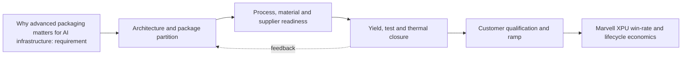

**Figure FIG-MMD-002.** Decision flow for Why advanced packaging matters for AI infrastructure. Author-created schematic based on cited sources.

**Comparison table - TBL-MAIN-002A**

| Dimension | Near-term decision | 2027-2030 direction | Marvell action |
|---|---|---|---|
| Architecture | Prove a qualified baseline | Increase modularity and package scale | Maintain reusable floorplans and chiplet interfaces |
| Manufacturing | Secure capacity and test coverage | Add process alternatives where credible | Negotiate configuration-specific capacity and learning access |
| Performance | Close HBM, D2D and I/O budgets | Shift bottlenecks toward power and cooling | Co-optimize package, SerDes, memory and optical IP |
| Economics | Model expected good-package cost | Reduce concentration and scrap exposure | Offer hyperscalers transparent cost/yield trade spaces |
| Roadmap status | Confirmed plus announced | Expected scenarios with triggers | Refresh quarterly and at customer architecture changes |

**Marvell implication matrix - TBL-MAIN-002B**

| Question | Leadership interpretation | Trigger to act |
|---|---|---|
| Does it improve XPU PPA? | Count package-enabled system benefit, not isolated die metrics | Material bandwidth, latency or power advantage |
| Does it improve schedule? | Reuse and qualification depth can outweigh theoretical density | Customer design freeze or foundry rule release |
| Does it reduce supply risk? | A second logo is not a second qualified configuration | Demonstrated equivalent package and test flow |
| Is ownership strategic? | Own differentiating interfaces and data; partner for scale manufacturing | Repeated dependency that affects win rate |

> **Marvell implication:** Treat Why advanced packaging matters for AI infrastructure as a customer-facing architecture capability with quantified PPA, yield, cost and supply options. Do not position it as a backend feature or rely on unqualified roadmap claims.

### Section close

- **Why it matters:** It can change attainable bandwidth, power, package size, schedule and hyperscaler TCO.
- **Current maturity:** Mixed by configuration; see profile and roadmap databases.
- **Key bottlenecks:** memory bandwidth per watt, package edge bandwidth, rack density.
- **Leading vendors:** See [vendor database](../data/vendor_roadmaps.yaml).
- **Roadmap:** See [2024-2030 roadmap](../data/vendor_roadmaps.yaml).
- **Marvell implication:** Integrate the capability into custom XPU architecture and commercial planning.
- **Corporate development implication:** Target control points where access, IP or scarce process knowledge changes win probability.
- **Open questions:** Qualification timing, capacity allocation, yield at target body size, and customer-specific reliability.
- **Figures and tables included:** FIG-MMD-002; TBL-MAIN-002A; TBL-MAIN-002B.
- **Next refresh recommendation:** 2026-09-10, or earlier on a material vendor or customer roadmap disclosure.

## 3. Packaging as the new scaling vector after Moore's Law slows

> **Section metadata**
> - **Section title:** Packaging as the new scaling vector after Moore's Law slows
> - **Owner placeholder:** Advanced Packaging Intelligence Owner
> - **Last refreshed date:** 2026-06-10
> - **Refresh status:** Current baseline
> - **Source count:** 3
> - **Confidence level:** Medium-high; confirmed facts separated from announced and inferred roadmap items
> - **Key changes since last refresh:** Initial repository baseline
> - **Open questions:** Customer qualification timing, package-level yields, commercial terms, and capacity allocation
> - **Links to related sections:** [reports/marvell_xpu_implications.md](../reports/marvell_xpu_implications.md), [data/technology_taxonomy.yaml](../data/technology_taxonomy.yaml), [data/source_database.yaml](../data/source_database.yaml)
> - **Figures included:** FIG-MMD-003
> - **Tables included:** TBL-MAIN-003A, TBL-MAIN-003B
> - **Next suggested refresh date:** 2026-09-10

Heterogeneous integration permits each function to use an appropriate process while package interconnect replaces some monolithic on-die wiring. This section treats public vendor statements as evidence of direction, not as proof of customer-qualified volume. [[SRC-IEEE-001]](../data/source_database.yaml) [[SRC-UCIE-001]](../data/source_database.yaml) [[SRC-TSMC-001]](../data/source_database.yaml)

### Architecture

The architecture should be evaluated as a system partitioning decision, not as a package label. The decisive boundary is where bandwidth-intensive functions sit relative to compute, memory, I/O and power delivery. A package that minimizes one link may worsen another, so floorplanning must jointly optimize HBM escape routing, die-to-die reach, optical or electrical I/O placement, decoupling and coolant access. For **Packaging as the new scaling vector after Moore's Law slows**, the practical focal point is chiplet partition. This is a decision variable because it changes the package contract among the XPU architecture, HBM subsystem, connectivity fabric and manufacturing flow. [[SRC-IEEE-001]](../data/source_database.yaml) [[SRC-UCIE-001]](../data/source_database.yaml) [[SRC-TSMC-001]](../data/source_database.yaml)

### Manufacturing flow

The manufacturing sequence determines accumulated yield and cycle time. Wafer sort, thinning, TSV reveal, redistribution, bump or hybrid-bond preparation, die placement, underfill or molding, substrate attach, lid attach and final test each create distinct defect opportunities. The commercially relevant metric is good systems per start and delivery predictability, not the yield of an isolated process module. For **Packaging as the new scaling vector after Moore's Law slows**, the practical focal point is process-node matching. This is a decision variable because it changes the package contract among the XPU architecture, HBM subsystem, connectivity fabric and manufacturing flow. [[SRC-IEEE-001]](../data/source_database.yaml) [[SRC-UCIE-001]](../data/source_database.yaml) [[SRC-TSMC-001]](../data/source_database.yaml)

### Materials and process dependencies

Key dependencies include low-loss dielectrics, copper line and via control, ABF or alternative substrate capacity, temporary bonding materials, underfill, molding compound, thermal interface material and metrology. Material choices couple electrical loss, coefficient-of-thermal-expansion mismatch, moisture sensitivity and warpage; substituting a material therefore requires package requalification rather than a procurement-only change. For **Packaging as the new scaling vector after Moore's Law slows**, the practical focal point is reticle limits. This is a decision variable because it changes the package contract among the XPU architecture, HBM subsystem, connectivity fabric and manufacturing flow. [[SRC-IEEE-001]](../data/source_database.yaml) [[SRC-UCIE-001]](../data/source_database.yaml) [[SRC-TSMC-001]](../data/source_database.yaml)

### Metrics and benchmark discipline

Bandwidth density, energy per bit, latency and pitch are useful only when test conditions are explicit. A short-reach die-to-die demonstration cannot be compared directly with a rack-reach SerDes link, and a bonding-pitch claim does not reveal routable bandwidth after power, keep-out and redundancy are included. The database therefore records ranges and caveats instead of false point precision. For **Packaging as the new scaling vector after Moore's Law slows**, the practical focal point is 3D cache. This is a decision variable because it changes the package contract among the XPU architecture, HBM subsystem, connectivity fabric and manufacturing flow. [[SRC-IEEE-001]](../data/source_database.yaml) [[SRC-UCIE-001]](../data/source_database.yaml) [[SRC-TSMC-001]](../data/source_database.yaml)

### Economics and yield

Cost is dominated by more than assembly price. Expensive known-good logic and HBM make scrap exposure material; larger interposers and substrates reduce units per panel or wafer; additional test insertions raise cost but can prevent higher downstream loss. The correct model values expected good-package cost, schedule risk and customer revenue exposure from missed ramps. For **Packaging as the new scaling vector after Moore's Law slows**, the practical focal point is package-level scaling. This is a decision variable because it changes the package contract among the XPU architecture, HBM subsystem, connectivity fabric and manufacturing flow. [[SRC-IEEE-001]](../data/source_database.yaml) [[SRC-UCIE-001]](../data/source_database.yaml) [[SRC-TSMC-001]](../data/source_database.yaml)

### Thermal and power

Thermal design is becoming an architecture constraint. HBM, logic, optical engines and voltage conversion compete for package edge, vertical heat paths and coolant temperature budget. Hot spots, lateral gradients and thermo-mechanical cycling can reduce attainable frequency or lifetime even when average package power remains within a cold-plate rating. For **Packaging as the new scaling vector after Moore's Law slows**, the practical focal point is chiplet partition. This is a decision variable because it changes the package contract among the XPU architecture, HBM subsystem, connectivity fabric and manufacturing flow. [[SRC-IEEE-001]](../data/source_database.yaml) [[SRC-UCIE-001]](../data/source_database.yaml) [[SRC-TSMC-001]](../data/source_database.yaml)

### Supply chain and adoption

Adoption requires simultaneous readiness across foundry packaging, memory, substrate, OSAT or test, EDA signoff, system cooling and customer qualification. A nominally mature process may still be unavailable at the required body size, HBM count or regional supply path. Supplier concentration should therefore be tracked by qualified configuration, not vendor logo count. For **Packaging as the new scaling vector after Moore's Law slows**, the practical focal point is process-node matching. This is a decision variable because it changes the package contract among the XPU architecture, HBM subsystem, connectivity fabric and manufacturing flow. [[SRC-IEEE-001]](../data/source_database.yaml) [[SRC-UCIE-001]](../data/source_database.yaml) [[SRC-TSMC-001]](../data/source_database.yaml)

### Competitive implications

Control of design rules, characterization data and capacity reservations can create a competitive moat. NVIDIA and Broadcom can optimize around large internal volumes, while merchant custom-silicon providers must convert ecosystem breadth and reusable IP into comparable schedule certainty. Open standards reduce switching friction only after interoperable silicon, test and software are proven. For **Packaging as the new scaling vector after Moore's Law slows**, the practical focal point is reticle limits. This is a decision variable because it changes the package contract among the XPU architecture, HBM subsystem, connectivity fabric and manufacturing flow. [[SRC-IEEE-001]](../data/source_database.yaml) [[SRC-UCIE-001]](../data/source_database.yaml) [[SRC-TSMC-001]](../data/source_database.yaml)

### Marvell implication

Marvell should package this capability as part of an end-to-end XPU platform: architecture exploration, reusable die-to-die and HBM IP, package and board co-design, manufacturing ownership, test strategy and lifecycle telemetry. The differentiation is not ownership of every factory step; it is the ability to give a hyperscaler a credible performance, cost, yield and supply plan before design freeze. For **Packaging as the new scaling vector after Moore's Law slows**, the practical focal point is 3D cache. This is a decision variable because it changes the package contract among the XPU architecture, HBM subsystem, connectivity fabric and manufacturing flow. [[SRC-IEEE-001]](../data/source_database.yaml) [[SRC-UCIE-001]](../data/source_database.yaml) [[SRC-TSMC-001]](../data/source_database.yaml)

### Corporate development implication

Partnership or investment should target capability gaps that are difficult to reproduce through ordinary sourcing: optical attach, thermal materials and structures, chiplet test, multi-physics automation, advanced substrate process know-how and interoperable die-to-die IP. Acquisitions deserve consideration only where control materially improves XPU win probability or protects a strategic interface. For **Packaging as the new scaling vector after Moore's Law slows**, the practical focal point is package-level scaling. This is a decision variable because it changes the package contract among the XPU architecture, HBM subsystem, connectivity fabric and manufacturing flow. [[SRC-IEEE-001]](../data/source_database.yaml) [[SRC-UCIE-001]](../data/source_database.yaml) [[SRC-TSMC-001]](../data/source_database.yaml)

### Roadmap through 2030

The likely trajectory is larger and more heterogeneous packages, finer vertical connections, more customized memory base dies, greater use of local bridges or RDL to manage cost, and optics moving closer to high-radix switch and selected compute packages. The pace will be gated by yield learning, serviceability and power removal rather than by interconnect demonstrations alone. For **Packaging as the new scaling vector after Moore's Law slows**, the practical focal point is chiplet partition. This is a decision variable because it changes the package contract among the XPU architecture, HBM subsystem, connectivity fabric and manufacturing flow. [[SRC-IEEE-001]](../data/source_database.yaml) [[SRC-UCIE-001]](../data/source_database.yaml) [[SRC-TSMC-001]](../data/source_database.yaml)

### Diligence priorities

Leadership should request configuration-specific evidence: qualified dimensions, HBM stack count, power map, thermal resistance, warpage, known-good-die coverage, repair flow, monthly capacity, cycle time, second-source path and cost sensitivity. Claims without these fields should remain announced or expected in the roadmap rather than promoted to confirmed. For **Packaging as the new scaling vector after Moore's Law slows**, the practical focal point is process-node matching. This is a decision variable because it changes the package contract among the XPU architecture, HBM subsystem, connectivity fabric and manufacturing flow. [[SRC-IEEE-001]](../data/source_database.yaml) [[SRC-UCIE-001]](../data/source_database.yaml) [[SRC-TSMC-001]](../data/source_database.yaml)

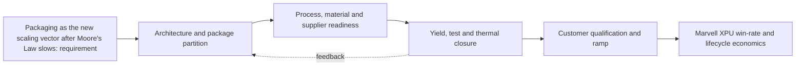

**Figure FIG-MMD-003.** Decision flow for Packaging as the new scaling vector after Moore's Law slows. Author-created schematic based on cited sources.

**Comparison table - TBL-MAIN-003A**

| Dimension | Near-term decision | 2027-2030 direction | Marvell action |
|---|---|---|---|
| Architecture | Prove a qualified baseline | Increase modularity and package scale | Maintain reusable floorplans and chiplet interfaces |
| Manufacturing | Secure capacity and test coverage | Add process alternatives where credible | Negotiate configuration-specific capacity and learning access |
| Performance | Close HBM, D2D and I/O budgets | Shift bottlenecks toward power and cooling | Co-optimize package, SerDes, memory and optical IP |
| Economics | Model expected good-package cost | Reduce concentration and scrap exposure | Offer hyperscalers transparent cost/yield trade spaces |
| Roadmap status | Confirmed plus announced | Expected scenarios with triggers | Refresh quarterly and at customer architecture changes |

**Marvell implication matrix - TBL-MAIN-003B**

| Question | Leadership interpretation | Trigger to act |
|---|---|---|
| Does it improve XPU PPA? | Count package-enabled system benefit, not isolated die metrics | Material bandwidth, latency or power advantage |
| Does it improve schedule? | Reuse and qualification depth can outweigh theoretical density | Customer design freeze or foundry rule release |
| Does it reduce supply risk? | A second logo is not a second qualified configuration | Demonstrated equivalent package and test flow |
| Is ownership strategic? | Own differentiating interfaces and data; partner for scale manufacturing | Repeated dependency that affects win rate |

> **Marvell implication:** Treat Packaging as the new scaling vector after Moore's Law slows as a customer-facing architecture capability with quantified PPA, yield, cost and supply options. Do not position it as a backend feature or rely on unqualified roadmap claims.

### Section close

- **Why it matters:** It can change attainable bandwidth, power, package size, schedule and hyperscaler TCO.
- **Current maturity:** Mixed by configuration; see profile and roadmap databases.
- **Key bottlenecks:** chiplet partition, process-node matching, reticle limits.
- **Leading vendors:** See [vendor database](../data/vendor_roadmaps.yaml).
- **Roadmap:** See [2024-2030 roadmap](../data/vendor_roadmaps.yaml).
- **Marvell implication:** Integrate the capability into custom XPU architecture and commercial planning.
- **Corporate development implication:** Target control points where access, IP or scarce process knowledge changes win probability.
- **Open questions:** Qualification timing, capacity allocation, yield at target body size, and customer-specific reliability.
- **Figures and tables included:** FIG-MMD-003; TBL-MAIN-003A; TBL-MAIN-003B.
- **Next refresh recommendation:** 2026-09-10, or earlier on a material vendor or customer roadmap disclosure.

## 4. Advanced packaging taxonomy

> **Section metadata**
> - **Section title:** Advanced packaging taxonomy
> - **Owner placeholder:** Advanced Packaging Intelligence Owner
> - **Last refreshed date:** 2026-06-10
> - **Refresh status:** Current baseline
> - **Source count:** 4
> - **Confidence level:** Medium-high; confirmed facts separated from announced and inferred roadmap items
> - **Key changes since last refresh:** Initial repository baseline
> - **Open questions:** Customer qualification timing, package-level yields, commercial terms, and capacity allocation
> - **Links to related sections:** [reports/marvell_xpu_implications.md](../reports/marvell_xpu_implications.md), [data/technology_taxonomy.yaml](../data/technology_taxonomy.yaml), [data/source_database.yaml](../data/source_database.yaml)
> - **Figures included:** FIG-MMD-004
> - **Tables included:** TBL-MAIN-004A, TBL-MAIN-004B
> - **Next suggested refresh date:** 2026-09-10

The useful taxonomy separates lateral 2.5D integration, vertical 3D bonding, fan-out, substrate innovation, optical integration and system-level thermal or test infrastructure. This section treats public vendor statements as evidence of direction, not as proof of customer-qualified volume. [[SRC-TSMC-001]](../data/source_database.yaml) [[SRC-INTEL-001]](../data/source_database.yaml) [[SRC-ASE-001]](../data/source_database.yaml) [[SRC-SAMSUNG-001]](../data/source_database.yaml)

### Architecture

The architecture should be evaluated as a system partitioning decision, not as a package label. The decisive boundary is where bandwidth-intensive functions sit relative to compute, memory, I/O and power delivery. A package that minimizes one link may worsen another, so floorplanning must jointly optimize HBM escape routing, die-to-die reach, optical or electrical I/O placement, decoupling and coolant access. For **Advanced packaging taxonomy**, the practical focal point is 2.5D versus 3D. This is a decision variable because it changes the package contract among the XPU architecture, HBM subsystem, connectivity fabric and manufacturing flow. [[SRC-TSMC-001]](../data/source_database.yaml) [[SRC-INTEL-001]](../data/source_database.yaml) [[SRC-ASE-001]](../data/source_database.yaml) [[SRC-SAMSUNG-001]](../data/source_database.yaml)

### Manufacturing flow

The manufacturing sequence determines accumulated yield and cycle time. Wafer sort, thinning, TSV reveal, redistribution, bump or hybrid-bond preparation, die placement, underfill or molding, substrate attach, lid attach and final test each create distinct defect opportunities. The commercially relevant metric is good systems per start and delivery predictability, not the yield of an isolated process module. For **Advanced packaging taxonomy**, the practical focal point is bridge versus interposer. This is a decision variable because it changes the package contract among the XPU architecture, HBM subsystem, connectivity fabric and manufacturing flow. [[SRC-TSMC-001]](../data/source_database.yaml) [[SRC-INTEL-001]](../data/source_database.yaml) [[SRC-ASE-001]](../data/source_database.yaml) [[SRC-SAMSUNG-001]](../data/source_database.yaml)

### Materials and process dependencies

Key dependencies include low-loss dielectrics, copper line and via control, ABF or alternative substrate capacity, temporary bonding materials, underfill, molding compound, thermal interface material and metrology. Material choices couple electrical loss, coefficient-of-thermal-expansion mismatch, moisture sensitivity and warpage; substituting a material therefore requires package requalification rather than a procurement-only change. For **Advanced packaging taxonomy**, the practical focal point is fan-out versus substrate. This is a decision variable because it changes the package contract among the XPU architecture, HBM subsystem, connectivity fabric and manufacturing flow. [[SRC-TSMC-001]](../data/source_database.yaml) [[SRC-INTEL-001]](../data/source_database.yaml) [[SRC-ASE-001]](../data/source_database.yaml) [[SRC-SAMSUNG-001]](../data/source_database.yaml)

### Metrics and benchmark discipline

Bandwidth density, energy per bit, latency and pitch are useful only when test conditions are explicit. A short-reach die-to-die demonstration cannot be compared directly with a rack-reach SerDes link, and a bonding-pitch claim does not reveal routable bandwidth after power, keep-out and redundancy are included. The database therefore records ranges and caveats instead of false point precision. For **Advanced packaging taxonomy**, the practical focal point is electrical versus optical I/O. This is a decision variable because it changes the package contract among the XPU architecture, HBM subsystem, connectivity fabric and manufacturing flow. [[SRC-TSMC-001]](../data/source_database.yaml) [[SRC-INTEL-001]](../data/source_database.yaml) [[SRC-ASE-001]](../data/source_database.yaml) [[SRC-SAMSUNG-001]](../data/source_database.yaml)

### Economics and yield

Cost is dominated by more than assembly price. Expensive known-good logic and HBM make scrap exposure material; larger interposers and substrates reduce units per panel or wafer; additional test insertions raise cost but can prevent higher downstream loss. The correct model values expected good-package cost, schedule risk and customer revenue exposure from missed ramps. For **Advanced packaging taxonomy**, the practical focal point is foundry versus OSAT ownership. This is a decision variable because it changes the package contract among the XPU architecture, HBM subsystem, connectivity fabric and manufacturing flow. [[SRC-TSMC-001]](../data/source_database.yaml) [[SRC-INTEL-001]](../data/source_database.yaml) [[SRC-ASE-001]](../data/source_database.yaml) [[SRC-SAMSUNG-001]](../data/source_database.yaml)

### Thermal and power

Thermal design is becoming an architecture constraint. HBM, logic, optical engines and voltage conversion compete for package edge, vertical heat paths and coolant temperature budget. Hot spots, lateral gradients and thermo-mechanical cycling can reduce attainable frequency or lifetime even when average package power remains within a cold-plate rating. For **Advanced packaging taxonomy**, the practical focal point is 2.5D versus 3D. This is a decision variable because it changes the package contract among the XPU architecture, HBM subsystem, connectivity fabric and manufacturing flow. [[SRC-TSMC-001]](../data/source_database.yaml) [[SRC-INTEL-001]](../data/source_database.yaml) [[SRC-ASE-001]](../data/source_database.yaml) [[SRC-SAMSUNG-001]](../data/source_database.yaml)

### Supply chain and adoption

Adoption requires simultaneous readiness across foundry packaging, memory, substrate, OSAT or test, EDA signoff, system cooling and customer qualification. A nominally mature process may still be unavailable at the required body size, HBM count or regional supply path. Supplier concentration should therefore be tracked by qualified configuration, not vendor logo count. For **Advanced packaging taxonomy**, the practical focal point is bridge versus interposer. This is a decision variable because it changes the package contract among the XPU architecture, HBM subsystem, connectivity fabric and manufacturing flow. [[SRC-TSMC-001]](../data/source_database.yaml) [[SRC-INTEL-001]](../data/source_database.yaml) [[SRC-ASE-001]](../data/source_database.yaml) [[SRC-SAMSUNG-001]](../data/source_database.yaml)

### Competitive implications

Control of design rules, characterization data and capacity reservations can create a competitive moat. NVIDIA and Broadcom can optimize around large internal volumes, while merchant custom-silicon providers must convert ecosystem breadth and reusable IP into comparable schedule certainty. Open standards reduce switching friction only after interoperable silicon, test and software are proven. For **Advanced packaging taxonomy**, the practical focal point is fan-out versus substrate. This is a decision variable because it changes the package contract among the XPU architecture, HBM subsystem, connectivity fabric and manufacturing flow. [[SRC-TSMC-001]](../data/source_database.yaml) [[SRC-INTEL-001]](../data/source_database.yaml) [[SRC-ASE-001]](../data/source_database.yaml) [[SRC-SAMSUNG-001]](../data/source_database.yaml)

### Marvell implication

Marvell should package this capability as part of an end-to-end XPU platform: architecture exploration, reusable die-to-die and HBM IP, package and board co-design, manufacturing ownership, test strategy and lifecycle telemetry. The differentiation is not ownership of every factory step; it is the ability to give a hyperscaler a credible performance, cost, yield and supply plan before design freeze. For **Advanced packaging taxonomy**, the practical focal point is electrical versus optical I/O. This is a decision variable because it changes the package contract among the XPU architecture, HBM subsystem, connectivity fabric and manufacturing flow. [[SRC-TSMC-001]](../data/source_database.yaml) [[SRC-INTEL-001]](../data/source_database.yaml) [[SRC-ASE-001]](../data/source_database.yaml) [[SRC-SAMSUNG-001]](../data/source_database.yaml)

### Corporate development implication

Partnership or investment should target capability gaps that are difficult to reproduce through ordinary sourcing: optical attach, thermal materials and structures, chiplet test, multi-physics automation, advanced substrate process know-how and interoperable die-to-die IP. Acquisitions deserve consideration only where control materially improves XPU win probability or protects a strategic interface. For **Advanced packaging taxonomy**, the practical focal point is foundry versus OSAT ownership. This is a decision variable because it changes the package contract among the XPU architecture, HBM subsystem, connectivity fabric and manufacturing flow. [[SRC-TSMC-001]](../data/source_database.yaml) [[SRC-INTEL-001]](../data/source_database.yaml) [[SRC-ASE-001]](../data/source_database.yaml) [[SRC-SAMSUNG-001]](../data/source_database.yaml)

### Roadmap through 2030

The likely trajectory is larger and more heterogeneous packages, finer vertical connections, more customized memory base dies, greater use of local bridges or RDL to manage cost, and optics moving closer to high-radix switch and selected compute packages. The pace will be gated by yield learning, serviceability and power removal rather than by interconnect demonstrations alone. For **Advanced packaging taxonomy**, the practical focal point is 2.5D versus 3D. This is a decision variable because it changes the package contract among the XPU architecture, HBM subsystem, connectivity fabric and manufacturing flow. [[SRC-TSMC-001]](../data/source_database.yaml) [[SRC-INTEL-001]](../data/source_database.yaml) [[SRC-ASE-001]](../data/source_database.yaml) [[SRC-SAMSUNG-001]](../data/source_database.yaml)

### Diligence priorities

Leadership should request configuration-specific evidence: qualified dimensions, HBM stack count, power map, thermal resistance, warpage, known-good-die coverage, repair flow, monthly capacity, cycle time, second-source path and cost sensitivity. Claims without these fields should remain announced or expected in the roadmap rather than promoted to confirmed. For **Advanced packaging taxonomy**, the practical focal point is bridge versus interposer. This is a decision variable because it changes the package contract among the XPU architecture, HBM subsystem, connectivity fabric and manufacturing flow. [[SRC-TSMC-001]](../data/source_database.yaml) [[SRC-INTEL-001]](../data/source_database.yaml) [[SRC-ASE-001]](../data/source_database.yaml) [[SRC-SAMSUNG-001]](../data/source_database.yaml)

**Figure FIG-MMD-004.** Decision flow for Advanced packaging taxonomy. Author-created schematic based on cited sources.

**Comparison table - TBL-MAIN-004A**

| Dimension | Near-term decision | 2027-2030 direction | Marvell action |
|---|---|---|---|
| Architecture | Prove a qualified baseline | Increase modularity and package scale | Maintain reusable floorplans and chiplet interfaces |
| Manufacturing | Secure capacity and test coverage | Add process alternatives where credible | Negotiate configuration-specific capacity and learning access |
| Performance | Close HBM, D2D and I/O budgets | Shift bottlenecks toward power and cooling | Co-optimize package, SerDes, memory and optical IP |
| Economics | Model expected good-package cost | Reduce concentration and scrap exposure | Offer hyperscalers transparent cost/yield trade spaces |
| Roadmap status | Confirmed plus announced | Expected scenarios with triggers | Refresh quarterly and at customer architecture changes |

**Marvell implication matrix - TBL-MAIN-004B**

| Question | Leadership interpretation | Trigger to act |
|---|---|---|
| Does it improve XPU PPA? | Count package-enabled system benefit, not isolated die metrics | Material bandwidth, latency or power advantage |
| Does it improve schedule? | Reuse and qualification depth can outweigh theoretical density | Customer design freeze or foundry rule release |
| Does it reduce supply risk? | A second logo is not a second qualified configuration | Demonstrated equivalent package and test flow |
| Is ownership strategic? | Own differentiating interfaces and data; partner for scale manufacturing | Repeated dependency that affects win rate |

> **Marvell implication:** Treat Advanced packaging taxonomy as a customer-facing architecture capability with quantified PPA, yield, cost and supply options. Do not position it as a backend feature or rely on unqualified roadmap claims.

### Section close

- **Why it matters:** It can change attainable bandwidth, power, package size, schedule and hyperscaler TCO.
- **Current maturity:** Mixed by configuration; see profile and roadmap databases.
- **Key bottlenecks:** 2.5D versus 3D, bridge versus interposer, fan-out versus substrate.
- **Leading vendors:** See [vendor database](../data/vendor_roadmaps.yaml).
- **Roadmap:** See [2024-2030 roadmap](../data/vendor_roadmaps.yaml).
- **Marvell implication:** Integrate the capability into custom XPU architecture and commercial planning.
- **Corporate development implication:** Target control points where access, IP or scarce process knowledge changes win probability.
- **Open questions:** Qualification timing, capacity allocation, yield at target body size, and customer-specific reliability.
- **Figures and tables included:** FIG-MMD-004; TBL-MAIN-004A; TBL-MAIN-004B.
- **Next refresh recommendation:** 2026-09-10, or earlier on a material vendor or customer roadmap disclosure.

## 5. 2.5D packaging deep dive

> **Section metadata**
> - **Section title:** 2.5D packaging deep dive
> - **Owner placeholder:** Advanced Packaging Intelligence Owner
> - **Last refreshed date:** 2026-06-10
> - **Refresh status:** Current baseline
> - **Source count:** 3
> - **Confidence level:** Medium-high; confirmed facts separated from announced and inferred roadmap items
> - **Key changes since last refresh:** Initial repository baseline
> - **Open questions:** Customer qualification timing, package-level yields, commercial terms, and capacity allocation
> - **Links to related sections:** [reports/marvell_xpu_implications.md](../reports/marvell_xpu_implications.md), [data/technology_taxonomy.yaml](../data/technology_taxonomy.yaml), [data/source_database.yaml](../data/source_database.yaml)
> - **Figures included:** FIG-MMD-005
> - **Tables included:** TBL-MAIN-005A, TBL-MAIN-005B
> - **Next suggested refresh date:** 2026-09-10

2.5D remains the baseline for high-end AI accelerators because it combines fine-pitch logic-to-HBM connectivity with comparatively separable thermal paths. This section treats public vendor statements as evidence of direction, not as proof of customer-qualified volume. [[SRC-TSMC-001]](../data/source_database.yaml) [[SRC-INTEL-001]](../data/source_database.yaml) [[SRC-ASE-001]](../data/source_database.yaml)

### Architecture

The architecture should be evaluated as a system partitioning decision, not as a package label. The decisive boundary is where bandwidth-intensive functions sit relative to compute, memory, I/O and power delivery. A package that minimizes one link may worsen another, so floorplanning must jointly optimize HBM escape routing, die-to-die reach, optical or electrical I/O placement, decoupling and coolant access. For **2.5D packaging deep dive**, the practical focal point is CoWoS-S capacity. This is a decision variable because it changes the package contract among the XPU architecture, HBM subsystem, connectivity fabric and manufacturing flow. [[SRC-TSMC-001]](../data/source_database.yaml) [[SRC-INTEL-001]](../data/source_database.yaml) [[SRC-ASE-001]](../data/source_database.yaml)

### Manufacturing flow

The manufacturing sequence determines accumulated yield and cycle time. Wafer sort, thinning, TSV reveal, redistribution, bump or hybrid-bond preparation, die placement, underfill or molding, substrate attach, lid attach and final test each create distinct defect opportunities. The commercially relevant metric is good systems per start and delivery predictability, not the yield of an isolated process module. For **2.5D packaging deep dive**, the practical focal point is CoWoS-L local silicon interconnect. This is a decision variable because it changes the package contract among the XPU architecture, HBM subsystem, connectivity fabric and manufacturing flow. [[SRC-TSMC-001]](../data/source_database.yaml) [[SRC-INTEL-001]](../data/source_database.yaml) [[SRC-ASE-001]](../data/source_database.yaml)

### Materials and process dependencies

Key dependencies include low-loss dielectrics, copper line and via control, ABF or alternative substrate capacity, temporary bonding materials, underfill, molding compound, thermal interface material and metrology. Material choices couple electrical loss, coefficient-of-thermal-expansion mismatch, moisture sensitivity and warpage; substituting a material therefore requires package requalification rather than a procurement-only change. For **2.5D packaging deep dive**, the practical focal point is CoWoS-R routing density. This is a decision variable because it changes the package contract among the XPU architecture, HBM subsystem, connectivity fabric and manufacturing flow. [[SRC-TSMC-001]](../data/source_database.yaml) [[SRC-INTEL-001]](../data/source_database.yaml) [[SRC-ASE-001]](../data/source_database.yaml)

### Metrics and benchmark discipline

Bandwidth density, energy per bit, latency and pitch are useful only when test conditions are explicit. A short-reach die-to-die demonstration cannot be compared directly with a rack-reach SerDes link, and a bonding-pitch claim does not reveal routable bandwidth after power, keep-out and redundancy are included. The database therefore records ranges and caveats instead of false point precision. For **2.5D packaging deep dive**, the practical focal point is EMIB-style bridges. This is a decision variable because it changes the package contract among the XPU architecture, HBM subsystem, connectivity fabric and manufacturing flow. [[SRC-TSMC-001]](../data/source_database.yaml) [[SRC-INTEL-001]](../data/source_database.yaml) [[SRC-ASE-001]](../data/source_database.yaml)

### Economics and yield

Cost is dominated by more than assembly price. Expensive known-good logic and HBM make scrap exposure material; larger interposers and substrates reduce units per panel or wafer; additional test insertions raise cost but can prevent higher downstream loss. The correct model values expected good-package cost, schedule risk and customer revenue exposure from missed ramps. For **2.5D packaging deep dive**, the practical focal point is RDL and organic alternatives. This is a decision variable because it changes the package contract among the XPU architecture, HBM subsystem, connectivity fabric and manufacturing flow. [[SRC-TSMC-001]](../data/source_database.yaml) [[SRC-INTEL-001]](../data/source_database.yaml) [[SRC-ASE-001]](../data/source_database.yaml)

### Thermal and power

Thermal design is becoming an architecture constraint. HBM, logic, optical engines and voltage conversion compete for package edge, vertical heat paths and coolant temperature budget. Hot spots, lateral gradients and thermo-mechanical cycling can reduce attainable frequency or lifetime even when average package power remains within a cold-plate rating. For **2.5D packaging deep dive**, the practical focal point is CoWoS-S capacity. This is a decision variable because it changes the package contract among the XPU architecture, HBM subsystem, connectivity fabric and manufacturing flow. [[SRC-TSMC-001]](../data/source_database.yaml) [[SRC-INTEL-001]](../data/source_database.yaml) [[SRC-ASE-001]](../data/source_database.yaml)

### Supply chain and adoption

Adoption requires simultaneous readiness across foundry packaging, memory, substrate, OSAT or test, EDA signoff, system cooling and customer qualification. A nominally mature process may still be unavailable at the required body size, HBM count or regional supply path. Supplier concentration should therefore be tracked by qualified configuration, not vendor logo count. For **2.5D packaging deep dive**, the practical focal point is CoWoS-L local silicon interconnect. This is a decision variable because it changes the package contract among the XPU architecture, HBM subsystem, connectivity fabric and manufacturing flow. [[SRC-TSMC-001]](../data/source_database.yaml) [[SRC-INTEL-001]](../data/source_database.yaml) [[SRC-ASE-001]](../data/source_database.yaml)

### Competitive implications

Control of design rules, characterization data and capacity reservations can create a competitive moat. NVIDIA and Broadcom can optimize around large internal volumes, while merchant custom-silicon providers must convert ecosystem breadth and reusable IP into comparable schedule certainty. Open standards reduce switching friction only after interoperable silicon, test and software are proven. For **2.5D packaging deep dive**, the practical focal point is CoWoS-R routing density. This is a decision variable because it changes the package contract among the XPU architecture, HBM subsystem, connectivity fabric and manufacturing flow. [[SRC-TSMC-001]](../data/source_database.yaml) [[SRC-INTEL-001]](../data/source_database.yaml) [[SRC-ASE-001]](../data/source_database.yaml)

### Marvell implication

Marvell should package this capability as part of an end-to-end XPU platform: architecture exploration, reusable die-to-die and HBM IP, package and board co-design, manufacturing ownership, test strategy and lifecycle telemetry. The differentiation is not ownership of every factory step; it is the ability to give a hyperscaler a credible performance, cost, yield and supply plan before design freeze. For **2.5D packaging deep dive**, the practical focal point is EMIB-style bridges. This is a decision variable because it changes the package contract among the XPU architecture, HBM subsystem, connectivity fabric and manufacturing flow. [[SRC-TSMC-001]](../data/source_database.yaml) [[SRC-INTEL-001]](../data/source_database.yaml) [[SRC-ASE-001]](../data/source_database.yaml)

### Corporate development implication

Partnership or investment should target capability gaps that are difficult to reproduce through ordinary sourcing: optical attach, thermal materials and structures, chiplet test, multi-physics automation, advanced substrate process know-how and interoperable die-to-die IP. Acquisitions deserve consideration only where control materially improves XPU win probability or protects a strategic interface. For **2.5D packaging deep dive**, the practical focal point is RDL and organic alternatives. This is a decision variable because it changes the package contract among the XPU architecture, HBM subsystem, connectivity fabric and manufacturing flow. [[SRC-TSMC-001]](../data/source_database.yaml) [[SRC-INTEL-001]](../data/source_database.yaml) [[SRC-ASE-001]](../data/source_database.yaml)

### Roadmap through 2030

The likely trajectory is larger and more heterogeneous packages, finer vertical connections, more customized memory base dies, greater use of local bridges or RDL to manage cost, and optics moving closer to high-radix switch and selected compute packages. The pace will be gated by yield learning, serviceability and power removal rather than by interconnect demonstrations alone. For **2.5D packaging deep dive**, the practical focal point is CoWoS-S capacity. This is a decision variable because it changes the package contract among the XPU architecture, HBM subsystem, connectivity fabric and manufacturing flow. [[SRC-TSMC-001]](../data/source_database.yaml) [[SRC-INTEL-001]](../data/source_database.yaml) [[SRC-ASE-001]](../data/source_database.yaml)

### Diligence priorities

Leadership should request configuration-specific evidence: qualified dimensions, HBM stack count, power map, thermal resistance, warpage, known-good-die coverage, repair flow, monthly capacity, cycle time, second-source path and cost sensitivity. Claims without these fields should remain announced or expected in the roadmap rather than promoted to confirmed. For **2.5D packaging deep dive**, the practical focal point is CoWoS-L local silicon interconnect. This is a decision variable because it changes the package contract among the XPU architecture, HBM subsystem, connectivity fabric and manufacturing flow. [[SRC-TSMC-001]](../data/source_database.yaml) [[SRC-INTEL-001]](../data/source_database.yaml) [[SRC-ASE-001]](../data/source_database.yaml)

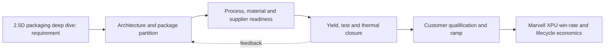

**Figure FIG-MMD-005.** Decision flow for 2.5D packaging deep dive. Author-created schematic based on cited sources.

**Comparison table - TBL-MAIN-005A**

| Dimension | Near-term decision | 2027-2030 direction | Marvell action |
|---|---|---|---|
| Architecture | Prove a qualified baseline | Increase modularity and package scale | Maintain reusable floorplans and chiplet interfaces |
| Manufacturing | Secure capacity and test coverage | Add process alternatives where credible | Negotiate configuration-specific capacity and learning access |
| Performance | Close HBM, D2D and I/O budgets | Shift bottlenecks toward power and cooling | Co-optimize package, SerDes, memory and optical IP |
| Economics | Model expected good-package cost | Reduce concentration and scrap exposure | Offer hyperscalers transparent cost/yield trade spaces |
| Roadmap status | Confirmed plus announced | Expected scenarios with triggers | Refresh quarterly and at customer architecture changes |

**Marvell implication matrix - TBL-MAIN-005B**

| Question | Leadership interpretation | Trigger to act |
|---|---|---|
| Does it improve XPU PPA? | Count package-enabled system benefit, not isolated die metrics | Material bandwidth, latency or power advantage |
| Does it improve schedule? | Reuse and qualification depth can outweigh theoretical density | Customer design freeze or foundry rule release |
| Does it reduce supply risk? | A second logo is not a second qualified configuration | Demonstrated equivalent package and test flow |
| Is ownership strategic? | Own differentiating interfaces and data; partner for scale manufacturing | Repeated dependency that affects win rate |

> **Marvell implication:** Treat 2.5D packaging deep dive as a customer-facing architecture capability with quantified PPA, yield, cost and supply options. Do not position it as a backend feature or rely on unqualified roadmap claims.

### Section close

- **Why it matters:** It can change attainable bandwidth, power, package size, schedule and hyperscaler TCO.
- **Current maturity:** Mixed by configuration; see profile and roadmap databases.
- **Key bottlenecks:** CoWoS-S capacity, CoWoS-L local silicon interconnect, CoWoS-R routing density.
- **Leading vendors:** See [vendor database](../data/vendor_roadmaps.yaml).
- **Roadmap:** See [2024-2030 roadmap](../data/vendor_roadmaps.yaml).
- **Marvell implication:** Integrate the capability into custom XPU architecture and commercial planning.
- **Corporate development implication:** Target control points where access, IP or scarce process knowledge changes win probability.
- **Open questions:** Qualification timing, capacity allocation, yield at target body size, and customer-specific reliability.
- **Figures and tables included:** FIG-MMD-005; TBL-MAIN-005A; TBL-MAIN-005B.
- **Next refresh recommendation:** 2026-09-10, or earlier on a material vendor or customer roadmap disclosure.

## 6. 3D stacking and hybrid bonding deep dive

> **Section metadata**
> - **Section title:** 3D stacking and hybrid bonding deep dive
> - **Owner placeholder:** Advanced Packaging Intelligence Owner
> - **Last refreshed date:** 2026-06-10
> - **Refresh status:** Current baseline
> - **Source count:** 3
> - **Confidence level:** Medium-high; confirmed facts separated from announced and inferred roadmap items
> - **Key changes since last refresh:** Initial repository baseline
> - **Open questions:** Customer qualification timing, package-level yields, commercial terms, and capacity allocation
> - **Links to related sections:** [reports/marvell_xpu_implications.md](../reports/marvell_xpu_implications.md), [data/technology_taxonomy.yaml](../data/technology_taxonomy.yaml), [data/source_database.yaml](../data/source_database.yaml)
> - **Figures included:** FIG-MMD-006
> - **Tables included:** TBL-MAIN-006A, TBL-MAIN-006B
> - **Next suggested refresh date:** 2026-09-10

3D integration offers much higher vertical bandwidth density but shifts risk toward bond yield, thermal coupling, pre-bond test and irreparable stack failures. This section treats public vendor statements as evidence of direction, not as proof of customer-qualified volume. [[SRC-TSMC-001]](../data/source_database.yaml) [[SRC-INTEL-001]](../data/source_database.yaml) [[SRC-ECTC-001]](../data/source_database.yaml)

### Architecture

The architecture should be evaluated as a system partitioning decision, not as a package label. The decisive boundary is where bandwidth-intensive functions sit relative to compute, memory, I/O and power delivery. A package that minimizes one link may worsen another, so floorplanning must jointly optimize HBM escape routing, die-to-die reach, optical or electrical I/O placement, decoupling and coolant access. For **3D stacking and hybrid bonding deep dive**, the practical focal point is SoIC qualification. This is a decision variable because it changes the package contract among the XPU architecture, HBM subsystem, connectivity fabric and manufacturing flow. [[SRC-TSMC-001]](../data/source_database.yaml) [[SRC-INTEL-001]](../data/source_database.yaml) [[SRC-ECTC-001]](../data/source_database.yaml)

### Manufacturing flow

The manufacturing sequence determines accumulated yield and cycle time. Wafer sort, thinning, TSV reveal, redistribution, bump or hybrid-bond preparation, die placement, underfill or molding, substrate attach, lid attach and final test each create distinct defect opportunities. The commercially relevant metric is good systems per start and delivery predictability, not the yield of an isolated process module. For **3D stacking and hybrid bonding deep dive**, the practical focal point is Foveros Direct. This is a decision variable because it changes the package contract among the XPU architecture, HBM subsystem, connectivity fabric and manufacturing flow. [[SRC-TSMC-001]](../data/source_database.yaml) [[SRC-INTEL-001]](../data/source_database.yaml) [[SRC-ECTC-001]](../data/source_database.yaml)

### Materials and process dependencies

Key dependencies include low-loss dielectrics, copper line and via control, ABF or alternative substrate capacity, temporary bonding materials, underfill, molding compound, thermal interface material and metrology. Material choices couple electrical loss, coefficient-of-thermal-expansion mismatch, moisture sensitivity and warpage; substituting a material therefore requires package requalification rather than a procurement-only change. For **3D stacking and hybrid bonding deep dive**, the practical focal point is hybrid bond pitch. This is a decision variable because it changes the package contract among the XPU architecture, HBM subsystem, connectivity fabric and manufacturing flow. [[SRC-TSMC-001]](../data/source_database.yaml) [[SRC-INTEL-001]](../data/source_database.yaml) [[SRC-ECTC-001]](../data/source_database.yaml)

### Metrics and benchmark discipline

Bandwidth density, energy per bit, latency and pitch are useful only when test conditions are explicit. A short-reach die-to-die demonstration cannot be compared directly with a rack-reach SerDes link, and a bonding-pitch claim does not reveal routable bandwidth after power, keep-out and redundancy are included. The database therefore records ranges and caveats instead of false point precision. For **3D stacking and hybrid bonding deep dive**, the practical focal point is logic-on-logic thermal density. This is a decision variable because it changes the package contract among the XPU architecture, HBM subsystem, connectivity fabric and manufacturing flow. [[SRC-TSMC-001]](../data/source_database.yaml) [[SRC-INTEL-001]](../data/source_database.yaml) [[SRC-ECTC-001]](../data/source_database.yaml)

### Economics and yield

Cost is dominated by more than assembly price. Expensive known-good logic and HBM make scrap exposure material; larger interposers and substrates reduce units per panel or wafer; additional test insertions raise cost but can prevent higher downstream loss. The correct model values expected good-package cost, schedule risk and customer revenue exposure from missed ramps. For **3D stacking and hybrid bonding deep dive**, the practical focal point is 3D SRAM. This is a decision variable because it changes the package contract among the XPU architecture, HBM subsystem, connectivity fabric and manufacturing flow. [[SRC-TSMC-001]](../data/source_database.yaml) [[SRC-INTEL-001]](../data/source_database.yaml) [[SRC-ECTC-001]](../data/source_database.yaml)

### Thermal and power

Thermal design is becoming an architecture constraint. HBM, logic, optical engines and voltage conversion compete for package edge, vertical heat paths and coolant temperature budget. Hot spots, lateral gradients and thermo-mechanical cycling can reduce attainable frequency or lifetime even when average package power remains within a cold-plate rating. For **3D stacking and hybrid bonding deep dive**, the practical focal point is SoIC qualification. This is a decision variable because it changes the package contract among the XPU architecture, HBM subsystem, connectivity fabric and manufacturing flow. [[SRC-TSMC-001]](../data/source_database.yaml) [[SRC-INTEL-001]](../data/source_database.yaml) [[SRC-ECTC-001]](../data/source_database.yaml)

### Supply chain and adoption

Adoption requires simultaneous readiness across foundry packaging, memory, substrate, OSAT or test, EDA signoff, system cooling and customer qualification. A nominally mature process may still be unavailable at the required body size, HBM count or regional supply path. Supplier concentration should therefore be tracked by qualified configuration, not vendor logo count. For **3D stacking and hybrid bonding deep dive**, the practical focal point is Foveros Direct. This is a decision variable because it changes the package contract among the XPU architecture, HBM subsystem, connectivity fabric and manufacturing flow. [[SRC-TSMC-001]](../data/source_database.yaml) [[SRC-INTEL-001]](../data/source_database.yaml) [[SRC-ECTC-001]](../data/source_database.yaml)

### Competitive implications

Control of design rules, characterization data and capacity reservations can create a competitive moat. NVIDIA and Broadcom can optimize around large internal volumes, while merchant custom-silicon providers must convert ecosystem breadth and reusable IP into comparable schedule certainty. Open standards reduce switching friction only after interoperable silicon, test and software are proven. For **3D stacking and hybrid bonding deep dive**, the practical focal point is hybrid bond pitch. This is a decision variable because it changes the package contract among the XPU architecture, HBM subsystem, connectivity fabric and manufacturing flow. [[SRC-TSMC-001]](../data/source_database.yaml) [[SRC-INTEL-001]](../data/source_database.yaml) [[SRC-ECTC-001]](../data/source_database.yaml)

### Marvell implication

Marvell should package this capability as part of an end-to-end XPU platform: architecture exploration, reusable die-to-die and HBM IP, package and board co-design, manufacturing ownership, test strategy and lifecycle telemetry. The differentiation is not ownership of every factory step; it is the ability to give a hyperscaler a credible performance, cost, yield and supply plan before design freeze. For **3D stacking and hybrid bonding deep dive**, the practical focal point is logic-on-logic thermal density. This is a decision variable because it changes the package contract among the XPU architecture, HBM subsystem, connectivity fabric and manufacturing flow. [[SRC-TSMC-001]](../data/source_database.yaml) [[SRC-INTEL-001]](../data/source_database.yaml) [[SRC-ECTC-001]](../data/source_database.yaml)

### Corporate development implication

Partnership or investment should target capability gaps that are difficult to reproduce through ordinary sourcing: optical attach, thermal materials and structures, chiplet test, multi-physics automation, advanced substrate process know-how and interoperable die-to-die IP. Acquisitions deserve consideration only where control materially improves XPU win probability or protects a strategic interface. For **3D stacking and hybrid bonding deep dive**, the practical focal point is 3D SRAM. This is a decision variable because it changes the package contract among the XPU architecture, HBM subsystem, connectivity fabric and manufacturing flow. [[SRC-TSMC-001]](../data/source_database.yaml) [[SRC-INTEL-001]](../data/source_database.yaml) [[SRC-ECTC-001]](../data/source_database.yaml)

### Roadmap through 2030

The likely trajectory is larger and more heterogeneous packages, finer vertical connections, more customized memory base dies, greater use of local bridges or RDL to manage cost, and optics moving closer to high-radix switch and selected compute packages. The pace will be gated by yield learning, serviceability and power removal rather than by interconnect demonstrations alone. For **3D stacking and hybrid bonding deep dive**, the practical focal point is SoIC qualification. This is a decision variable because it changes the package contract among the XPU architecture, HBM subsystem, connectivity fabric and manufacturing flow. [[SRC-TSMC-001]](../data/source_database.yaml) [[SRC-INTEL-001]](../data/source_database.yaml) [[SRC-ECTC-001]](../data/source_database.yaml)

### Diligence priorities

Leadership should request configuration-specific evidence: qualified dimensions, HBM stack count, power map, thermal resistance, warpage, known-good-die coverage, repair flow, monthly capacity, cycle time, second-source path and cost sensitivity. Claims without these fields should remain announced or expected in the roadmap rather than promoted to confirmed. For **3D stacking and hybrid bonding deep dive**, the practical focal point is Foveros Direct. This is a decision variable because it changes the package contract among the XPU architecture, HBM subsystem, connectivity fabric and manufacturing flow. [[SRC-TSMC-001]](../data/source_database.yaml) [[SRC-INTEL-001]](../data/source_database.yaml) [[SRC-ECTC-001]](../data/source_database.yaml)

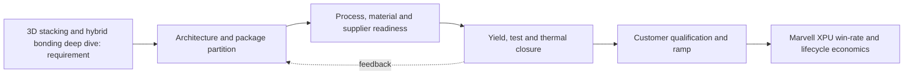

**Figure FIG-MMD-006.** Decision flow for 3D stacking and hybrid bonding deep dive. Author-created schematic based on cited sources.

**Comparison table - TBL-MAIN-006A**

| Dimension | Near-term decision | 2027-2030 direction | Marvell action |
|---|---|---|---|
| Architecture | Prove a qualified baseline | Increase modularity and package scale | Maintain reusable floorplans and chiplet interfaces |
| Manufacturing | Secure capacity and test coverage | Add process alternatives where credible | Negotiate configuration-specific capacity and learning access |
| Performance | Close HBM, D2D and I/O budgets | Shift bottlenecks toward power and cooling | Co-optimize package, SerDes, memory and optical IP |
| Economics | Model expected good-package cost | Reduce concentration and scrap exposure | Offer hyperscalers transparent cost/yield trade spaces |
| Roadmap status | Confirmed plus announced | Expected scenarios with triggers | Refresh quarterly and at customer architecture changes |

**Marvell implication matrix - TBL-MAIN-006B**

| Question | Leadership interpretation | Trigger to act |
|---|---|---|
| Does it improve XPU PPA? | Count package-enabled system benefit, not isolated die metrics | Material bandwidth, latency or power advantage |
| Does it improve schedule? | Reuse and qualification depth can outweigh theoretical density | Customer design freeze or foundry rule release |
| Does it reduce supply risk? | A second logo is not a second qualified configuration | Demonstrated equivalent package and test flow |
| Is ownership strategic? | Own differentiating interfaces and data; partner for scale manufacturing | Repeated dependency that affects win rate |

> **Marvell implication:** Treat 3D stacking and hybrid bonding deep dive as a customer-facing architecture capability with quantified PPA, yield, cost and supply options. Do not position it as a backend feature or rely on unqualified roadmap claims.

### Section close

- **Why it matters:** It can change attainable bandwidth, power, package size, schedule and hyperscaler TCO.
- **Current maturity:** Mixed by configuration; see profile and roadmap databases.
- **Key bottlenecks:** SoIC qualification, Foveros Direct, hybrid bond pitch.
- **Leading vendors:** See [vendor database](../data/vendor_roadmaps.yaml).
- **Roadmap:** See [2024-2030 roadmap](../data/vendor_roadmaps.yaml).
- **Marvell implication:** Integrate the capability into custom XPU architecture and commercial planning.
- **Corporate development implication:** Target control points where access, IP or scarce process knowledge changes win probability.
- **Open questions:** Qualification timing, capacity allocation, yield at target body size, and customer-specific reliability.
- **Figures and tables included:** FIG-MMD-006; TBL-MAIN-006A; TBL-MAIN-006B.
- **Next refresh recommendation:** 2026-09-10, or earlier on a material vendor or customer roadmap disclosure.

## 7. HBM packaging and custom HBM architecture

> **Section metadata**
> - **Section title:** HBM packaging and custom HBM architecture
> - **Owner placeholder:** Advanced Packaging Intelligence Owner
> - **Last refreshed date:** 2026-06-10
> - **Refresh status:** Current baseline
> - **Source count:** 4
> - **Confidence level:** Medium-high; confirmed facts separated from announced and inferred roadmap items
> - **Key changes since last refresh:** Initial repository baseline
> - **Open questions:** Customer qualification timing, package-level yields, commercial terms, and capacity allocation
> - **Links to related sections:** [reports/marvell_xpu_implications.md](../reports/marvell_xpu_implications.md), [data/technology_taxonomy.yaml](../data/technology_taxonomy.yaml), [data/source_database.yaml](../data/source_database.yaml)
> - **Figures included:** FIG-MMD-007
> - **Tables included:** TBL-MAIN-007A, TBL-MAIN-007B
> - **Next suggested refresh date:** 2026-09-10

HBM4's wider interface and logic base die create a strategic co-design point among memory vendors, foundries and custom XPU providers. This section treats public vendor statements as evidence of direction, not as proof of customer-qualified volume. [[SRC-JEDEC-001]](../data/source_database.yaml) [[SRC-SKH-001]](../data/source_database.yaml) [[SRC-MRVL-001]](../data/source_database.yaml) [[SRC-MICRON-001]](../data/source_database.yaml)

### Architecture

The architecture should be evaluated as a system partitioning decision, not as a package label. The decisive boundary is where bandwidth-intensive functions sit relative to compute, memory, I/O and power delivery. A package that minimizes one link may worsen another, so floorplanning must jointly optimize HBM escape routing, die-to-die reach, optical or electrical I/O placement, decoupling and coolant access. For **HBM packaging and custom HBM architecture**, the practical focal point is 2,048-bit interface. This is a decision variable because it changes the package contract among the XPU architecture, HBM subsystem, connectivity fabric and manufacturing flow. [[SRC-JEDEC-001]](../data/source_database.yaml) [[SRC-SKH-001]](../data/source_database.yaml) [[SRC-MRVL-001]](../data/source_database.yaml) [[SRC-MICRON-001]](../data/source_database.yaml)

### Manufacturing flow

The manufacturing sequence determines accumulated yield and cycle time. Wafer sort, thinning, TSV reveal, redistribution, bump or hybrid-bond preparation, die placement, underfill or molding, substrate attach, lid attach and final test each create distinct defect opportunities. The commercially relevant metric is good systems per start and delivery predictability, not the yield of an isolated process module. For **HBM packaging and custom HBM architecture**, the practical focal point is custom base die. This is a decision variable because it changes the package contract among the XPU architecture, HBM subsystem, connectivity fabric and manufacturing flow. [[SRC-JEDEC-001]](../data/source_database.yaml) [[SRC-SKH-001]](../data/source_database.yaml) [[SRC-MRVL-001]](../data/source_database.yaml) [[SRC-MICRON-001]](../data/source_database.yaml)

### Materials and process dependencies

Key dependencies include low-loss dielectrics, copper line and via control, ABF or alternative substrate capacity, temporary bonding materials, underfill, molding compound, thermal interface material and metrology. Material choices couple electrical loss, coefficient-of-thermal-expansion mismatch, moisture sensitivity and warpage; substituting a material therefore requires package requalification rather than a procurement-only change. For **HBM packaging and custom HBM architecture**, the practical focal point is 12-high and 16-high stacks. This is a decision variable because it changes the package contract among the XPU architecture, HBM subsystem, connectivity fabric and manufacturing flow. [[SRC-JEDEC-001]](../data/source_database.yaml) [[SRC-SKH-001]](../data/source_database.yaml) [[SRC-MRVL-001]](../data/source_database.yaml) [[SRC-MICRON-001]](../data/source_database.yaml)

### Metrics and benchmark discipline

Bandwidth density, energy per bit, latency and pitch are useful only when test conditions are explicit. A short-reach die-to-die demonstration cannot be compared directly with a rack-reach SerDes link, and a bonding-pitch claim does not reveal routable bandwidth after power, keep-out and redundancy are included. The database therefore records ranges and caveats instead of false point precision. For **HBM packaging and custom HBM architecture**, the practical focal point is thermal resistance. This is a decision variable because it changes the package contract among the XPU architecture, HBM subsystem, connectivity fabric and manufacturing flow. [[SRC-JEDEC-001]](../data/source_database.yaml) [[SRC-SKH-001]](../data/source_database.yaml) [[SRC-MRVL-001]](../data/source_database.yaml) [[SRC-MICRON-001]](../data/source_database.yaml)

### Economics and yield

Cost is dominated by more than assembly price. Expensive known-good logic and HBM make scrap exposure material; larger interposers and substrates reduce units per panel or wafer; additional test insertions raise cost but can prevent higher downstream loss. The correct model values expected good-package cost, schedule risk and customer revenue exposure from missed ramps. For **HBM packaging and custom HBM architecture**, the practical focal point is memory-vendor qualification. This is a decision variable because it changes the package contract among the XPU architecture, HBM subsystem, connectivity fabric and manufacturing flow. [[SRC-JEDEC-001]](../data/source_database.yaml) [[SRC-SKH-001]](../data/source_database.yaml) [[SRC-MRVL-001]](../data/source_database.yaml) [[SRC-MICRON-001]](../data/source_database.yaml)

### Thermal and power

Thermal design is becoming an architecture constraint. HBM, logic, optical engines and voltage conversion compete for package edge, vertical heat paths and coolant temperature budget. Hot spots, lateral gradients and thermo-mechanical cycling can reduce attainable frequency or lifetime even when average package power remains within a cold-plate rating. For **HBM packaging and custom HBM architecture**, the practical focal point is 2,048-bit interface. This is a decision variable because it changes the package contract among the XPU architecture, HBM subsystem, connectivity fabric and manufacturing flow. [[SRC-JEDEC-001]](../data/source_database.yaml) [[SRC-SKH-001]](../data/source_database.yaml) [[SRC-MRVL-001]](../data/source_database.yaml) [[SRC-MICRON-001]](../data/source_database.yaml)

### Supply chain and adoption

Adoption requires simultaneous readiness across foundry packaging, memory, substrate, OSAT or test, EDA signoff, system cooling and customer qualification. A nominally mature process may still be unavailable at the required body size, HBM count or regional supply path. Supplier concentration should therefore be tracked by qualified configuration, not vendor logo count. For **HBM packaging and custom HBM architecture**, the practical focal point is custom base die. This is a decision variable because it changes the package contract among the XPU architecture, HBM subsystem, connectivity fabric and manufacturing flow. [[SRC-JEDEC-001]](../data/source_database.yaml) [[SRC-SKH-001]](../data/source_database.yaml) [[SRC-MRVL-001]](../data/source_database.yaml) [[SRC-MICRON-001]](../data/source_database.yaml)

### Competitive implications

Control of design rules, characterization data and capacity reservations can create a competitive moat. NVIDIA and Broadcom can optimize around large internal volumes, while merchant custom-silicon providers must convert ecosystem breadth and reusable IP into comparable schedule certainty. Open standards reduce switching friction only after interoperable silicon, test and software are proven. For **HBM packaging and custom HBM architecture**, the practical focal point is 12-high and 16-high stacks. This is a decision variable because it changes the package contract among the XPU architecture, HBM subsystem, connectivity fabric and manufacturing flow. [[SRC-JEDEC-001]](../data/source_database.yaml) [[SRC-SKH-001]](../data/source_database.yaml) [[SRC-MRVL-001]](../data/source_database.yaml) [[SRC-MICRON-001]](../data/source_database.yaml)

### Marvell implication

Marvell should package this capability as part of an end-to-end XPU platform: architecture exploration, reusable die-to-die and HBM IP, package and board co-design, manufacturing ownership, test strategy and lifecycle telemetry. The differentiation is not ownership of every factory step; it is the ability to give a hyperscaler a credible performance, cost, yield and supply plan before design freeze. For **HBM packaging and custom HBM architecture**, the practical focal point is thermal resistance. This is a decision variable because it changes the package contract among the XPU architecture, HBM subsystem, connectivity fabric and manufacturing flow. [[SRC-JEDEC-001]](../data/source_database.yaml) [[SRC-SKH-001]](../data/source_database.yaml) [[SRC-MRVL-001]](../data/source_database.yaml) [[SRC-MICRON-001]](../data/source_database.yaml)

### Corporate development implication

Partnership or investment should target capability gaps that are difficult to reproduce through ordinary sourcing: optical attach, thermal materials and structures, chiplet test, multi-physics automation, advanced substrate process know-how and interoperable die-to-die IP. Acquisitions deserve consideration only where control materially improves XPU win probability or protects a strategic interface. For **HBM packaging and custom HBM architecture**, the practical focal point is memory-vendor qualification. This is a decision variable because it changes the package contract among the XPU architecture, HBM subsystem, connectivity fabric and manufacturing flow. [[SRC-JEDEC-001]](../data/source_database.yaml) [[SRC-SKH-001]](../data/source_database.yaml) [[SRC-MRVL-001]](../data/source_database.yaml) [[SRC-MICRON-001]](../data/source_database.yaml)

### Roadmap through 2030

The likely trajectory is larger and more heterogeneous packages, finer vertical connections, more customized memory base dies, greater use of local bridges or RDL to manage cost, and optics moving closer to high-radix switch and selected compute packages. The pace will be gated by yield learning, serviceability and power removal rather than by interconnect demonstrations alone. For **HBM packaging and custom HBM architecture**, the practical focal point is 2,048-bit interface. This is a decision variable because it changes the package contract among the XPU architecture, HBM subsystem, connectivity fabric and manufacturing flow. [[SRC-JEDEC-001]](../data/source_database.yaml) [[SRC-SKH-001]](../data/source_database.yaml) [[SRC-MRVL-001]](../data/source_database.yaml) [[SRC-MICRON-001]](../data/source_database.yaml)

### Diligence priorities

Leadership should request configuration-specific evidence: qualified dimensions, HBM stack count, power map, thermal resistance, warpage, known-good-die coverage, repair flow, monthly capacity, cycle time, second-source path and cost sensitivity. Claims without these fields should remain announced or expected in the roadmap rather than promoted to confirmed. For **HBM packaging and custom HBM architecture**, the practical focal point is custom base die. This is a decision variable because it changes the package contract among the XPU architecture, HBM subsystem, connectivity fabric and manufacturing flow. [[SRC-JEDEC-001]](../data/source_database.yaml) [[SRC-SKH-001]](../data/source_database.yaml) [[SRC-MRVL-001]](../data/source_database.yaml) [[SRC-MICRON-001]](../data/source_database.yaml)

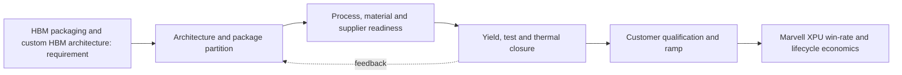

**Figure FIG-MMD-007.** Decision flow for HBM packaging and custom HBM architecture. Author-created schematic based on cited sources.

**Comparison table - TBL-MAIN-007A**

| Dimension | Near-term decision | 2027-2030 direction | Marvell action |
|---|---|---|---|
| Architecture | Prove a qualified baseline | Increase modularity and package scale | Maintain reusable floorplans and chiplet interfaces |
| Manufacturing | Secure capacity and test coverage | Add process alternatives where credible | Negotiate configuration-specific capacity and learning access |
| Performance | Close HBM, D2D and I/O budgets | Shift bottlenecks toward power and cooling | Co-optimize package, SerDes, memory and optical IP |
| Economics | Model expected good-package cost | Reduce concentration and scrap exposure | Offer hyperscalers transparent cost/yield trade spaces |
| Roadmap status | Confirmed plus announced | Expected scenarios with triggers | Refresh quarterly and at customer architecture changes |

**Marvell implication matrix - TBL-MAIN-007B**

| Question | Leadership interpretation | Trigger to act |
|---|---|---|
| Does it improve XPU PPA? | Count package-enabled system benefit, not isolated die metrics | Material bandwidth, latency or power advantage |
| Does it improve schedule? | Reuse and qualification depth can outweigh theoretical density | Customer design freeze or foundry rule release |
| Does it reduce supply risk? | A second logo is not a second qualified configuration | Demonstrated equivalent package and test flow |
| Is ownership strategic? | Own differentiating interfaces and data; partner for scale manufacturing | Repeated dependency that affects win rate |

> **Marvell implication:** Treat HBM packaging and custom HBM architecture as a customer-facing architecture capability with quantified PPA, yield, cost and supply options. Do not position it as a backend feature or rely on unqualified roadmap claims.

### Section close

- **Why it matters:** It can change attainable bandwidth, power, package size, schedule and hyperscaler TCO.
- **Current maturity:** Mixed by configuration; see profile and roadmap databases.
- **Key bottlenecks:** 2,048-bit interface, custom base die, 12-high and 16-high stacks.
- **Leading vendors:** See [vendor database](../data/vendor_roadmaps.yaml).
- **Roadmap:** See [2024-2030 roadmap](../data/vendor_roadmaps.yaml).
- **Marvell implication:** Integrate the capability into custom XPU architecture and commercial planning.
- **Corporate development implication:** Target control points where access, IP or scarce process knowledge changes win probability.
- **Open questions:** Qualification timing, capacity allocation, yield at target body size, and customer-specific reliability.
- **Figures and tables included:** FIG-MMD-007; TBL-MAIN-007A; TBL-MAIN-007B.
- **Next refresh recommendation:** 2026-09-10, or earlier on a material vendor or customer roadmap disclosure.

## 8. CPO and optical I/O packaging

> **Section metadata**
> - **Section title:** CPO and optical I/O packaging
> - **Owner placeholder:** Advanced Packaging Intelligence Owner
> - **Last refreshed date:** 2026-06-10
> - **Refresh status:** Current baseline
> - **Source count:** 4
> - **Confidence level:** Medium-high; confirmed facts separated from announced and inferred roadmap items
> - **Key changes since last refresh:** Initial repository baseline
> - **Open questions:** Customer qualification timing, package-level yields, commercial terms, and capacity allocation
> - **Links to related sections:** [reports/marvell_xpu_implications.md](../reports/marvell_xpu_implications.md), [data/technology_taxonomy.yaml](../data/technology_taxonomy.yaml), [data/source_database.yaml](../data/source_database.yaml)
> - **Figures included:** FIG-MMD-008
> - **Tables included:** TBL-MAIN-008A, TBL-MAIN-008B
> - **Next suggested refresh date:** 2026-09-10

Optics moving toward the switch or XPU package can lower long electrical reach but introduces laser, fiber attach, thermal isolation, test and serviceability requirements. This section treats public vendor statements as evidence of direction, not as proof of customer-qualified volume. [[SRC-OIF-001]](../data/source_database.yaml) [[SRC-NVIDIA-002]](../data/source_database.yaml) [[SRC-MRVL-003]](../data/source_database.yaml) [[SRC-AYAR-001]](../data/source_database.yaml)

### Architecture

The architecture should be evaluated as a system partitioning decision, not as a package label. The decisive boundary is where bandwidth-intensive functions sit relative to compute, memory, I/O and power delivery. A package that minimizes one link may worsen another, so floorplanning must jointly optimize HBM escape routing, die-to-die reach, optical or electrical I/O placement, decoupling and coolant access. For **CPO and optical I/O packaging**, the practical focal point is switch CPO. This is a decision variable because it changes the package contract among the XPU architecture, HBM subsystem, connectivity fabric and manufacturing flow. [[SRC-OIF-001]](../data/source_database.yaml) [[SRC-NVIDIA-002]](../data/source_database.yaml) [[SRC-MRVL-003]](../data/source_database.yaml) [[SRC-AYAR-001]](../data/source_database.yaml)

### Manufacturing flow

The manufacturing sequence determines accumulated yield and cycle time. Wafer sort, thinning, TSV reveal, redistribution, bump or hybrid-bond preparation, die placement, underfill or molding, substrate attach, lid attach and final test each create distinct defect opportunities. The commercially relevant metric is good systems per start and delivery predictability, not the yield of an isolated process module. For **CPO and optical I/O packaging**, the practical focal point is XPU optical I/O. This is a decision variable because it changes the package contract among the XPU architecture, HBM subsystem, connectivity fabric and manufacturing flow. [[SRC-OIF-001]](../data/source_database.yaml) [[SRC-NVIDIA-002]](../data/source_database.yaml) [[SRC-MRVL-003]](../data/source_database.yaml) [[SRC-AYAR-001]](../data/source_database.yaml)

### Materials and process dependencies

Key dependencies include low-loss dielectrics, copper line and via control, ABF or alternative substrate capacity, temporary bonding materials, underfill, molding compound, thermal interface material and metrology. Material choices couple electrical loss, coefficient-of-thermal-expansion mismatch, moisture sensitivity and warpage; substituting a material therefore requires package requalification rather than a procurement-only change. For **CPO and optical I/O packaging**, the practical focal point is external laser. This is a decision variable because it changes the package contract among the XPU architecture, HBM subsystem, connectivity fabric and manufacturing flow. [[SRC-OIF-001]](../data/source_database.yaml) [[SRC-NVIDIA-002]](../data/source_database.yaml) [[SRC-MRVL-003]](../data/source_database.yaml) [[SRC-AYAR-001]](../data/source_database.yaml)

### Metrics and benchmark discipline

Bandwidth density, energy per bit, latency and pitch are useful only when test conditions are explicit. A short-reach die-to-die demonstration cannot be compared directly with a rack-reach SerDes link, and a bonding-pitch claim does not reveal routable bandwidth after power, keep-out and redundancy are included. The database therefore records ranges and caveats instead of false point precision. For **CPO and optical I/O packaging**, the practical focal point is fiber attach yield. This is a decision variable because it changes the package contract among the XPU architecture, HBM subsystem, connectivity fabric and manufacturing flow. [[SRC-OIF-001]](../data/source_database.yaml) [[SRC-NVIDIA-002]](../data/source_database.yaml) [[SRC-MRVL-003]](../data/source_database.yaml) [[SRC-AYAR-001]](../data/source_database.yaml)

### Economics and yield

Cost is dominated by more than assembly price. Expensive known-good logic and HBM make scrap exposure material; larger interposers and substrates reduce units per panel or wafer; additional test insertions raise cost but can prevent higher downstream loss. The correct model values expected good-package cost, schedule risk and customer revenue exposure from missed ramps. For **CPO and optical I/O packaging**, the practical focal point is field replaceability. This is a decision variable because it changes the package contract among the XPU architecture, HBM subsystem, connectivity fabric and manufacturing flow. [[SRC-OIF-001]](../data/source_database.yaml) [[SRC-NVIDIA-002]](../data/source_database.yaml) [[SRC-MRVL-003]](../data/source_database.yaml) [[SRC-AYAR-001]](../data/source_database.yaml)

### Thermal and power

Thermal design is becoming an architecture constraint. HBM, logic, optical engines and voltage conversion compete for package edge, vertical heat paths and coolant temperature budget. Hot spots, lateral gradients and thermo-mechanical cycling can reduce attainable frequency or lifetime even when average package power remains within a cold-plate rating. For **CPO and optical I/O packaging**, the practical focal point is switch CPO. This is a decision variable because it changes the package contract among the XPU architecture, HBM subsystem, connectivity fabric and manufacturing flow. [[SRC-OIF-001]](../data/source_database.yaml) [[SRC-NVIDIA-002]](../data/source_database.yaml) [[SRC-MRVL-003]](../data/source_database.yaml) [[SRC-AYAR-001]](../data/source_database.yaml)

### Supply chain and adoption

Adoption requires simultaneous readiness across foundry packaging, memory, substrate, OSAT or test, EDA signoff, system cooling and customer qualification. A nominally mature process may still be unavailable at the required body size, HBM count or regional supply path. Supplier concentration should therefore be tracked by qualified configuration, not vendor logo count. For **CPO and optical I/O packaging**, the practical focal point is XPU optical I/O. This is a decision variable because it changes the package contract among the XPU architecture, HBM subsystem, connectivity fabric and manufacturing flow. [[SRC-OIF-001]](../data/source_database.yaml) [[SRC-NVIDIA-002]](../data/source_database.yaml) [[SRC-MRVL-003]](../data/source_database.yaml) [[SRC-AYAR-001]](../data/source_database.yaml)

### Competitive implications

Control of design rules, characterization data and capacity reservations can create a competitive moat. NVIDIA and Broadcom can optimize around large internal volumes, while merchant custom-silicon providers must convert ecosystem breadth and reusable IP into comparable schedule certainty. Open standards reduce switching friction only after interoperable silicon, test and software are proven. For **CPO and optical I/O packaging**, the practical focal point is external laser. This is a decision variable because it changes the package contract among the XPU architecture, HBM subsystem, connectivity fabric and manufacturing flow. [[SRC-OIF-001]](../data/source_database.yaml) [[SRC-NVIDIA-002]](../data/source_database.yaml) [[SRC-MRVL-003]](../data/source_database.yaml) [[SRC-AYAR-001]](../data/source_database.yaml)

### Marvell implication

Marvell should package this capability as part of an end-to-end XPU platform: architecture exploration, reusable die-to-die and HBM IP, package and board co-design, manufacturing ownership, test strategy and lifecycle telemetry. The differentiation is not ownership of every factory step; it is the ability to give a hyperscaler a credible performance, cost, yield and supply plan before design freeze. For **CPO and optical I/O packaging**, the practical focal point is fiber attach yield. This is a decision variable because it changes the package contract among the XPU architecture, HBM subsystem, connectivity fabric and manufacturing flow. [[SRC-OIF-001]](../data/source_database.yaml) [[SRC-NVIDIA-002]](../data/source_database.yaml) [[SRC-MRVL-003]](../data/source_database.yaml) [[SRC-AYAR-001]](../data/source_database.yaml)

### Corporate development implication

Partnership or investment should target capability gaps that are difficult to reproduce through ordinary sourcing: optical attach, thermal materials and structures, chiplet test, multi-physics automation, advanced substrate process know-how and interoperable die-to-die IP. Acquisitions deserve consideration only where control materially improves XPU win probability or protects a strategic interface. For **CPO and optical I/O packaging**, the practical focal point is field replaceability. This is a decision variable because it changes the package contract among the XPU architecture, HBM subsystem, connectivity fabric and manufacturing flow. [[SRC-OIF-001]](../data/source_database.yaml) [[SRC-NVIDIA-002]](../data/source_database.yaml) [[SRC-MRVL-003]](../data/source_database.yaml) [[SRC-AYAR-001]](../data/source_database.yaml)

### Roadmap through 2030

The likely trajectory is larger and more heterogeneous packages, finer vertical connections, more customized memory base dies, greater use of local bridges or RDL to manage cost, and optics moving closer to high-radix switch and selected compute packages. The pace will be gated by yield learning, serviceability and power removal rather than by interconnect demonstrations alone. For **CPO and optical I/O packaging**, the practical focal point is switch CPO. This is a decision variable because it changes the package contract among the XPU architecture, HBM subsystem, connectivity fabric and manufacturing flow. [[SRC-OIF-001]](../data/source_database.yaml) [[SRC-NVIDIA-002]](../data/source_database.yaml) [[SRC-MRVL-003]](../data/source_database.yaml) [[SRC-AYAR-001]](../data/source_database.yaml)

### Diligence priorities

Leadership should request configuration-specific evidence: qualified dimensions, HBM stack count, power map, thermal resistance, warpage, known-good-die coverage, repair flow, monthly capacity, cycle time, second-source path and cost sensitivity. Claims without these fields should remain announced or expected in the roadmap rather than promoted to confirmed. For **CPO and optical I/O packaging**, the practical focal point is XPU optical I/O. This is a decision variable because it changes the package contract among the XPU architecture, HBM subsystem, connectivity fabric and manufacturing flow. [[SRC-OIF-001]](../data/source_database.yaml) [[SRC-NVIDIA-002]](../data/source_database.yaml) [[SRC-MRVL-003]](../data/source_database.yaml) [[SRC-AYAR-001]](../data/source_database.yaml)

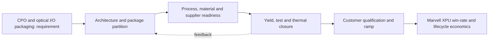

**Figure FIG-MMD-008.** Decision flow for CPO and optical I/O packaging. Author-created schematic based on cited sources.

**Comparison table - TBL-MAIN-008A**

| Dimension | Near-term decision | 2027-2030 direction | Marvell action |
|---|---|---|---|
| Architecture | Prove a qualified baseline | Increase modularity and package scale | Maintain reusable floorplans and chiplet interfaces |
| Manufacturing | Secure capacity and test coverage | Add process alternatives where credible | Negotiate configuration-specific capacity and learning access |
| Performance | Close HBM, D2D and I/O budgets | Shift bottlenecks toward power and cooling | Co-optimize package, SerDes, memory and optical IP |
| Economics | Model expected good-package cost | Reduce concentration and scrap exposure | Offer hyperscalers transparent cost/yield trade spaces |
| Roadmap status | Confirmed plus announced | Expected scenarios with triggers | Refresh quarterly and at customer architecture changes |

**Marvell implication matrix - TBL-MAIN-008B**

| Question | Leadership interpretation | Trigger to act |
|---|---|---|
| Does it improve XPU PPA? | Count package-enabled system benefit, not isolated die metrics | Material bandwidth, latency or power advantage |
| Does it improve schedule? | Reuse and qualification depth can outweigh theoretical density | Customer design freeze or foundry rule release |
| Does it reduce supply risk? | A second logo is not a second qualified configuration | Demonstrated equivalent package and test flow |
| Is ownership strategic? | Own differentiating interfaces and data; partner for scale manufacturing | Repeated dependency that affects win rate |

> **Marvell implication:** Treat CPO and optical I/O packaging as a customer-facing architecture capability with quantified PPA, yield, cost and supply options. Do not position it as a backend feature or rely on unqualified roadmap claims.

### Section close

- **Why it matters:** It can change attainable bandwidth, power, package size, schedule and hyperscaler TCO.
- **Current maturity:** Mixed by configuration; see profile and roadmap databases.
- **Key bottlenecks:** switch CPO, XPU optical I/O, external laser.
- **Leading vendors:** See [vendor database](../data/vendor_roadmaps.yaml).
- **Roadmap:** See [2024-2030 roadmap](../data/vendor_roadmaps.yaml).
- **Marvell implication:** Integrate the capability into custom XPU architecture and commercial planning.
- **Corporate development implication:** Target control points where access, IP or scarce process knowledge changes win probability.
- **Open questions:** Qualification timing, capacity allocation, yield at target body size, and customer-specific reliability.
- **Figures and tables included:** FIG-MMD-008; TBL-MAIN-008A; TBL-MAIN-008B.
- **Next refresh recommendation:** 2026-09-10, or earlier on a material vendor or customer roadmap disclosure.

## 9. Die-to-die interconnect and chiplet standards

> **Section metadata**
> - **Section title:** Die-to-die interconnect and chiplet standards
> - **Owner placeholder:** Advanced Packaging Intelligence Owner
> - **Last refreshed date:** 2026-06-10
> - **Refresh status:** Current baseline
> - **Source count:** 3
> - **Confidence level:** Medium-high; confirmed facts separated from announced and inferred roadmap items
> - **Key changes since last refresh:** Initial repository baseline
> - **Open questions:** Customer qualification timing, package-level yields, commercial terms, and capacity allocation
> - **Links to related sections:** [reports/marvell_xpu_implications.md](../reports/marvell_xpu_implications.md), [data/technology_taxonomy.yaml](../data/technology_taxonomy.yaml), [data/source_database.yaml](../data/source_database.yaml)
> - **Figures included:** FIG-MMD-009
> - **Tables included:** TBL-MAIN-009A, TBL-MAIN-009B
> - **Next suggested refresh date:** 2026-09-10

Die-to-die links trade parallel bandwidth density against serialized reach and routing flexibility, while standards add ecosystem leverage at some protocol and compliance cost. This section treats public vendor statements as evidence of direction, not as proof of customer-qualified volume. [[SRC-UCIE-001]](../data/source_database.yaml) [[SRC-UCIE-002]](../data/source_database.yaml) [[SRC-MRVL-002]](../data/source_database.yaml)

### Architecture

The architecture should be evaluated as a system partitioning decision, not as a package label. The decisive boundary is where bandwidth-intensive functions sit relative to compute, memory, I/O and power delivery. A package that minimizes one link may worsen another, so floorplanning must jointly optimize HBM escape routing, die-to-die reach, optical or electrical I/O placement, decoupling and coolant access. For **Die-to-die interconnect and chiplet standards**, the practical focal point is UCIe 2.0 and 3.0. This is a decision variable because it changes the package contract among the XPU architecture, HBM subsystem, connectivity fabric and manufacturing flow. [[SRC-UCIE-001]](../data/source_database.yaml) [[SRC-UCIE-002]](../data/source_database.yaml) [[SRC-MRVL-002]](../data/source_database.yaml)

### Manufacturing flow

The manufacturing sequence determines accumulated yield and cycle time. Wafer sort, thinning, TSV reveal, redistribution, bump or hybrid-bond preparation, die placement, underfill or molding, substrate attach, lid attach and final test each create distinct defect opportunities. The commercially relevant metric is good systems per start and delivery predictability, not the yield of an isolated process module. For **Die-to-die interconnect and chiplet standards**, the practical focal point is parallel link pitch. This is a decision variable because it changes the package contract among the XPU architecture, HBM subsystem, connectivity fabric and manufacturing flow. [[SRC-UCIE-001]](../data/source_database.yaml) [[SRC-UCIE-002]](../data/source_database.yaml) [[SRC-MRVL-002]](../data/source_database.yaml)

### Materials and process dependencies

Key dependencies include low-loss dielectrics, copper line and via control, ABF or alternative substrate capacity, temporary bonding materials, underfill, molding compound, thermal interface material and metrology. Material choices couple electrical loss, coefficient-of-thermal-expansion mismatch, moisture sensitivity and warpage; substituting a material therefore requires package requalification rather than a procurement-only change. For **Die-to-die interconnect and chiplet standards**, the practical focal point is XSR/USR energy. This is a decision variable because it changes the package contract among the XPU architecture, HBM subsystem, connectivity fabric and manufacturing flow. [[SRC-UCIE-001]](../data/source_database.yaml) [[SRC-UCIE-002]](../data/source_database.yaml) [[SRC-MRVL-002]](../data/source_database.yaml)

### Metrics and benchmark discipline

Bandwidth density, energy per bit, latency and pitch are useful only when test conditions are explicit. A short-reach die-to-die demonstration cannot be compared directly with a rack-reach SerDes link, and a bonding-pitch claim does not reveal routable bandwidth after power, keep-out and redundancy are included. The database therefore records ranges and caveats instead of false point precision. For **Die-to-die interconnect and chiplet standards**, the practical focal point is interoperability. This is a decision variable because it changes the package contract among the XPU architecture, HBM subsystem, connectivity fabric and manufacturing flow. [[SRC-UCIE-001]](../data/source_database.yaml) [[SRC-UCIE-002]](../data/source_database.yaml) [[SRC-MRVL-002]](../data/source_database.yaml)

### Economics and yield

Cost is dominated by more than assembly price. Expensive known-good logic and HBM make scrap exposure material; larger interposers and substrates reduce units per panel or wafer; additional test insertions raise cost but can prevent higher downstream loss. The correct model values expected good-package cost, schedule risk and customer revenue exposure from missed ramps. For **Die-to-die interconnect and chiplet standards**, the practical focal point is chiplet test. This is a decision variable because it changes the package contract among the XPU architecture, HBM subsystem, connectivity fabric and manufacturing flow. [[SRC-UCIE-001]](../data/source_database.yaml) [[SRC-UCIE-002]](../data/source_database.yaml) [[SRC-MRVL-002]](../data/source_database.yaml)

### Thermal and power

Thermal design is becoming an architecture constraint. HBM, logic, optical engines and voltage conversion compete for package edge, vertical heat paths and coolant temperature budget. Hot spots, lateral gradients and thermo-mechanical cycling can reduce attainable frequency or lifetime even when average package power remains within a cold-plate rating. For **Die-to-die interconnect and chiplet standards**, the practical focal point is UCIe 2.0 and 3.0. This is a decision variable because it changes the package contract among the XPU architecture, HBM subsystem, connectivity fabric and manufacturing flow. [[SRC-UCIE-001]](../data/source_database.yaml) [[SRC-UCIE-002]](../data/source_database.yaml) [[SRC-MRVL-002]](../data/source_database.yaml)

### Supply chain and adoption

Adoption requires simultaneous readiness across foundry packaging, memory, substrate, OSAT or test, EDA signoff, system cooling and customer qualification. A nominally mature process may still be unavailable at the required body size, HBM count or regional supply path. Supplier concentration should therefore be tracked by qualified configuration, not vendor logo count. For **Die-to-die interconnect and chiplet standards**, the practical focal point is parallel link pitch. This is a decision variable because it changes the package contract among the XPU architecture, HBM subsystem, connectivity fabric and manufacturing flow. [[SRC-UCIE-001]](../data/source_database.yaml) [[SRC-UCIE-002]](../data/source_database.yaml) [[SRC-MRVL-002]](../data/source_database.yaml)

### Competitive implications

Control of design rules, characterization data and capacity reservations can create a competitive moat. NVIDIA and Broadcom can optimize around large internal volumes, while merchant custom-silicon providers must convert ecosystem breadth and reusable IP into comparable schedule certainty. Open standards reduce switching friction only after interoperable silicon, test and software are proven. For **Die-to-die interconnect and chiplet standards**, the practical focal point is XSR/USR energy. This is a decision variable because it changes the package contract among the XPU architecture, HBM subsystem, connectivity fabric and manufacturing flow. [[SRC-UCIE-001]](../data/source_database.yaml) [[SRC-UCIE-002]](../data/source_database.yaml) [[SRC-MRVL-002]](../data/source_database.yaml)

### Marvell implication

Marvell should package this capability as part of an end-to-end XPU platform: architecture exploration, reusable die-to-die and HBM IP, package and board co-design, manufacturing ownership, test strategy and lifecycle telemetry. The differentiation is not ownership of every factory step; it is the ability to give a hyperscaler a credible performance, cost, yield and supply plan before design freeze. For **Die-to-die interconnect and chiplet standards**, the practical focal point is interoperability. This is a decision variable because it changes the package contract among the XPU architecture, HBM subsystem, connectivity fabric and manufacturing flow. [[SRC-UCIE-001]](../data/source_database.yaml) [[SRC-UCIE-002]](../data/source_database.yaml) [[SRC-MRVL-002]](../data/source_database.yaml)

### Corporate development implication

Partnership or investment should target capability gaps that are difficult to reproduce through ordinary sourcing: optical attach, thermal materials and structures, chiplet test, multi-physics automation, advanced substrate process know-how and interoperable die-to-die IP. Acquisitions deserve consideration only where control materially improves XPU win probability or protects a strategic interface. For **Die-to-die interconnect and chiplet standards**, the practical focal point is chiplet test. This is a decision variable because it changes the package contract among the XPU architecture, HBM subsystem, connectivity fabric and manufacturing flow. [[SRC-UCIE-001]](../data/source_database.yaml) [[SRC-UCIE-002]](../data/source_database.yaml) [[SRC-MRVL-002]](../data/source_database.yaml)

### Roadmap through 2030

The likely trajectory is larger and more heterogeneous packages, finer vertical connections, more customized memory base dies, greater use of local bridges or RDL to manage cost, and optics moving closer to high-radix switch and selected compute packages. The pace will be gated by yield learning, serviceability and power removal rather than by interconnect demonstrations alone. For **Die-to-die interconnect and chiplet standards**, the practical focal point is UCIe 2.0 and 3.0. This is a decision variable because it changes the package contract among the XPU architecture, HBM subsystem, connectivity fabric and manufacturing flow. [[SRC-UCIE-001]](../data/source_database.yaml) [[SRC-UCIE-002]](../data/source_database.yaml) [[SRC-MRVL-002]](../data/source_database.yaml)

### Diligence priorities

Leadership should request configuration-specific evidence: qualified dimensions, HBM stack count, power map, thermal resistance, warpage, known-good-die coverage, repair flow, monthly capacity, cycle time, second-source path and cost sensitivity. Claims without these fields should remain announced or expected in the roadmap rather than promoted to confirmed. For **Die-to-die interconnect and chiplet standards**, the practical focal point is parallel link pitch. This is a decision variable because it changes the package contract among the XPU architecture, HBM subsystem, connectivity fabric and manufacturing flow. [[SRC-UCIE-001]](../data/source_database.yaml) [[SRC-UCIE-002]](../data/source_database.yaml) [[SRC-MRVL-002]](../data/source_database.yaml)

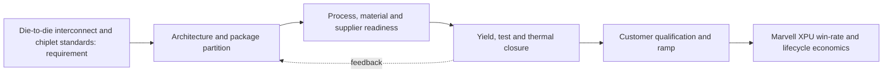

**Figure FIG-MMD-009.** Decision flow for Die-to-die interconnect and chiplet standards. Author-created schematic based on cited sources.

**Comparison table - TBL-MAIN-009A**

| Dimension | Near-term decision | 2027-2030 direction | Marvell action |
|---|---|---|---|
| Architecture | Prove a qualified baseline | Increase modularity and package scale | Maintain reusable floorplans and chiplet interfaces |
| Manufacturing | Secure capacity and test coverage | Add process alternatives where credible | Negotiate configuration-specific capacity and learning access |
| Performance | Close HBM, D2D and I/O budgets | Shift bottlenecks toward power and cooling | Co-optimize package, SerDes, memory and optical IP |
| Economics | Model expected good-package cost | Reduce concentration and scrap exposure | Offer hyperscalers transparent cost/yield trade spaces |
| Roadmap status | Confirmed plus announced | Expected scenarios with triggers | Refresh quarterly and at customer architecture changes |

**Marvell implication matrix - TBL-MAIN-009B**

| Question | Leadership interpretation | Trigger to act |
|---|---|---|
| Does it improve XPU PPA? | Count package-enabled system benefit, not isolated die metrics | Material bandwidth, latency or power advantage |
| Does it improve schedule? | Reuse and qualification depth can outweigh theoretical density | Customer design freeze or foundry rule release |
| Does it reduce supply risk? | A second logo is not a second qualified configuration | Demonstrated equivalent package and test flow |
| Is ownership strategic? | Own differentiating interfaces and data; partner for scale manufacturing | Repeated dependency that affects win rate |

> **Marvell implication:** Treat Die-to-die interconnect and chiplet standards as a customer-facing architecture capability with quantified PPA, yield, cost and supply options. Do not position it as a backend feature or rely on unqualified roadmap claims.

### Section close

- **Why it matters:** It can change attainable bandwidth, power, package size, schedule and hyperscaler TCO.
- **Current maturity:** Mixed by configuration; see profile and roadmap databases.
- **Key bottlenecks:** UCIe 2.0 and 3.0, parallel link pitch, XSR/USR energy.
- **Leading vendors:** See [vendor database](../data/vendor_roadmaps.yaml).
- **Roadmap:** See [2024-2030 roadmap](../data/vendor_roadmaps.yaml).
- **Marvell implication:** Integrate the capability into custom XPU architecture and commercial planning.
- **Corporate development implication:** Target control points where access, IP or scarce process knowledge changes win probability.
- **Open questions:** Qualification timing, capacity allocation, yield at target body size, and customer-specific reliability.
- **Figures and tables included:** FIG-MMD-009; TBL-MAIN-009A; TBL-MAIN-009B.
- **Next refresh recommendation:** 2026-09-10, or earlier on a material vendor or customer roadmap disclosure.

## 10. Substrates, power delivery, thermal and reliability

> **Section metadata**
> - **Section title:** Substrates, power delivery, thermal and reliability
> - **Owner placeholder:** Advanced Packaging Intelligence Owner
> - **Last refreshed date:** 2026-06-10
> - **Refresh status:** Current baseline
> - **Source count:** 3
> - **Confidence level:** Medium-high; confirmed facts separated from announced and inferred roadmap items
> - **Key changes since last refresh:** Initial repository baseline
> - **Open questions:** Customer qualification timing, package-level yields, commercial terms, and capacity allocation
> - **Links to related sections:** [reports/marvell_xpu_implications.md](../reports/marvell_xpu_implications.md), [data/technology_taxonomy.yaml](../data/technology_taxonomy.yaml), [data/source_database.yaml](../data/source_database.yaml)
> - **Figures included:** FIG-MMD-010
> - **Tables included:** TBL-MAIN-010A, TBL-MAIN-010B
> - **Next suggested refresh date:** 2026-09-10

Large AI packages are simultaneously constrained by organic substrate warpage, power-distribution impedance, package-edge escape and heat removal. This section treats public vendor statements as evidence of direction, not as proof of customer-qualified volume. [[SRC-INTEL-002]](../data/source_database.yaml) [[SRC-ANSYS-001]](../data/source_database.yaml) [[SRC-IEEE-001]](../data/source_database.yaml)

### Architecture

The architecture should be evaluated as a system partitioning decision, not as a package label. The decisive boundary is where bandwidth-intensive functions sit relative to compute, memory, I/O and power delivery. A package that minimizes one link may worsen another, so floorplanning must jointly optimize HBM escape routing, die-to-die reach, optical or electrical I/O placement, decoupling and coolant access. For **Substrates, power delivery, thermal and reliability**, the practical focal point is ABF body size. This is a decision variable because it changes the package contract among the XPU architecture, HBM subsystem, connectivity fabric and manufacturing flow. [[SRC-INTEL-002]](../data/source_database.yaml) [[SRC-ANSYS-001]](../data/source_database.yaml) [[SRC-IEEE-001]](../data/source_database.yaml)

### Manufacturing flow

The manufacturing sequence determines accumulated yield and cycle time. Wafer sort, thinning, TSV reveal, redistribution, bump or hybrid-bond preparation, die placement, underfill or molding, substrate attach, lid attach and final test each create distinct defect opportunities. The commercially relevant metric is good systems per start and delivery predictability, not the yield of an isolated process module. For **Substrates, power delivery, thermal and reliability**, the practical focal point is glass core. This is a decision variable because it changes the package contract among the XPU architecture, HBM subsystem, connectivity fabric and manufacturing flow. [[SRC-INTEL-002]](../data/source_database.yaml) [[SRC-ANSYS-001]](../data/source_database.yaml) [[SRC-IEEE-001]](../data/source_database.yaml)

### Materials and process dependencies

Key dependencies include low-loss dielectrics, copper line and via control, ABF or alternative substrate capacity, temporary bonding materials, underfill, molding compound, thermal interface material and metrology. Material choices couple electrical loss, coefficient-of-thermal-expansion mismatch, moisture sensitivity and warpage; substituting a material therefore requires package requalification rather than a procurement-only change. For **Substrates, power delivery, thermal and reliability**, the practical focal point is integrated voltage regulation. This is a decision variable because it changes the package contract among the XPU architecture, HBM subsystem, connectivity fabric and manufacturing flow. [[SRC-INTEL-002]](../data/source_database.yaml) [[SRC-ANSYS-001]](../data/source_database.yaml) [[SRC-IEEE-001]](../data/source_database.yaml)

### Metrics and benchmark discipline

Bandwidth density, energy per bit, latency and pitch are useful only when test conditions are explicit. A short-reach die-to-die demonstration cannot be compared directly with a rack-reach SerDes link, and a bonding-pitch claim does not reveal routable bandwidth after power, keep-out and redundancy are included. The database therefore records ranges and caveats instead of false point precision. For **Substrates, power delivery, thermal and reliability**, the practical focal point is cold plate design. This is a decision variable because it changes the package contract among the XPU architecture, HBM subsystem, connectivity fabric and manufacturing flow. [[SRC-INTEL-002]](../data/source_database.yaml) [[SRC-ANSYS-001]](../data/source_database.yaml) [[SRC-IEEE-001]](../data/source_database.yaml)

### Economics and yield

Cost is dominated by more than assembly price. Expensive known-good logic and HBM make scrap exposure material; larger interposers and substrates reduce units per panel or wafer; additional test insertions raise cost but can prevent higher downstream loss. The correct model values expected good-package cost, schedule risk and customer revenue exposure from missed ramps. For **Substrates, power delivery, thermal and reliability**, the practical focal point is thermo-mechanical fatigue. This is a decision variable because it changes the package contract among the XPU architecture, HBM subsystem, connectivity fabric and manufacturing flow. [[SRC-INTEL-002]](../data/source_database.yaml) [[SRC-ANSYS-001]](../data/source_database.yaml) [[SRC-IEEE-001]](../data/source_database.yaml)

### Thermal and power

Thermal design is becoming an architecture constraint. HBM, logic, optical engines and voltage conversion compete for package edge, vertical heat paths and coolant temperature budget. Hot spots, lateral gradients and thermo-mechanical cycling can reduce attainable frequency or lifetime even when average package power remains within a cold-plate rating. For **Substrates, power delivery, thermal and reliability**, the practical focal point is ABF body size. This is a decision variable because it changes the package contract among the XPU architecture, HBM subsystem, connectivity fabric and manufacturing flow. [[SRC-INTEL-002]](../data/source_database.yaml) [[SRC-ANSYS-001]](../data/source_database.yaml) [[SRC-IEEE-001]](../data/source_database.yaml)

### Supply chain and adoption

Adoption requires simultaneous readiness across foundry packaging, memory, substrate, OSAT or test, EDA signoff, system cooling and customer qualification. A nominally mature process may still be unavailable at the required body size, HBM count or regional supply path. Supplier concentration should therefore be tracked by qualified configuration, not vendor logo count. For **Substrates, power delivery, thermal and reliability**, the practical focal point is glass core. This is a decision variable because it changes the package contract among the XPU architecture, HBM subsystem, connectivity fabric and manufacturing flow. [[SRC-INTEL-002]](../data/source_database.yaml) [[SRC-ANSYS-001]](../data/source_database.yaml) [[SRC-IEEE-001]](../data/source_database.yaml)

### Competitive implications

Control of design rules, characterization data and capacity reservations can create a competitive moat. NVIDIA and Broadcom can optimize around large internal volumes, while merchant custom-silicon providers must convert ecosystem breadth and reusable IP into comparable schedule certainty. Open standards reduce switching friction only after interoperable silicon, test and software are proven. For **Substrates, power delivery, thermal and reliability**, the practical focal point is integrated voltage regulation. This is a decision variable because it changes the package contract among the XPU architecture, HBM subsystem, connectivity fabric and manufacturing flow. [[SRC-INTEL-002]](../data/source_database.yaml) [[SRC-ANSYS-001]](../data/source_database.yaml) [[SRC-IEEE-001]](../data/source_database.yaml)

### Marvell implication

Marvell should package this capability as part of an end-to-end XPU platform: architecture exploration, reusable die-to-die and HBM IP, package and board co-design, manufacturing ownership, test strategy and lifecycle telemetry. The differentiation is not ownership of every factory step; it is the ability to give a hyperscaler a credible performance, cost, yield and supply plan before design freeze. For **Substrates, power delivery, thermal and reliability**, the practical focal point is cold plate design. This is a decision variable because it changes the package contract among the XPU architecture, HBM subsystem, connectivity fabric and manufacturing flow. [[SRC-INTEL-002]](../data/source_database.yaml) [[SRC-ANSYS-001]](../data/source_database.yaml) [[SRC-IEEE-001]](../data/source_database.yaml)

### Corporate development implication

Partnership or investment should target capability gaps that are difficult to reproduce through ordinary sourcing: optical attach, thermal materials and structures, chiplet test, multi-physics automation, advanced substrate process know-how and interoperable die-to-die IP. Acquisitions deserve consideration only where control materially improves XPU win probability or protects a strategic interface. For **Substrates, power delivery, thermal and reliability**, the practical focal point is thermo-mechanical fatigue. This is a decision variable because it changes the package contract among the XPU architecture, HBM subsystem, connectivity fabric and manufacturing flow. [[SRC-INTEL-002]](../data/source_database.yaml) [[SRC-ANSYS-001]](../data/source_database.yaml) [[SRC-IEEE-001]](../data/source_database.yaml)

### Roadmap through 2030

The likely trajectory is larger and more heterogeneous packages, finer vertical connections, more customized memory base dies, greater use of local bridges or RDL to manage cost, and optics moving closer to high-radix switch and selected compute packages. The pace will be gated by yield learning, serviceability and power removal rather than by interconnect demonstrations alone. For **Substrates, power delivery, thermal and reliability**, the practical focal point is ABF body size. This is a decision variable because it changes the package contract among the XPU architecture, HBM subsystem, connectivity fabric and manufacturing flow. [[SRC-INTEL-002]](../data/source_database.yaml) [[SRC-ANSYS-001]](../data/source_database.yaml) [[SRC-IEEE-001]](../data/source_database.yaml)

### Diligence priorities

Leadership should request configuration-specific evidence: qualified dimensions, HBM stack count, power map, thermal resistance, warpage, known-good-die coverage, repair flow, monthly capacity, cycle time, second-source path and cost sensitivity. Claims without these fields should remain announced or expected in the roadmap rather than promoted to confirmed. For **Substrates, power delivery, thermal and reliability**, the practical focal point is glass core. This is a decision variable because it changes the package contract among the XPU architecture, HBM subsystem, connectivity fabric and manufacturing flow. [[SRC-INTEL-002]](../data/source_database.yaml) [[SRC-ANSYS-001]](../data/source_database.yaml) [[SRC-IEEE-001]](../data/source_database.yaml)

**Figure FIG-MMD-010.** Decision flow for Substrates, power delivery, thermal and reliability. Author-created schematic based on cited sources.

**Comparison table - TBL-MAIN-010A**

| Dimension | Near-term decision | 2027-2030 direction | Marvell action |
|---|---|---|---|
| Architecture | Prove a qualified baseline | Increase modularity and package scale | Maintain reusable floorplans and chiplet interfaces |
| Manufacturing | Secure capacity and test coverage | Add process alternatives where credible | Negotiate configuration-specific capacity and learning access |
| Performance | Close HBM, D2D and I/O budgets | Shift bottlenecks toward power and cooling | Co-optimize package, SerDes, memory and optical IP |
| Economics | Model expected good-package cost | Reduce concentration and scrap exposure | Offer hyperscalers transparent cost/yield trade spaces |
| Roadmap status | Confirmed plus announced | Expected scenarios with triggers | Refresh quarterly and at customer architecture changes |

**Marvell implication matrix - TBL-MAIN-010B**

| Question | Leadership interpretation | Trigger to act |
|---|---|---|
| Does it improve XPU PPA? | Count package-enabled system benefit, not isolated die metrics | Material bandwidth, latency or power advantage |
| Does it improve schedule? | Reuse and qualification depth can outweigh theoretical density | Customer design freeze or foundry rule release |
| Does it reduce supply risk? | A second logo is not a second qualified configuration | Demonstrated equivalent package and test flow |
| Is ownership strategic? | Own differentiating interfaces and data; partner for scale manufacturing | Repeated dependency that affects win rate |

> **Marvell implication:** Treat Substrates, power delivery, thermal and reliability as a customer-facing architecture capability with quantified PPA, yield, cost and supply options. Do not position it as a backend feature or rely on unqualified roadmap claims.

### Section close

- **Why it matters:** It can change attainable bandwidth, power, package size, schedule and hyperscaler TCO.
- **Current maturity:** Mixed by configuration; see profile and roadmap databases.
- **Key bottlenecks:** ABF body size, glass core, integrated voltage regulation.
- **Leading vendors:** See [vendor database](../data/vendor_roadmaps.yaml).
- **Roadmap:** See [2024-2030 roadmap](../data/vendor_roadmaps.yaml).
- **Marvell implication:** Integrate the capability into custom XPU architecture and commercial planning.
- **Corporate development implication:** Target control points where access, IP or scarce process knowledge changes win probability.
- **Open questions:** Qualification timing, capacity allocation, yield at target body size, and customer-specific reliability.
- **Figures and tables included:** FIG-MMD-010; TBL-MAIN-010A; TBL-MAIN-010B.
- **Next refresh recommendation:** 2026-09-10, or earlier on a material vendor or customer roadmap disclosure.

## 11. Test, yield, capacity and supply-chain constraints

> **Section metadata**
> - **Section title:** Test, yield, capacity and supply-chain constraints
> - **Owner placeholder:** Advanced Packaging Intelligence Owner
> - **Last refreshed date:** 2026-06-10
> - **Refresh status:** Current baseline
> - **Source count:** 3
> - **Confidence level:** Medium-high; confirmed facts separated from announced and inferred roadmap items
> - **Key changes since last refresh:** Initial repository baseline
> - **Open questions:** Customer qualification timing, package-level yields, commercial terms, and capacity allocation
> - **Links to related sections:** [reports/marvell_xpu_implications.md](../reports/marvell_xpu_implications.md), [data/technology_taxonomy.yaml](../data/technology_taxonomy.yaml), [data/source_database.yaml](../data/source_database.yaml)
> - **Figures included:** FIG-MMD-011
> - **Tables included:** TBL-MAIN-011A, TBL-MAIN-011B
> - **Next suggested refresh date:** 2026-09-10

Multi-die economics compound the yield and schedule of logic, HBM, interposer, substrate, assembly and test; known-good-die discipline is therefore central. This section treats public vendor statements as evidence of direction, not as proof of customer-qualified volume. [[SRC-AMKOR-001]](../data/source_database.yaml) [[SRC-ASE-001]](../data/source_database.yaml) [[SRC-ECTC-001]](../data/source_database.yaml)

### Architecture

The architecture should be evaluated as a system partitioning decision, not as a package label. The decisive boundary is where bandwidth-intensive functions sit relative to compute, memory, I/O and power delivery. A package that minimizes one link may worsen another, so floorplanning must jointly optimize HBM escape routing, die-to-die reach, optical or electrical I/O placement, decoupling and coolant access. For **Test, yield, capacity and supply-chain constraints**, the practical focal point is wafer sort coverage. This is a decision variable because it changes the package contract among the XPU architecture, HBM subsystem, connectivity fabric and manufacturing flow. [[SRC-AMKOR-001]](../data/source_database.yaml) [[SRC-ASE-001]](../data/source_database.yaml) [[SRC-ECTC-001]](../data/source_database.yaml)

### Manufacturing flow

The manufacturing sequence determines accumulated yield and cycle time. Wafer sort, thinning, TSV reveal, redistribution, bump or hybrid-bond preparation, die placement, underfill or molding, substrate attach, lid attach and final test each create distinct defect opportunities. The commercially relevant metric is good systems per start and delivery predictability, not the yield of an isolated process module. For **Test, yield, capacity and supply-chain constraints**, the practical focal point is HBM test. This is a decision variable because it changes the package contract among the XPU architecture, HBM subsystem, connectivity fabric and manufacturing flow. [[SRC-AMKOR-001]](../data/source_database.yaml) [[SRC-ASE-001]](../data/source_database.yaml) [[SRC-ECTC-001]](../data/source_database.yaml)

### Materials and process dependencies

Key dependencies include low-loss dielectrics, copper line and via control, ABF or alternative substrate capacity, temporary bonding materials, underfill, molding compound, thermal interface material and metrology. Material choices couple electrical loss, coefficient-of-thermal-expansion mismatch, moisture sensitivity and warpage; substituting a material therefore requires package requalification rather than a procurement-only change. For **Test, yield, capacity and supply-chain constraints**, the practical focal point is mid-bond test. This is a decision variable because it changes the package contract among the XPU architecture, HBM subsystem, connectivity fabric and manufacturing flow. [[SRC-AMKOR-001]](../data/source_database.yaml) [[SRC-ASE-001]](../data/source_database.yaml) [[SRC-ECTC-001]](../data/source_database.yaml)

### Metrics and benchmark discipline

Bandwidth density, energy per bit, latency and pitch are useful only when test conditions are explicit. A short-reach die-to-die demonstration cannot be compared directly with a rack-reach SerDes link, and a bonding-pitch claim does not reveal routable bandwidth after power, keep-out and redundancy are included. The database therefore records ranges and caveats instead of false point precision. For **Test, yield, capacity and supply-chain constraints**, the practical focal point is repair strategy. This is a decision variable because it changes the package contract among the XPU architecture, HBM subsystem, connectivity fabric and manufacturing flow. [[SRC-AMKOR-001]](../data/source_database.yaml) [[SRC-ASE-001]](../data/source_database.yaml) [[SRC-ECTC-001]](../data/source_database.yaml)

### Economics and yield

Cost is dominated by more than assembly price. Expensive known-good logic and HBM make scrap exposure material; larger interposers and substrates reduce units per panel or wafer; additional test insertions raise cost but can prevent higher downstream loss. The correct model values expected good-package cost, schedule risk and customer revenue exposure from missed ramps. For **Test, yield, capacity and supply-chain constraints**, the practical focal point is capacity allocation. This is a decision variable because it changes the package contract among the XPU architecture, HBM subsystem, connectivity fabric and manufacturing flow. [[SRC-AMKOR-001]](../data/source_database.yaml) [[SRC-ASE-001]](../data/source_database.yaml) [[SRC-ECTC-001]](../data/source_database.yaml)

### Thermal and power

Thermal design is becoming an architecture constraint. HBM, logic, optical engines and voltage conversion compete for package edge, vertical heat paths and coolant temperature budget. Hot spots, lateral gradients and thermo-mechanical cycling can reduce attainable frequency or lifetime even when average package power remains within a cold-plate rating. For **Test, yield, capacity and supply-chain constraints**, the practical focal point is wafer sort coverage. This is a decision variable because it changes the package contract among the XPU architecture, HBM subsystem, connectivity fabric and manufacturing flow. [[SRC-AMKOR-001]](../data/source_database.yaml) [[SRC-ASE-001]](../data/source_database.yaml) [[SRC-ECTC-001]](../data/source_database.yaml)

### Supply chain and adoption

Adoption requires simultaneous readiness across foundry packaging, memory, substrate, OSAT or test, EDA signoff, system cooling and customer qualification. A nominally mature process may still be unavailable at the required body size, HBM count or regional supply path. Supplier concentration should therefore be tracked by qualified configuration, not vendor logo count. For **Test, yield, capacity and supply-chain constraints**, the practical focal point is HBM test. This is a decision variable because it changes the package contract among the XPU architecture, HBM subsystem, connectivity fabric and manufacturing flow. [[SRC-AMKOR-001]](../data/source_database.yaml) [[SRC-ASE-001]](../data/source_database.yaml) [[SRC-ECTC-001]](../data/source_database.yaml)

### Competitive implications

Control of design rules, characterization data and capacity reservations can create a competitive moat. NVIDIA and Broadcom can optimize around large internal volumes, while merchant custom-silicon providers must convert ecosystem breadth and reusable IP into comparable schedule certainty. Open standards reduce switching friction only after interoperable silicon, test and software are proven. For **Test, yield, capacity and supply-chain constraints**, the practical focal point is mid-bond test. This is a decision variable because it changes the package contract among the XPU architecture, HBM subsystem, connectivity fabric and manufacturing flow. [[SRC-AMKOR-001]](../data/source_database.yaml) [[SRC-ASE-001]](../data/source_database.yaml) [[SRC-ECTC-001]](../data/source_database.yaml)

### Marvell implication

Marvell should package this capability as part of an end-to-end XPU platform: architecture exploration, reusable die-to-die and HBM IP, package and board co-design, manufacturing ownership, test strategy and lifecycle telemetry. The differentiation is not ownership of every factory step; it is the ability to give a hyperscaler a credible performance, cost, yield and supply plan before design freeze. For **Test, yield, capacity and supply-chain constraints**, the practical focal point is repair strategy. This is a decision variable because it changes the package contract among the XPU architecture, HBM subsystem, connectivity fabric and manufacturing flow. [[SRC-AMKOR-001]](../data/source_database.yaml) [[SRC-ASE-001]](../data/source_database.yaml) [[SRC-ECTC-001]](../data/source_database.yaml)

### Corporate development implication

Partnership or investment should target capability gaps that are difficult to reproduce through ordinary sourcing: optical attach, thermal materials and structures, chiplet test, multi-physics automation, advanced substrate process know-how and interoperable die-to-die IP. Acquisitions deserve consideration only where control materially improves XPU win probability or protects a strategic interface. For **Test, yield, capacity and supply-chain constraints**, the practical focal point is capacity allocation. This is a decision variable because it changes the package contract among the XPU architecture, HBM subsystem, connectivity fabric and manufacturing flow. [[SRC-AMKOR-001]](../data/source_database.yaml) [[SRC-ASE-001]](../data/source_database.yaml) [[SRC-ECTC-001]](../data/source_database.yaml)

### Roadmap through 2030

The likely trajectory is larger and more heterogeneous packages, finer vertical connections, more customized memory base dies, greater use of local bridges or RDL to manage cost, and optics moving closer to high-radix switch and selected compute packages. The pace will be gated by yield learning, serviceability and power removal rather than by interconnect demonstrations alone. For **Test, yield, capacity and supply-chain constraints**, the practical focal point is wafer sort coverage. This is a decision variable because it changes the package contract among the XPU architecture, HBM subsystem, connectivity fabric and manufacturing flow. [[SRC-AMKOR-001]](../data/source_database.yaml) [[SRC-ASE-001]](../data/source_database.yaml) [[SRC-ECTC-001]](../data/source_database.yaml)

### Diligence priorities

Leadership should request configuration-specific evidence: qualified dimensions, HBM stack count, power map, thermal resistance, warpage, known-good-die coverage, repair flow, monthly capacity, cycle time, second-source path and cost sensitivity. Claims without these fields should remain announced or expected in the roadmap rather than promoted to confirmed. For **Test, yield, capacity and supply-chain constraints**, the practical focal point is HBM test. This is a decision variable because it changes the package contract among the XPU architecture, HBM subsystem, connectivity fabric and manufacturing flow. [[SRC-AMKOR-001]](../data/source_database.yaml) [[SRC-ASE-001]](../data/source_database.yaml) [[SRC-ECTC-001]](../data/source_database.yaml)

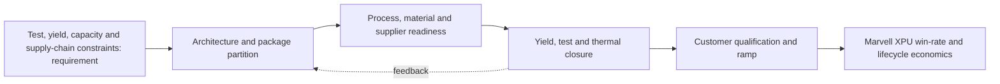

**Figure FIG-MMD-011.** Decision flow for Test, yield, capacity and supply-chain constraints. Author-created schematic based on cited sources.

**Comparison table - TBL-MAIN-011A**

| Dimension | Near-term decision | 2027-2030 direction | Marvell action |
|---|---|---|---|
| Architecture | Prove a qualified baseline | Increase modularity and package scale | Maintain reusable floorplans and chiplet interfaces |
| Manufacturing | Secure capacity and test coverage | Add process alternatives where credible | Negotiate configuration-specific capacity and learning access |
| Performance | Close HBM, D2D and I/O budgets | Shift bottlenecks toward power and cooling | Co-optimize package, SerDes, memory and optical IP |
| Economics | Model expected good-package cost | Reduce concentration and scrap exposure | Offer hyperscalers transparent cost/yield trade spaces |
| Roadmap status | Confirmed plus announced | Expected scenarios with triggers | Refresh quarterly and at customer architecture changes |

**Marvell implication matrix - TBL-MAIN-011B**

| Question | Leadership interpretation | Trigger to act |
|---|---|---|
| Does it improve XPU PPA? | Count package-enabled system benefit, not isolated die metrics | Material bandwidth, latency or power advantage |
| Does it improve schedule? | Reuse and qualification depth can outweigh theoretical density | Customer design freeze or foundry rule release |
| Does it reduce supply risk? | A second logo is not a second qualified configuration | Demonstrated equivalent package and test flow |
| Is ownership strategic? | Own differentiating interfaces and data; partner for scale manufacturing | Repeated dependency that affects win rate |

> **Marvell implication:** Treat Test, yield, capacity and supply-chain constraints as a customer-facing architecture capability with quantified PPA, yield, cost and supply options. Do not position it as a backend feature or rely on unqualified roadmap claims.

### Section close

- **Why it matters:** It can change attainable bandwidth, power, package size, schedule and hyperscaler TCO.
- **Current maturity:** Mixed by configuration; see profile and roadmap databases.
- **Key bottlenecks:** wafer sort coverage, HBM test, mid-bond test.
- **Leading vendors:** See [vendor database](../data/vendor_roadmaps.yaml).
- **Roadmap:** See [2024-2030 roadmap](../data/vendor_roadmaps.yaml).
- **Marvell implication:** Integrate the capability into custom XPU architecture and commercial planning.
- **Corporate development implication:** Target control points where access, IP or scarce process knowledge changes win probability.
- **Open questions:** Qualification timing, capacity allocation, yield at target body size, and customer-specific reliability.
- **Figures and tables included:** FIG-MMD-011; TBL-MAIN-011A; TBL-MAIN-011B.
- **Next refresh recommendation:** 2026-09-10, or earlier on a material vendor or customer roadmap disclosure.

## 12. Vendor roadmap comparison

> **Section metadata**
> - **Section title:** Vendor roadmap comparison
> - **Owner placeholder:** Advanced Packaging Intelligence Owner
> - **Last refreshed date:** 2026-06-10
> - **Refresh status:** Current baseline
> - **Source count:** 4
> - **Confidence level:** Medium-high; confirmed facts separated from announced and inferred roadmap items
> - **Key changes since last refresh:** Initial repository baseline
> - **Open questions:** Customer qualification timing, package-level yields, commercial terms, and capacity allocation
> - **Links to related sections:** [reports/marvell_xpu_implications.md](../reports/marvell_xpu_implications.md), [data/technology_taxonomy.yaml](../data/technology_taxonomy.yaml), [data/source_database.yaml](../data/source_database.yaml)
> - **Figures included:** FIG-MMD-012
> - **Tables included:** TBL-MAIN-012A, TBL-MAIN-012B
> - **Next suggested refresh date:** 2026-09-10

Roadmaps must be normalized by evidence status because a shipping package, an announced platform and a conference test vehicle carry different commercial implications. This section treats public vendor statements as evidence of direction, not as proof of customer-qualified volume. [[SRC-TSMC-003]](../data/source_database.yaml) [[SRC-INTEL-001]](../data/source_database.yaml) [[SRC-SAMSUNG-001]](../data/source_database.yaml) [[SRC-SKH-001]](../data/source_database.yaml)

### Architecture

The architecture should be evaluated as a system partitioning decision, not as a package label. The decisive boundary is where bandwidth-intensive functions sit relative to compute, memory, I/O and power delivery. A package that minimizes one link may worsen another, so floorplanning must jointly optimize HBM escape routing, die-to-die reach, optical or electrical I/O placement, decoupling and coolant access. For **Vendor roadmap comparison**, the practical focal point is foundry platforms. This is a decision variable because it changes the package contract among the XPU architecture, HBM subsystem, connectivity fabric and manufacturing flow. [[SRC-TSMC-003]](../data/source_database.yaml) [[SRC-INTEL-001]](../data/source_database.yaml) [[SRC-SAMSUNG-001]](../data/source_database.yaml) [[SRC-SKH-001]](../data/source_database.yaml)

### Manufacturing flow

The manufacturing sequence determines accumulated yield and cycle time. Wafer sort, thinning, TSV reveal, redistribution, bump or hybrid-bond preparation, die placement, underfill or molding, substrate attach, lid attach and final test each create distinct defect opportunities. The commercially relevant metric is good systems per start and delivery predictability, not the yield of an isolated process module. For **Vendor roadmap comparison**, the practical focal point is OSAT alternatives. This is a decision variable because it changes the package contract among the XPU architecture, HBM subsystem, connectivity fabric and manufacturing flow. [[SRC-TSMC-003]](../data/source_database.yaml) [[SRC-INTEL-001]](../data/source_database.yaml) [[SRC-SAMSUNG-001]](../data/source_database.yaml) [[SRC-SKH-001]](../data/source_database.yaml)

### Materials and process dependencies

Key dependencies include low-loss dielectrics, copper line and via control, ABF or alternative substrate capacity, temporary bonding materials, underfill, molding compound, thermal interface material and metrology. Material choices couple electrical loss, coefficient-of-thermal-expansion mismatch, moisture sensitivity and warpage; substituting a material therefore requires package requalification rather than a procurement-only change. For **Vendor roadmap comparison**, the practical focal point is HBM vendor timing. This is a decision variable because it changes the package contract among the XPU architecture, HBM subsystem, connectivity fabric and manufacturing flow. [[SRC-TSMC-003]](../data/source_database.yaml) [[SRC-INTEL-001]](../data/source_database.yaml) [[SRC-SAMSUNG-001]](../data/source_database.yaml) [[SRC-SKH-001]](../data/source_database.yaml)

### Metrics and benchmark discipline

Bandwidth density, energy per bit, latency and pitch are useful only when test conditions are explicit. A short-reach die-to-die demonstration cannot be compared directly with a rack-reach SerDes link, and a bonding-pitch claim does not reveal routable bandwidth after power, keep-out and redundancy are included. The database therefore records ranges and caveats instead of false point precision. For **Vendor roadmap comparison**, the practical focal point is CPO readiness. This is a decision variable because it changes the package contract among the XPU architecture, HBM subsystem, connectivity fabric and manufacturing flow. [[SRC-TSMC-003]](../data/source_database.yaml) [[SRC-INTEL-001]](../data/source_database.yaml) [[SRC-SAMSUNG-001]](../data/source_database.yaml) [[SRC-SKH-001]](../data/source_database.yaml)

### Economics and yield

Cost is dominated by more than assembly price. Expensive known-good logic and HBM make scrap exposure material; larger interposers and substrates reduce units per panel or wafer; additional test insertions raise cost but can prevent higher downstream loss. The correct model values expected good-package cost, schedule risk and customer revenue exposure from missed ramps. For **Vendor roadmap comparison**, the practical focal point is EDA enablement. This is a decision variable because it changes the package contract among the XPU architecture, HBM subsystem, connectivity fabric and manufacturing flow. [[SRC-TSMC-003]](../data/source_database.yaml) [[SRC-INTEL-001]](../data/source_database.yaml) [[SRC-SAMSUNG-001]](../data/source_database.yaml) [[SRC-SKH-001]](../data/source_database.yaml)

### Thermal and power

Thermal design is becoming an architecture constraint. HBM, logic, optical engines and voltage conversion compete for package edge, vertical heat paths and coolant temperature budget. Hot spots, lateral gradients and thermo-mechanical cycling can reduce attainable frequency or lifetime even when average package power remains within a cold-plate rating. For **Vendor roadmap comparison**, the practical focal point is foundry platforms. This is a decision variable because it changes the package contract among the XPU architecture, HBM subsystem, connectivity fabric and manufacturing flow. [[SRC-TSMC-003]](../data/source_database.yaml) [[SRC-INTEL-001]](../data/source_database.yaml) [[SRC-SAMSUNG-001]](../data/source_database.yaml) [[SRC-SKH-001]](../data/source_database.yaml)

### Supply chain and adoption

Adoption requires simultaneous readiness across foundry packaging, memory, substrate, OSAT or test, EDA signoff, system cooling and customer qualification. A nominally mature process may still be unavailable at the required body size, HBM count or regional supply path. Supplier concentration should therefore be tracked by qualified configuration, not vendor logo count. For **Vendor roadmap comparison**, the practical focal point is OSAT alternatives. This is a decision variable because it changes the package contract among the XPU architecture, HBM subsystem, connectivity fabric and manufacturing flow. [[SRC-TSMC-003]](../data/source_database.yaml) [[SRC-INTEL-001]](../data/source_database.yaml) [[SRC-SAMSUNG-001]](../data/source_database.yaml) [[SRC-SKH-001]](../data/source_database.yaml)

### Competitive implications

Control of design rules, characterization data and capacity reservations can create a competitive moat. NVIDIA and Broadcom can optimize around large internal volumes, while merchant custom-silicon providers must convert ecosystem breadth and reusable IP into comparable schedule certainty. Open standards reduce switching friction only after interoperable silicon, test and software are proven. For **Vendor roadmap comparison**, the practical focal point is HBM vendor timing. This is a decision variable because it changes the package contract among the XPU architecture, HBM subsystem, connectivity fabric and manufacturing flow. [[SRC-TSMC-003]](../data/source_database.yaml) [[SRC-INTEL-001]](../data/source_database.yaml) [[SRC-SAMSUNG-001]](../data/source_database.yaml) [[SRC-SKH-001]](../data/source_database.yaml)

### Marvell implication

Marvell should package this capability as part of an end-to-end XPU platform: architecture exploration, reusable die-to-die and HBM IP, package and board co-design, manufacturing ownership, test strategy and lifecycle telemetry. The differentiation is not ownership of every factory step; it is the ability to give a hyperscaler a credible performance, cost, yield and supply plan before design freeze. For **Vendor roadmap comparison**, the practical focal point is CPO readiness. This is a decision variable because it changes the package contract among the XPU architecture, HBM subsystem, connectivity fabric and manufacturing flow. [[SRC-TSMC-003]](../data/source_database.yaml) [[SRC-INTEL-001]](../data/source_database.yaml) [[SRC-SAMSUNG-001]](../data/source_database.yaml) [[SRC-SKH-001]](../data/source_database.yaml)

### Corporate development implication

Partnership or investment should target capability gaps that are difficult to reproduce through ordinary sourcing: optical attach, thermal materials and structures, chiplet test, multi-physics automation, advanced substrate process know-how and interoperable die-to-die IP. Acquisitions deserve consideration only where control materially improves XPU win probability or protects a strategic interface. For **Vendor roadmap comparison**, the practical focal point is EDA enablement. This is a decision variable because it changes the package contract among the XPU architecture, HBM subsystem, connectivity fabric and manufacturing flow. [[SRC-TSMC-003]](../data/source_database.yaml) [[SRC-INTEL-001]](../data/source_database.yaml) [[SRC-SAMSUNG-001]](../data/source_database.yaml) [[SRC-SKH-001]](../data/source_database.yaml)

### Roadmap through 2030

The likely trajectory is larger and more heterogeneous packages, finer vertical connections, more customized memory base dies, greater use of local bridges or RDL to manage cost, and optics moving closer to high-radix switch and selected compute packages. The pace will be gated by yield learning, serviceability and power removal rather than by interconnect demonstrations alone. For **Vendor roadmap comparison**, the practical focal point is foundry platforms. This is a decision variable because it changes the package contract among the XPU architecture, HBM subsystem, connectivity fabric and manufacturing flow. [[SRC-TSMC-003]](../data/source_database.yaml) [[SRC-INTEL-001]](../data/source_database.yaml) [[SRC-SAMSUNG-001]](../data/source_database.yaml) [[SRC-SKH-001]](../data/source_database.yaml)

### Diligence priorities

Leadership should request configuration-specific evidence: qualified dimensions, HBM stack count, power map, thermal resistance, warpage, known-good-die coverage, repair flow, monthly capacity, cycle time, second-source path and cost sensitivity. Claims without these fields should remain announced or expected in the roadmap rather than promoted to confirmed. For **Vendor roadmap comparison**, the practical focal point is OSAT alternatives. This is a decision variable because it changes the package contract among the XPU architecture, HBM subsystem, connectivity fabric and manufacturing flow. [[SRC-TSMC-003]](../data/source_database.yaml) [[SRC-INTEL-001]](../data/source_database.yaml) [[SRC-SAMSUNG-001]](../data/source_database.yaml) [[SRC-SKH-001]](../data/source_database.yaml)

**Figure FIG-MMD-012.** Decision flow for Vendor roadmap comparison. Author-created schematic based on cited sources.

**Comparison table - TBL-MAIN-012A**

| Dimension | Near-term decision | 2027-2030 direction | Marvell action |
|---|---|---|---|
| Architecture | Prove a qualified baseline | Increase modularity and package scale | Maintain reusable floorplans and chiplet interfaces |
| Manufacturing | Secure capacity and test coverage | Add process alternatives where credible | Negotiate configuration-specific capacity and learning access |
| Performance | Close HBM, D2D and I/O budgets | Shift bottlenecks toward power and cooling | Co-optimize package, SerDes, memory and optical IP |
| Economics | Model expected good-package cost | Reduce concentration and scrap exposure | Offer hyperscalers transparent cost/yield trade spaces |
| Roadmap status | Confirmed plus announced | Expected scenarios with triggers | Refresh quarterly and at customer architecture changes |

**Marvell implication matrix - TBL-MAIN-012B**

| Question | Leadership interpretation | Trigger to act |
|---|---|---|
| Does it improve XPU PPA? | Count package-enabled system benefit, not isolated die metrics | Material bandwidth, latency or power advantage |
| Does it improve schedule? | Reuse and qualification depth can outweigh theoretical density | Customer design freeze or foundry rule release |
| Does it reduce supply risk? | A second logo is not a second qualified configuration | Demonstrated equivalent package and test flow |
| Is ownership strategic? | Own differentiating interfaces and data; partner for scale manufacturing | Repeated dependency that affects win rate |

> **Marvell implication:** Treat Vendor roadmap comparison as a customer-facing architecture capability with quantified PPA, yield, cost and supply options. Do not position it as a backend feature or rely on unqualified roadmap claims.

### Section close

- **Why it matters:** It can change attainable bandwidth, power, package size, schedule and hyperscaler TCO.
- **Current maturity:** Mixed by configuration; see profile and roadmap databases.
- **Key bottlenecks:** foundry platforms, OSAT alternatives, HBM vendor timing.
- **Leading vendors:** See [vendor database](../data/vendor_roadmaps.yaml).
- **Roadmap:** See [2024-2030 roadmap](../data/vendor_roadmaps.yaml).
- **Marvell implication:** Integrate the capability into custom XPU architecture and commercial planning.
- **Corporate development implication:** Target control points where access, IP or scarce process knowledge changes win probability.
- **Open questions:** Qualification timing, capacity allocation, yield at target body size, and customer-specific reliability.
- **Figures and tables included:** FIG-MMD-012; TBL-MAIN-012A; TBL-MAIN-012B.
- **Next refresh recommendation:** 2026-09-10, or earlier on a material vendor or customer roadmap disclosure.

## 13. Hyperscaler XPU packaging requirements

> **Section metadata**
> - **Section title:** Hyperscaler XPU packaging requirements
> - **Owner placeholder:** Advanced Packaging Intelligence Owner
> - **Last refreshed date:** 2026-06-10
> - **Refresh status:** Current baseline
> - **Source count:** 3
> - **Confidence level:** Medium-high; confirmed facts separated from announced and inferred roadmap items
> - **Key changes since last refresh:** Initial repository baseline
> - **Open questions:** Customer qualification timing, package-level yields, commercial terms, and capacity allocation
> - **Links to related sections:** [reports/marvell_xpu_implications.md](../reports/marvell_xpu_implications.md), [data/technology_taxonomy.yaml](../data/technology_taxonomy.yaml), [data/source_database.yaml](../data/source_database.yaml)
> - **Figures included:** FIG-MMD-013
> - **Tables included:** TBL-MAIN-013A, TBL-MAIN-013B
> - **Next suggested refresh date:** 2026-09-10

Hyperscalers optimize different objective functions: training prioritizes bandwidth and scale, inference emphasizes cost and power, and internal ASIC teams value customization and schedule control. This section treats public vendor statements as evidence of direction, not as proof of customer-qualified volume. [[SRC-MRVL-001]](../data/source_database.yaml) [[SRC-NVIDIA-001]](../data/source_database.yaml) [[SRC-UET-001]](../data/source_database.yaml)

### Architecture

The architecture should be evaluated as a system partitioning decision, not as a package label. The decisive boundary is where bandwidth-intensive functions sit relative to compute, memory, I/O and power delivery. A package that minimizes one link may worsen another, so floorplanning must jointly optimize HBM escape routing, die-to-die reach, optical or electrical I/O placement, decoupling and coolant access. For **Hyperscaler XPU packaging requirements**, the practical focal point is training bandwidth. This is a decision variable because it changes the package contract among the XPU architecture, HBM subsystem, connectivity fabric and manufacturing flow. [[SRC-MRVL-001]](../data/source_database.yaml) [[SRC-NVIDIA-001]](../data/source_database.yaml) [[SRC-UET-001]](../data/source_database.yaml)

### Manufacturing flow

The manufacturing sequence determines accumulated yield and cycle time. Wafer sort, thinning, TSV reveal, redistribution, bump or hybrid-bond preparation, die placement, underfill or molding, substrate attach, lid attach and final test each create distinct defect opportunities. The commercially relevant metric is good systems per start and delivery predictability, not the yield of an isolated process module. For **Hyperscaler XPU packaging requirements**, the practical focal point is inference cost per token. This is a decision variable because it changes the package contract among the XPU architecture, HBM subsystem, connectivity fabric and manufacturing flow. [[SRC-MRVL-001]](../data/source_database.yaml) [[SRC-NVIDIA-001]](../data/source_database.yaml) [[SRC-UET-001]](../data/source_database.yaml)

### Materials and process dependencies

Key dependencies include low-loss dielectrics, copper line and via control, ABF or alternative substrate capacity, temporary bonding materials, underfill, molding compound, thermal interface material and metrology. Material choices couple electrical loss, coefficient-of-thermal-expansion mismatch, moisture sensitivity and warpage; substituting a material therefore requires package requalification rather than a procurement-only change. For **Hyperscaler XPU packaging requirements**, the practical focal point is neocloud serviceability. This is a decision variable because it changes the package contract among the XPU architecture, HBM subsystem, connectivity fabric and manufacturing flow. [[SRC-MRVL-001]](../data/source_database.yaml) [[SRC-NVIDIA-001]](../data/source_database.yaml) [[SRC-UET-001]](../data/source_database.yaml)

### Metrics and benchmark discipline

Bandwidth density, energy per bit, latency and pitch are useful only when test conditions are explicit. A short-reach die-to-die demonstration cannot be compared directly with a rack-reach SerDes link, and a bonding-pitch claim does not reveal routable bandwidth after power, keep-out and redundancy are included. The database therefore records ranges and caveats instead of false point precision. For **Hyperscaler XPU packaging requirements**, the practical focal point is multi-source resilience. This is a decision variable because it changes the package contract among the XPU architecture, HBM subsystem, connectivity fabric and manufacturing flow. [[SRC-MRVL-001]](../data/source_database.yaml) [[SRC-NVIDIA-001]](../data/source_database.yaml) [[SRC-UET-001]](../data/source_database.yaml)

### Economics and yield

Cost is dominated by more than assembly price. Expensive known-good logic and HBM make scrap exposure material; larger interposers and substrates reduce units per panel or wafer; additional test insertions raise cost but can prevent higher downstream loss. The correct model values expected good-package cost, schedule risk and customer revenue exposure from missed ramps. For **Hyperscaler XPU packaging requirements**, the practical focal point is software-platform coupling. This is a decision variable because it changes the package contract among the XPU architecture, HBM subsystem, connectivity fabric and manufacturing flow. [[SRC-MRVL-001]](../data/source_database.yaml) [[SRC-NVIDIA-001]](../data/source_database.yaml) [[SRC-UET-001]](../data/source_database.yaml)

### Thermal and power

Thermal design is becoming an architecture constraint. HBM, logic, optical engines and voltage conversion compete for package edge, vertical heat paths and coolant temperature budget. Hot spots, lateral gradients and thermo-mechanical cycling can reduce attainable frequency or lifetime even when average package power remains within a cold-plate rating. For **Hyperscaler XPU packaging requirements**, the practical focal point is training bandwidth. This is a decision variable because it changes the package contract among the XPU architecture, HBM subsystem, connectivity fabric and manufacturing flow. [[SRC-MRVL-001]](../data/source_database.yaml) [[SRC-NVIDIA-001]](../data/source_database.yaml) [[SRC-UET-001]](../data/source_database.yaml)

### Supply chain and adoption

Adoption requires simultaneous readiness across foundry packaging, memory, substrate, OSAT or test, EDA signoff, system cooling and customer qualification. A nominally mature process may still be unavailable at the required body size, HBM count or regional supply path. Supplier concentration should therefore be tracked by qualified configuration, not vendor logo count. For **Hyperscaler XPU packaging requirements**, the practical focal point is inference cost per token. This is a decision variable because it changes the package contract among the XPU architecture, HBM subsystem, connectivity fabric and manufacturing flow. [[SRC-MRVL-001]](../data/source_database.yaml) [[SRC-NVIDIA-001]](../data/source_database.yaml) [[SRC-UET-001]](../data/source_database.yaml)

### Competitive implications

Control of design rules, characterization data and capacity reservations can create a competitive moat. NVIDIA and Broadcom can optimize around large internal volumes, while merchant custom-silicon providers must convert ecosystem breadth and reusable IP into comparable schedule certainty. Open standards reduce switching friction only after interoperable silicon, test and software are proven. For **Hyperscaler XPU packaging requirements**, the practical focal point is neocloud serviceability. This is a decision variable because it changes the package contract among the XPU architecture, HBM subsystem, connectivity fabric and manufacturing flow. [[SRC-MRVL-001]](../data/source_database.yaml) [[SRC-NVIDIA-001]](../data/source_database.yaml) [[SRC-UET-001]](../data/source_database.yaml)

### Marvell implication

Marvell should package this capability as part of an end-to-end XPU platform: architecture exploration, reusable die-to-die and HBM IP, package and board co-design, manufacturing ownership, test strategy and lifecycle telemetry. The differentiation is not ownership of every factory step; it is the ability to give a hyperscaler a credible performance, cost, yield and supply plan before design freeze. For **Hyperscaler XPU packaging requirements**, the practical focal point is multi-source resilience. This is a decision variable because it changes the package contract among the XPU architecture, HBM subsystem, connectivity fabric and manufacturing flow. [[SRC-MRVL-001]](../data/source_database.yaml) [[SRC-NVIDIA-001]](../data/source_database.yaml) [[SRC-UET-001]](../data/source_database.yaml)

### Corporate development implication

Partnership or investment should target capability gaps that are difficult to reproduce through ordinary sourcing: optical attach, thermal materials and structures, chiplet test, multi-physics automation, advanced substrate process know-how and interoperable die-to-die IP. Acquisitions deserve consideration only where control materially improves XPU win probability or protects a strategic interface. For **Hyperscaler XPU packaging requirements**, the practical focal point is software-platform coupling. This is a decision variable because it changes the package contract among the XPU architecture, HBM subsystem, connectivity fabric and manufacturing flow. [[SRC-MRVL-001]](../data/source_database.yaml) [[SRC-NVIDIA-001]](../data/source_database.yaml) [[SRC-UET-001]](../data/source_database.yaml)

### Roadmap through 2030

The likely trajectory is larger and more heterogeneous packages, finer vertical connections, more customized memory base dies, greater use of local bridges or RDL to manage cost, and optics moving closer to high-radix switch and selected compute packages. The pace will be gated by yield learning, serviceability and power removal rather than by interconnect demonstrations alone. For **Hyperscaler XPU packaging requirements**, the practical focal point is training bandwidth. This is a decision variable because it changes the package contract among the XPU architecture, HBM subsystem, connectivity fabric and manufacturing flow. [[SRC-MRVL-001]](../data/source_database.yaml) [[SRC-NVIDIA-001]](../data/source_database.yaml) [[SRC-UET-001]](../data/source_database.yaml)

### Diligence priorities

Leadership should request configuration-specific evidence: qualified dimensions, HBM stack count, power map, thermal resistance, warpage, known-good-die coverage, repair flow, monthly capacity, cycle time, second-source path and cost sensitivity. Claims without these fields should remain announced or expected in the roadmap rather than promoted to confirmed. For **Hyperscaler XPU packaging requirements**, the practical focal point is inference cost per token. This is a decision variable because it changes the package contract among the XPU architecture, HBM subsystem, connectivity fabric and manufacturing flow. [[SRC-MRVL-001]](../data/source_database.yaml) [[SRC-NVIDIA-001]](../data/source_database.yaml) [[SRC-UET-001]](../data/source_database.yaml)

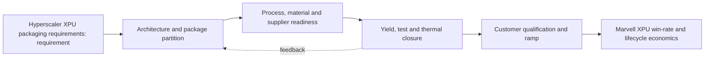

**Figure FIG-MMD-013.** Decision flow for Hyperscaler XPU packaging requirements. Author-created schematic based on cited sources.

**Comparison table - TBL-MAIN-013A**

| Dimension | Near-term decision | 2027-2030 direction | Marvell action |
|---|---|---|---|
| Architecture | Prove a qualified baseline | Increase modularity and package scale | Maintain reusable floorplans and chiplet interfaces |
| Manufacturing | Secure capacity and test coverage | Add process alternatives where credible | Negotiate configuration-specific capacity and learning access |
| Performance | Close HBM, D2D and I/O budgets | Shift bottlenecks toward power and cooling | Co-optimize package, SerDes, memory and optical IP |
| Economics | Model expected good-package cost | Reduce concentration and scrap exposure | Offer hyperscalers transparent cost/yield trade spaces |
| Roadmap status | Confirmed plus announced | Expected scenarios with triggers | Refresh quarterly and at customer architecture changes |

**Marvell implication matrix - TBL-MAIN-013B**

| Question | Leadership interpretation | Trigger to act |
|---|---|---|
| Does it improve XPU PPA? | Count package-enabled system benefit, not isolated die metrics | Material bandwidth, latency or power advantage |
| Does it improve schedule? | Reuse and qualification depth can outweigh theoretical density | Customer design freeze or foundry rule release |
| Does it reduce supply risk? | A second logo is not a second qualified configuration | Demonstrated equivalent package and test flow |
| Is ownership strategic? | Own differentiating interfaces and data; partner for scale manufacturing | Repeated dependency that affects win rate |

> **Marvell implication:** Treat Hyperscaler XPU packaging requirements as a customer-facing architecture capability with quantified PPA, yield, cost and supply options. Do not position it as a backend feature or rely on unqualified roadmap claims.

### Section close

- **Why it matters:** It can change attainable bandwidth, power, package size, schedule and hyperscaler TCO.
- **Current maturity:** Mixed by configuration; see profile and roadmap databases.
- **Key bottlenecks:** training bandwidth, inference cost per token, neocloud serviceability.
- **Leading vendors:** See [vendor database](../data/vendor_roadmaps.yaml).
- **Roadmap:** See [2024-2030 roadmap](../data/vendor_roadmaps.yaml).
- **Marvell implication:** Integrate the capability into custom XPU architecture and commercial planning.
- **Corporate development implication:** Target control points where access, IP or scarce process knowledge changes win probability.
- **Open questions:** Qualification timing, capacity allocation, yield at target body size, and customer-specific reliability.
- **Figures and tables included:** FIG-MMD-013; TBL-MAIN-013A; TBL-MAIN-013B.
- **Next refresh recommendation:** 2026-09-10, or earlier on a material vendor or customer roadmap disclosure.

## 14. Marvell current positioning

> **Section metadata**
> - **Section title:** Marvell current positioning
> - **Owner placeholder:** Advanced Packaging Intelligence Owner
> - **Last refreshed date:** 2026-06-10
> - **Refresh status:** Current baseline
> - **Source count:** 3
> - **Confidence level:** Medium-high; confirmed facts separated from announced and inferred roadmap items
> - **Key changes since last refresh:** Initial repository baseline
> - **Open questions:** Customer qualification timing, package-level yields, commercial terms, and capacity allocation
> - **Links to related sections:** [reports/marvell_xpu_implications.md](../reports/marvell_xpu_implications.md), [data/technology_taxonomy.yaml](../data/technology_taxonomy.yaml), [data/source_database.yaml](../data/source_database.yaml)
> - **Figures included:** FIG-MMD-014
> - **Tables included:** TBL-MAIN-014A, TBL-MAIN-014B
> - **Next suggested refresh date:** 2026-09-10

Marvell's public platform combines custom silicon, advanced packaging, HBM attach, high-speed SerDes, Ethernet switching, optical DSP and silicon photonics. This section treats public vendor statements as evidence of direction, not as proof of customer-qualified volume. [[SRC-MRVL-001]](../data/source_database.yaml) [[SRC-MRVL-002]](../data/source_database.yaml) [[SRC-MRVL-003]](../data/source_database.yaml)

### Architecture

The architecture should be evaluated as a system partitioning decision, not as a package label. The decisive boundary is where bandwidth-intensive functions sit relative to compute, memory, I/O and power delivery. A package that minimizes one link may worsen another, so floorplanning must jointly optimize HBM escape routing, die-to-die reach, optical or electrical I/O placement, decoupling and coolant access. For **Marvell current positioning**, the practical focal point is full-service custom. This is a decision variable because it changes the package contract among the XPU architecture, HBM subsystem, connectivity fabric and manufacturing flow. [[SRC-MRVL-001]](../data/source_database.yaml) [[SRC-MRVL-002]](../data/source_database.yaml) [[SRC-MRVL-003]](../data/source_database.yaml)

### Manufacturing flow

The manufacturing sequence determines accumulated yield and cycle time. Wafer sort, thinning, TSV reveal, redistribution, bump or hybrid-bond preparation, die placement, underfill or molding, substrate attach, lid attach and final test each create distinct defect opportunities. The commercially relevant metric is good systems per start and delivery predictability, not the yield of an isolated process module. For **Marvell current positioning**, the practical focal point is custom HBM. This is a decision variable because it changes the package contract among the XPU architecture, HBM subsystem, connectivity fabric and manufacturing flow. [[SRC-MRVL-001]](../data/source_database.yaml) [[SRC-MRVL-002]](../data/source_database.yaml) [[SRC-MRVL-003]](../data/source_database.yaml)

### Materials and process dependencies

Key dependencies include low-loss dielectrics, copper line and via control, ABF or alternative substrate capacity, temporary bonding materials, underfill, molding compound, thermal interface material and metrology. Material choices couple electrical loss, coefficient-of-thermal-expansion mismatch, moisture sensitivity and warpage; substituting a material therefore requires package requalification rather than a procurement-only change. For **Marvell current positioning**, the practical focal point is 224G and 448G roadmap. This is a decision variable because it changes the package contract among the XPU architecture, HBM subsystem, connectivity fabric and manufacturing flow. [[SRC-MRVL-001]](../data/source_database.yaml) [[SRC-MRVL-002]](../data/source_database.yaml) [[SRC-MRVL-003]](../data/source_database.yaml)

### Metrics and benchmark discipline

Bandwidth density, energy per bit, latency and pitch are useful only when test conditions are explicit. A short-reach die-to-die demonstration cannot be compared directly with a rack-reach SerDes link, and a bonding-pitch claim does not reveal routable bandwidth after power, keep-out and redundancy are included. The database therefore records ranges and caveats instead of false point precision. For **Marvell current positioning**, the practical focal point is CPO and photonic fabric. This is a decision variable because it changes the package contract among the XPU architecture, HBM subsystem, connectivity fabric and manufacturing flow. [[SRC-MRVL-001]](../data/source_database.yaml) [[SRC-MRVL-002]](../data/source_database.yaml) [[SRC-MRVL-003]](../data/source_database.yaml)

### Economics and yield

Cost is dominated by more than assembly price. Expensive known-good logic and HBM make scrap exposure material; larger interposers and substrates reduce units per panel or wafer; additional test insertions raise cost but can prevent higher downstream loss. The correct model values expected good-package cost, schedule risk and customer revenue exposure from missed ramps. For **Marvell current positioning**, the practical focal point is XPU attach. This is a decision variable because it changes the package contract among the XPU architecture, HBM subsystem, connectivity fabric and manufacturing flow. [[SRC-MRVL-001]](../data/source_database.yaml) [[SRC-MRVL-002]](../data/source_database.yaml) [[SRC-MRVL-003]](../data/source_database.yaml)

### Thermal and power

Thermal design is becoming an architecture constraint. HBM, logic, optical engines and voltage conversion compete for package edge, vertical heat paths and coolant temperature budget. Hot spots, lateral gradients and thermo-mechanical cycling can reduce attainable frequency or lifetime even when average package power remains within a cold-plate rating. For **Marvell current positioning**, the practical focal point is full-service custom. This is a decision variable because it changes the package contract among the XPU architecture, HBM subsystem, connectivity fabric and manufacturing flow. [[SRC-MRVL-001]](../data/source_database.yaml) [[SRC-MRVL-002]](../data/source_database.yaml) [[SRC-MRVL-003]](../data/source_database.yaml)

### Supply chain and adoption

Adoption requires simultaneous readiness across foundry packaging, memory, substrate, OSAT or test, EDA signoff, system cooling and customer qualification. A nominally mature process may still be unavailable at the required body size, HBM count or regional supply path. Supplier concentration should therefore be tracked by qualified configuration, not vendor logo count. For **Marvell current positioning**, the practical focal point is custom HBM. This is a decision variable because it changes the package contract among the XPU architecture, HBM subsystem, connectivity fabric and manufacturing flow. [[SRC-MRVL-001]](../data/source_database.yaml) [[SRC-MRVL-002]](../data/source_database.yaml) [[SRC-MRVL-003]](../data/source_database.yaml)

### Competitive implications

Control of design rules, characterization data and capacity reservations can create a competitive moat. NVIDIA and Broadcom can optimize around large internal volumes, while merchant custom-silicon providers must convert ecosystem breadth and reusable IP into comparable schedule certainty. Open standards reduce switching friction only after interoperable silicon, test and software are proven. For **Marvell current positioning**, the practical focal point is 224G and 448G roadmap. This is a decision variable because it changes the package contract among the XPU architecture, HBM subsystem, connectivity fabric and manufacturing flow. [[SRC-MRVL-001]](../data/source_database.yaml) [[SRC-MRVL-002]](../data/source_database.yaml) [[SRC-MRVL-003]](../data/source_database.yaml)

### Marvell implication

Marvell should package this capability as part of an end-to-end XPU platform: architecture exploration, reusable die-to-die and HBM IP, package and board co-design, manufacturing ownership, test strategy and lifecycle telemetry. The differentiation is not ownership of every factory step; it is the ability to give a hyperscaler a credible performance, cost, yield and supply plan before design freeze. For **Marvell current positioning**, the practical focal point is CPO and photonic fabric. This is a decision variable because it changes the package contract among the XPU architecture, HBM subsystem, connectivity fabric and manufacturing flow. [[SRC-MRVL-001]](../data/source_database.yaml) [[SRC-MRVL-002]](../data/source_database.yaml) [[SRC-MRVL-003]](../data/source_database.yaml)

### Corporate development implication

Partnership or investment should target capability gaps that are difficult to reproduce through ordinary sourcing: optical attach, thermal materials and structures, chiplet test, multi-physics automation, advanced substrate process know-how and interoperable die-to-die IP. Acquisitions deserve consideration only where control materially improves XPU win probability or protects a strategic interface. For **Marvell current positioning**, the practical focal point is XPU attach. This is a decision variable because it changes the package contract among the XPU architecture, HBM subsystem, connectivity fabric and manufacturing flow. [[SRC-MRVL-001]](../data/source_database.yaml) [[SRC-MRVL-002]](../data/source_database.yaml) [[SRC-MRVL-003]](../data/source_database.yaml)

### Roadmap through 2030

The likely trajectory is larger and more heterogeneous packages, finer vertical connections, more customized memory base dies, greater use of local bridges or RDL to manage cost, and optics moving closer to high-radix switch and selected compute packages. The pace will be gated by yield learning, serviceability and power removal rather than by interconnect demonstrations alone. For **Marvell current positioning**, the practical focal point is full-service custom. This is a decision variable because it changes the package contract among the XPU architecture, HBM subsystem, connectivity fabric and manufacturing flow. [[SRC-MRVL-001]](../data/source_database.yaml) [[SRC-MRVL-002]](../data/source_database.yaml) [[SRC-MRVL-003]](../data/source_database.yaml)

### Diligence priorities

Leadership should request configuration-specific evidence: qualified dimensions, HBM stack count, power map, thermal resistance, warpage, known-good-die coverage, repair flow, monthly capacity, cycle time, second-source path and cost sensitivity. Claims without these fields should remain announced or expected in the roadmap rather than promoted to confirmed. For **Marvell current positioning**, the practical focal point is custom HBM. This is a decision variable because it changes the package contract among the XPU architecture, HBM subsystem, connectivity fabric and manufacturing flow. [[SRC-MRVL-001]](../data/source_database.yaml) [[SRC-MRVL-002]](../data/source_database.yaml) [[SRC-MRVL-003]](../data/source_database.yaml)

**Figure FIG-MMD-014.** Decision flow for Marvell current positioning. Author-created schematic based on cited sources.

**Comparison table - TBL-MAIN-014A**

| Dimension | Near-term decision | 2027-2030 direction | Marvell action |
|---|---|---|---|
| Architecture | Prove a qualified baseline | Increase modularity and package scale | Maintain reusable floorplans and chiplet interfaces |
| Manufacturing | Secure capacity and test coverage | Add process alternatives where credible | Negotiate configuration-specific capacity and learning access |
| Performance | Close HBM, D2D and I/O budgets | Shift bottlenecks toward power and cooling | Co-optimize package, SerDes, memory and optical IP |
| Economics | Model expected good-package cost | Reduce concentration and scrap exposure | Offer hyperscalers transparent cost/yield trade spaces |
| Roadmap status | Confirmed plus announced | Expected scenarios with triggers | Refresh quarterly and at customer architecture changes |

**Marvell implication matrix - TBL-MAIN-014B**

| Question | Leadership interpretation | Trigger to act |
|---|---|---|
| Does it improve XPU PPA? | Count package-enabled system benefit, not isolated die metrics | Material bandwidth, latency or power advantage |
| Does it improve schedule? | Reuse and qualification depth can outweigh theoretical density | Customer design freeze or foundry rule release |
| Does it reduce supply risk? | A second logo is not a second qualified configuration | Demonstrated equivalent package and test flow |
| Is ownership strategic? | Own differentiating interfaces and data; partner for scale manufacturing | Repeated dependency that affects win rate |

> **Marvell implication:** Treat Marvell current positioning as a customer-facing architecture capability with quantified PPA, yield, cost and supply options. Do not position it as a backend feature or rely on unqualified roadmap claims.

### Section close

- **Why it matters:** It can change attainable bandwidth, power, package size, schedule and hyperscaler TCO.
- **Current maturity:** Mixed by configuration; see profile and roadmap databases.
- **Key bottlenecks:** full-service custom, custom HBM, 224G and 448G roadmap.
- **Leading vendors:** See [vendor database](../data/vendor_roadmaps.yaml).
- **Roadmap:** See [2024-2030 roadmap](../data/vendor_roadmaps.yaml).
- **Marvell implication:** Integrate the capability into custom XPU architecture and commercial planning.
- **Corporate development implication:** Target control points where access, IP or scarce process knowledge changes win probability.
- **Open questions:** Qualification timing, capacity allocation, yield at target body size, and customer-specific reliability.
- **Figures and tables included:** FIG-MMD-014; TBL-MAIN-014A; TBL-MAIN-014B.
- **Next refresh recommendation:** 2026-09-10, or earlier on a material vendor or customer roadmap disclosure.

## 15. Marvell versus Broadcom, NVIDIA, AMD, Intel, Alchip, GUC and MediaTek

> **Section metadata**
> - **Section title:** Marvell versus Broadcom, NVIDIA, AMD, Intel, Alchip, GUC and MediaTek
> - **Owner placeholder:** Advanced Packaging Intelligence Owner
> - **Last refreshed date:** 2026-06-10
> - **Refresh status:** Current baseline
> - **Source count:** 5
> - **Confidence level:** Medium-high; confirmed facts separated from announced and inferred roadmap items
> - **Key changes since last refresh:** Initial repository baseline
> - **Open questions:** Customer qualification timing, package-level yields, commercial terms, and capacity allocation
> - **Links to related sections:** [reports/marvell_xpu_implications.md](../reports/marvell_xpu_implications.md), [data/technology_taxonomy.yaml](../data/technology_taxonomy.yaml), [data/source_database.yaml](../data/source_database.yaml)
> - **Figures included:** FIG-MMD-015
> - **Tables included:** TBL-MAIN-015A, TBL-MAIN-015B
> - **Next suggested refresh date:** 2026-09-10

Marvell competes against different business models: full-stack platforms, custom ASIC scale leaders, GPU vendors, foundry-packaging integration and design-service specialists. This section treats public vendor statements as evidence of direction, not as proof of customer-qualified volume. [[SRC-MRVL-001]](../data/source_database.yaml) [[SRC-NVIDIA-001]](../data/source_database.yaml) [[SRC-AMD-001]](../data/source_database.yaml) [[SRC-INTEL-001]](../data/source_database.yaml) [[SRC-BRCM-001]](../data/source_database.yaml)

### Architecture

The architecture should be evaluated as a system partitioning decision, not as a package label. The decisive boundary is where bandwidth-intensive functions sit relative to compute, memory, I/O and power delivery. A package that minimizes one link may worsen another, so floorplanning must jointly optimize HBM escape routing, die-to-die reach, optical or electrical I/O placement, decoupling and coolant access. For **Marvell versus Broadcom, NVIDIA, AMD, Intel, Alchip, GUC and MediaTek**, the practical focal point is Broadcom custom ASIC scale. This is a decision variable because it changes the package contract among the XPU architecture, HBM subsystem, connectivity fabric and manufacturing flow. [[SRC-MRVL-001]](../data/source_database.yaml) [[SRC-NVIDIA-001]](../data/source_database.yaml) [[SRC-AMD-001]](../data/source_database.yaml) [[SRC-INTEL-001]](../data/source_database.yaml) [[SRC-BRCM-001]](../data/source_database.yaml)

### Manufacturing flow

The manufacturing sequence determines accumulated yield and cycle time. Wafer sort, thinning, TSV reveal, redistribution, bump or hybrid-bond preparation, die placement, underfill or molding, substrate attach, lid attach and final test each create distinct defect opportunities. The commercially relevant metric is good systems per start and delivery predictability, not the yield of an isolated process module. For **Marvell versus Broadcom, NVIDIA, AMD, Intel, Alchip, GUC and MediaTek**, the practical focal point is NVIDIA proprietary fabric. This is a decision variable because it changes the package contract among the XPU architecture, HBM subsystem, connectivity fabric and manufacturing flow. [[SRC-MRVL-001]](../data/source_database.yaml) [[SRC-NVIDIA-001]](../data/source_database.yaml) [[SRC-AMD-001]](../data/source_database.yaml) [[SRC-INTEL-001]](../data/source_database.yaml) [[SRC-BRCM-001]](../data/source_database.yaml)

### Materials and process dependencies

Key dependencies include low-loss dielectrics, copper line and via control, ABF or alternative substrate capacity, temporary bonding materials, underfill, molding compound, thermal interface material and metrology. Material choices couple electrical loss, coefficient-of-thermal-expansion mismatch, moisture sensitivity and warpage; substituting a material therefore requires package requalification rather than a procurement-only change. For **Marvell versus Broadcom, NVIDIA, AMD, Intel, Alchip, GUC and MediaTek**, the practical focal point is AMD chiplet experience. This is a decision variable because it changes the package contract among the XPU architecture, HBM subsystem, connectivity fabric and manufacturing flow. [[SRC-MRVL-001]](../data/source_database.yaml) [[SRC-NVIDIA-001]](../data/source_database.yaml) [[SRC-AMD-001]](../data/source_database.yaml) [[SRC-INTEL-001]](../data/source_database.yaml) [[SRC-BRCM-001]](../data/source_database.yaml)

### Metrics and benchmark discipline

Bandwidth density, energy per bit, latency and pitch are useful only when test conditions are explicit. A short-reach die-to-die demonstration cannot be compared directly with a rack-reach SerDes link, and a bonding-pitch claim does not reveal routable bandwidth after power, keep-out and redundancy are included. The database therefore records ranges and caveats instead of false point precision. For **Marvell versus Broadcom, NVIDIA, AMD, Intel, Alchip, GUC and MediaTek**, the practical focal point is Intel packaging control. This is a decision variable because it changes the package contract among the XPU architecture, HBM subsystem, connectivity fabric and manufacturing flow. [[SRC-MRVL-001]](../data/source_database.yaml) [[SRC-NVIDIA-001]](../data/source_database.yaml) [[SRC-AMD-001]](../data/source_database.yaml) [[SRC-INTEL-001]](../data/source_database.yaml) [[SRC-BRCM-001]](../data/source_database.yaml)

### Economics and yield

Cost is dominated by more than assembly price. Expensive known-good logic and HBM make scrap exposure material; larger interposers and substrates reduce units per panel or wafer; additional test insertions raise cost but can prevent higher downstream loss. The correct model values expected good-package cost, schedule risk and customer revenue exposure from missed ramps. For **Marvell versus Broadcom, NVIDIA, AMD, Intel, Alchip, GUC and MediaTek**, the practical focal point is ASIC service pricing. This is a decision variable because it changes the package contract among the XPU architecture, HBM subsystem, connectivity fabric and manufacturing flow. [[SRC-MRVL-001]](../data/source_database.yaml) [[SRC-NVIDIA-001]](../data/source_database.yaml) [[SRC-AMD-001]](../data/source_database.yaml) [[SRC-INTEL-001]](../data/source_database.yaml) [[SRC-BRCM-001]](../data/source_database.yaml)

### Thermal and power

Thermal design is becoming an architecture constraint. HBM, logic, optical engines and voltage conversion compete for package edge, vertical heat paths and coolant temperature budget. Hot spots, lateral gradients and thermo-mechanical cycling can reduce attainable frequency or lifetime even when average package power remains within a cold-plate rating. For **Marvell versus Broadcom, NVIDIA, AMD, Intel, Alchip, GUC and MediaTek**, the practical focal point is Broadcom custom ASIC scale. This is a decision variable because it changes the package contract among the XPU architecture, HBM subsystem, connectivity fabric and manufacturing flow. [[SRC-MRVL-001]](../data/source_database.yaml) [[SRC-NVIDIA-001]](../data/source_database.yaml) [[SRC-AMD-001]](../data/source_database.yaml) [[SRC-INTEL-001]](../data/source_database.yaml) [[SRC-BRCM-001]](../data/source_database.yaml)

### Supply chain and adoption

Adoption requires simultaneous readiness across foundry packaging, memory, substrate, OSAT or test, EDA signoff, system cooling and customer qualification. A nominally mature process may still be unavailable at the required body size, HBM count or regional supply path. Supplier concentration should therefore be tracked by qualified configuration, not vendor logo count. For **Marvell versus Broadcom, NVIDIA, AMD, Intel, Alchip, GUC and MediaTek**, the practical focal point is NVIDIA proprietary fabric. This is a decision variable because it changes the package contract among the XPU architecture, HBM subsystem, connectivity fabric and manufacturing flow. [[SRC-MRVL-001]](../data/source_database.yaml) [[SRC-NVIDIA-001]](../data/source_database.yaml) [[SRC-AMD-001]](../data/source_database.yaml) [[SRC-INTEL-001]](../data/source_database.yaml) [[SRC-BRCM-001]](../data/source_database.yaml)

### Competitive implications

Control of design rules, characterization data and capacity reservations can create a competitive moat. NVIDIA and Broadcom can optimize around large internal volumes, while merchant custom-silicon providers must convert ecosystem breadth and reusable IP into comparable schedule certainty. Open standards reduce switching friction only after interoperable silicon, test and software are proven. For **Marvell versus Broadcom, NVIDIA, AMD, Intel, Alchip, GUC and MediaTek**, the practical focal point is AMD chiplet experience. This is a decision variable because it changes the package contract among the XPU architecture, HBM subsystem, connectivity fabric and manufacturing flow. [[SRC-MRVL-001]](../data/source_database.yaml) [[SRC-NVIDIA-001]](../data/source_database.yaml) [[SRC-AMD-001]](../data/source_database.yaml) [[SRC-INTEL-001]](../data/source_database.yaml) [[SRC-BRCM-001]](../data/source_database.yaml)

### Marvell implication

Marvell should package this capability as part of an end-to-end XPU platform: architecture exploration, reusable die-to-die and HBM IP, package and board co-design, manufacturing ownership, test strategy and lifecycle telemetry. The differentiation is not ownership of every factory step; it is the ability to give a hyperscaler a credible performance, cost, yield and supply plan before design freeze. For **Marvell versus Broadcom, NVIDIA, AMD, Intel, Alchip, GUC and MediaTek**, the practical focal point is Intel packaging control. This is a decision variable because it changes the package contract among the XPU architecture, HBM subsystem, connectivity fabric and manufacturing flow. [[SRC-MRVL-001]](../data/source_database.yaml) [[SRC-NVIDIA-001]](../data/source_database.yaml) [[SRC-AMD-001]](../data/source_database.yaml) [[SRC-INTEL-001]](../data/source_database.yaml) [[SRC-BRCM-001]](../data/source_database.yaml)

### Corporate development implication

Partnership or investment should target capability gaps that are difficult to reproduce through ordinary sourcing: optical attach, thermal materials and structures, chiplet test, multi-physics automation, advanced substrate process know-how and interoperable die-to-die IP. Acquisitions deserve consideration only where control materially improves XPU win probability or protects a strategic interface. For **Marvell versus Broadcom, NVIDIA, AMD, Intel, Alchip, GUC and MediaTek**, the practical focal point is ASIC service pricing. This is a decision variable because it changes the package contract among the XPU architecture, HBM subsystem, connectivity fabric and manufacturing flow. [[SRC-MRVL-001]](../data/source_database.yaml) [[SRC-NVIDIA-001]](../data/source_database.yaml) [[SRC-AMD-001]](../data/source_database.yaml) [[SRC-INTEL-001]](../data/source_database.yaml) [[SRC-BRCM-001]](../data/source_database.yaml)

### Roadmap through 2030

The likely trajectory is larger and more heterogeneous packages, finer vertical connections, more customized memory base dies, greater use of local bridges or RDL to manage cost, and optics moving closer to high-radix switch and selected compute packages. The pace will be gated by yield learning, serviceability and power removal rather than by interconnect demonstrations alone. For **Marvell versus Broadcom, NVIDIA, AMD, Intel, Alchip, GUC and MediaTek**, the practical focal point is Broadcom custom ASIC scale. This is a decision variable because it changes the package contract among the XPU architecture, HBM subsystem, connectivity fabric and manufacturing flow. [[SRC-MRVL-001]](../data/source_database.yaml) [[SRC-NVIDIA-001]](../data/source_database.yaml) [[SRC-AMD-001]](../data/source_database.yaml) [[SRC-INTEL-001]](../data/source_database.yaml) [[SRC-BRCM-001]](../data/source_database.yaml)

### Diligence priorities

Leadership should request configuration-specific evidence: qualified dimensions, HBM stack count, power map, thermal resistance, warpage, known-good-die coverage, repair flow, monthly capacity, cycle time, second-source path and cost sensitivity. Claims without these fields should remain announced or expected in the roadmap rather than promoted to confirmed. For **Marvell versus Broadcom, NVIDIA, AMD, Intel, Alchip, GUC and MediaTek**, the practical focal point is NVIDIA proprietary fabric. This is a decision variable because it changes the package contract among the XPU architecture, HBM subsystem, connectivity fabric and manufacturing flow. [[SRC-MRVL-001]](../data/source_database.yaml) [[SRC-NVIDIA-001]](../data/source_database.yaml) [[SRC-AMD-001]](../data/source_database.yaml) [[SRC-INTEL-001]](../data/source_database.yaml) [[SRC-BRCM-001]](../data/source_database.yaml)

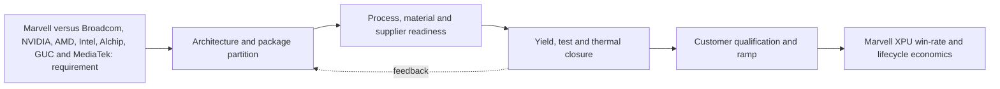

**Figure FIG-MMD-015.** Decision flow for Marvell versus Broadcom, NVIDIA, AMD, Intel, Alchip, GUC and MediaTek. Author-created schematic based on cited sources.

**Comparison table - TBL-MAIN-015A**

| Dimension | Near-term decision | 2027-2030 direction | Marvell action |
|---|---|---|---|
| Architecture | Prove a qualified baseline | Increase modularity and package scale | Maintain reusable floorplans and chiplet interfaces |
| Manufacturing | Secure capacity and test coverage | Add process alternatives where credible | Negotiate configuration-specific capacity and learning access |
| Performance | Close HBM, D2D and I/O budgets | Shift bottlenecks toward power and cooling | Co-optimize package, SerDes, memory and optical IP |
| Economics | Model expected good-package cost | Reduce concentration and scrap exposure | Offer hyperscalers transparent cost/yield trade spaces |
| Roadmap status | Confirmed plus announced | Expected scenarios with triggers | Refresh quarterly and at customer architecture changes |

**Marvell implication matrix - TBL-MAIN-015B**

| Question | Leadership interpretation | Trigger to act |
|---|---|---|
| Does it improve XPU PPA? | Count package-enabled system benefit, not isolated die metrics | Material bandwidth, latency or power advantage |
| Does it improve schedule? | Reuse and qualification depth can outweigh theoretical density | Customer design freeze or foundry rule release |
| Does it reduce supply risk? | A second logo is not a second qualified configuration | Demonstrated equivalent package and test flow |
| Is ownership strategic? | Own differentiating interfaces and data; partner for scale manufacturing | Repeated dependency that affects win rate |

> **Marvell implication:** Treat Marvell versus Broadcom, NVIDIA, AMD, Intel, Alchip, GUC and MediaTek as a customer-facing architecture capability with quantified PPA, yield, cost and supply options. Do not position it as a backend feature or rely on unqualified roadmap claims.

### Section close

- **Why it matters:** It can change attainable bandwidth, power, package size, schedule and hyperscaler TCO.
- **Current maturity:** Mixed by configuration; see profile and roadmap databases.
- **Key bottlenecks:** Broadcom custom ASIC scale, NVIDIA proprietary fabric, AMD chiplet experience.
- **Leading vendors:** See [vendor database](../data/vendor_roadmaps.yaml).
- **Roadmap:** See [2024-2030 roadmap](../data/vendor_roadmaps.yaml).
- **Marvell implication:** Integrate the capability into custom XPU architecture and commercial planning.
- **Corporate development implication:** Target control points where access, IP or scarce process knowledge changes win probability.
- **Open questions:** Qualification timing, capacity allocation, yield at target body size, and customer-specific reliability.
- **Figures and tables included:** FIG-MMD-015; TBL-MAIN-015A; TBL-MAIN-015B.
- **Next refresh recommendation:** 2026-09-10, or earlier on a material vendor or customer roadmap disclosure.

## 16. Strategic implications for Marvell custom XPU business

> **Section metadata**
> - **Section title:** Strategic implications for Marvell custom XPU business
> - **Owner placeholder:** Advanced Packaging Intelligence Owner
> - **Last refreshed date:** 2026-06-10
> - **Refresh status:** Current baseline
> - **Source count:** 3
> - **Confidence level:** Medium-high; confirmed facts separated from announced and inferred roadmap items
> - **Key changes since last refresh:** Initial repository baseline
> - **Open questions:** Customer qualification timing, package-level yields, commercial terms, and capacity allocation
> - **Links to related sections:** [reports/marvell_xpu_implications.md](../reports/marvell_xpu_implications.md), [data/technology_taxonomy.yaml](../data/technology_taxonomy.yaml), [data/source_database.yaml](../data/source_database.yaml)
> - **Figures included:** FIG-MMD-016
> - **Tables included:** TBL-MAIN-016A, TBL-MAIN-016B
> - **Next suggested refresh date:** 2026-09-10

Packaging is a differentiation source when Marvell can translate reusable IP and supplier access into measurable customer PPA, schedule, yield or TCO advantage. This section treats public vendor statements as evidence of direction, not as proof of customer-qualified volume. [[SRC-MRVL-001]](../data/source_database.yaml) [[SRC-MRVL-003]](../data/source_database.yaml) [[SRC-TSMC-001]](../data/source_database.yaml)

### Architecture

The architecture should be evaluated as a system partitioning decision, not as a package label. The decisive boundary is where bandwidth-intensive functions sit relative to compute, memory, I/O and power delivery. A package that minimizes one link may worsen another, so floorplanning must jointly optimize HBM escape routing, die-to-die reach, optical or electrical I/O placement, decoupling and coolant access. For **Strategic implications for Marvell custom XPU business**, the practical focal point is reference package architectures. This is a decision variable because it changes the package contract among the XPU architecture, HBM subsystem, connectivity fabric and manufacturing flow. [[SRC-MRVL-001]](../data/source_database.yaml) [[SRC-MRVL-003]](../data/source_database.yaml) [[SRC-TSMC-001]](../data/source_database.yaml)

### Manufacturing flow

The manufacturing sequence determines accumulated yield and cycle time. Wafer sort, thinning, TSV reveal, redistribution, bump or hybrid-bond preparation, die placement, underfill or molding, substrate attach, lid attach and final test each create distinct defect opportunities. The commercially relevant metric is good systems per start and delivery predictability, not the yield of an isolated process module. For **Strategic implications for Marvell custom XPU business**, the practical focal point is memory co-design. This is a decision variable because it changes the package contract among the XPU architecture, HBM subsystem, connectivity fabric and manufacturing flow. [[SRC-MRVL-001]](../data/source_database.yaml) [[SRC-MRVL-003]](../data/source_database.yaml) [[SRC-TSMC-001]](../data/source_database.yaml)

### Materials and process dependencies

Key dependencies include low-loss dielectrics, copper line and via control, ABF or alternative substrate capacity, temporary bonding materials, underfill, molding compound, thermal interface material and metrology. Material choices couple electrical loss, coefficient-of-thermal-expansion mismatch, moisture sensitivity and warpage; substituting a material therefore requires package requalification rather than a procurement-only change. For **Strategic implications for Marvell custom XPU business**, the practical focal point is optical scale-up. This is a decision variable because it changes the package contract among the XPU architecture, HBM subsystem, connectivity fabric and manufacturing flow. [[SRC-MRVL-001]](../data/source_database.yaml) [[SRC-MRVL-003]](../data/source_database.yaml) [[SRC-TSMC-001]](../data/source_database.yaml)

### Metrics and benchmark discipline

Bandwidth density, energy per bit, latency and pitch are useful only when test conditions are explicit. A short-reach die-to-die demonstration cannot be compared directly with a rack-reach SerDes link, and a bonding-pitch claim does not reveal routable bandwidth after power, keep-out and redundancy are included. The database therefore records ranges and caveats instead of false point precision. For **Strategic implications for Marvell custom XPU business**, the practical focal point is supply optionality. This is a decision variable because it changes the package contract among the XPU architecture, HBM subsystem, connectivity fabric and manufacturing flow. [[SRC-MRVL-001]](../data/source_database.yaml) [[SRC-MRVL-003]](../data/source_database.yaml) [[SRC-TSMC-001]](../data/source_database.yaml)

### Economics and yield

Cost is dominated by more than assembly price. Expensive known-good logic and HBM make scrap exposure material; larger interposers and substrates reduce units per panel or wafer; additional test insertions raise cost but can prevent higher downstream loss. The correct model values expected good-package cost, schedule risk and customer revenue exposure from missed ramps. For **Strategic implications for Marvell custom XPU business**, the practical focal point is lifecycle telemetry. This is a decision variable because it changes the package contract among the XPU architecture, HBM subsystem, connectivity fabric and manufacturing flow. [[SRC-MRVL-001]](../data/source_database.yaml) [[SRC-MRVL-003]](../data/source_database.yaml) [[SRC-TSMC-001]](../data/source_database.yaml)

### Thermal and power

Thermal design is becoming an architecture constraint. HBM, logic, optical engines and voltage conversion compete for package edge, vertical heat paths and coolant temperature budget. Hot spots, lateral gradients and thermo-mechanical cycling can reduce attainable frequency or lifetime even when average package power remains within a cold-plate rating. For **Strategic implications for Marvell custom XPU business**, the practical focal point is reference package architectures. This is a decision variable because it changes the package contract among the XPU architecture, HBM subsystem, connectivity fabric and manufacturing flow. [[SRC-MRVL-001]](../data/source_database.yaml) [[SRC-MRVL-003]](../data/source_database.yaml) [[SRC-TSMC-001]](../data/source_database.yaml)

### Supply chain and adoption

Adoption requires simultaneous readiness across foundry packaging, memory, substrate, OSAT or test, EDA signoff, system cooling and customer qualification. A nominally mature process may still be unavailable at the required body size, HBM count or regional supply path. Supplier concentration should therefore be tracked by qualified configuration, not vendor logo count. For **Strategic implications for Marvell custom XPU business**, the practical focal point is memory co-design. This is a decision variable because it changes the package contract among the XPU architecture, HBM subsystem, connectivity fabric and manufacturing flow. [[SRC-MRVL-001]](../data/source_database.yaml) [[SRC-MRVL-003]](../data/source_database.yaml) [[SRC-TSMC-001]](../data/source_database.yaml)

### Competitive implications

Control of design rules, characterization data and capacity reservations can create a competitive moat. NVIDIA and Broadcom can optimize around large internal volumes, while merchant custom-silicon providers must convert ecosystem breadth and reusable IP into comparable schedule certainty. Open standards reduce switching friction only after interoperable silicon, test and software are proven. For **Strategic implications for Marvell custom XPU business**, the practical focal point is optical scale-up. This is a decision variable because it changes the package contract among the XPU architecture, HBM subsystem, connectivity fabric and manufacturing flow. [[SRC-MRVL-001]](../data/source_database.yaml) [[SRC-MRVL-003]](../data/source_database.yaml) [[SRC-TSMC-001]](../data/source_database.yaml)

### Marvell implication

Marvell should package this capability as part of an end-to-end XPU platform: architecture exploration, reusable die-to-die and HBM IP, package and board co-design, manufacturing ownership, test strategy and lifecycle telemetry. The differentiation is not ownership of every factory step; it is the ability to give a hyperscaler a credible performance, cost, yield and supply plan before design freeze. For **Strategic implications for Marvell custom XPU business**, the practical focal point is supply optionality. This is a decision variable because it changes the package contract among the XPU architecture, HBM subsystem, connectivity fabric and manufacturing flow. [[SRC-MRVL-001]](../data/source_database.yaml) [[SRC-MRVL-003]](../data/source_database.yaml) [[SRC-TSMC-001]](../data/source_database.yaml)

### Corporate development implication

Partnership or investment should target capability gaps that are difficult to reproduce through ordinary sourcing: optical attach, thermal materials and structures, chiplet test, multi-physics automation, advanced substrate process know-how and interoperable die-to-die IP. Acquisitions deserve consideration only where control materially improves XPU win probability or protects a strategic interface. For **Strategic implications for Marvell custom XPU business**, the practical focal point is lifecycle telemetry. This is a decision variable because it changes the package contract among the XPU architecture, HBM subsystem, connectivity fabric and manufacturing flow. [[SRC-MRVL-001]](../data/source_database.yaml) [[SRC-MRVL-003]](../data/source_database.yaml) [[SRC-TSMC-001]](../data/source_database.yaml)

### Roadmap through 2030

The likely trajectory is larger and more heterogeneous packages, finer vertical connections, more customized memory base dies, greater use of local bridges or RDL to manage cost, and optics moving closer to high-radix switch and selected compute packages. The pace will be gated by yield learning, serviceability and power removal rather than by interconnect demonstrations alone. For **Strategic implications for Marvell custom XPU business**, the practical focal point is reference package architectures. This is a decision variable because it changes the package contract among the XPU architecture, HBM subsystem, connectivity fabric and manufacturing flow. [[SRC-MRVL-001]](../data/source_database.yaml) [[SRC-MRVL-003]](../data/source_database.yaml) [[SRC-TSMC-001]](../data/source_database.yaml)

### Diligence priorities

Leadership should request configuration-specific evidence: qualified dimensions, HBM stack count, power map, thermal resistance, warpage, known-good-die coverage, repair flow, monthly capacity, cycle time, second-source path and cost sensitivity. Claims without these fields should remain announced or expected in the roadmap rather than promoted to confirmed. For **Strategic implications for Marvell custom XPU business**, the practical focal point is memory co-design. This is a decision variable because it changes the package contract among the XPU architecture, HBM subsystem, connectivity fabric and manufacturing flow. [[SRC-MRVL-001]](../data/source_database.yaml) [[SRC-MRVL-003]](../data/source_database.yaml) [[SRC-TSMC-001]](../data/source_database.yaml)

**Figure FIG-MMD-016.** Decision flow for Strategic implications for Marvell custom XPU business. Author-created schematic based on cited sources.

**Comparison table - TBL-MAIN-016A**

| Dimension | Near-term decision | 2027-2030 direction | Marvell action |
|---|---|---|---|
| Architecture | Prove a qualified baseline | Increase modularity and package scale | Maintain reusable floorplans and chiplet interfaces |
| Manufacturing | Secure capacity and test coverage | Add process alternatives where credible | Negotiate configuration-specific capacity and learning access |
| Performance | Close HBM, D2D and I/O budgets | Shift bottlenecks toward power and cooling | Co-optimize package, SerDes, memory and optical IP |
| Economics | Model expected good-package cost | Reduce concentration and scrap exposure | Offer hyperscalers transparent cost/yield trade spaces |
| Roadmap status | Confirmed plus announced | Expected scenarios with triggers | Refresh quarterly and at customer architecture changes |

**Marvell implication matrix - TBL-MAIN-016B**

| Question | Leadership interpretation | Trigger to act |
|---|---|---|
| Does it improve XPU PPA? | Count package-enabled system benefit, not isolated die metrics | Material bandwidth, latency or power advantage |
| Does it improve schedule? | Reuse and qualification depth can outweigh theoretical density | Customer design freeze or foundry rule release |
| Does it reduce supply risk? | A second logo is not a second qualified configuration | Demonstrated equivalent package and test flow |
| Is ownership strategic? | Own differentiating interfaces and data; partner for scale manufacturing | Repeated dependency that affects win rate |

> **Marvell implication:** Treat Strategic implications for Marvell custom XPU business as a customer-facing architecture capability with quantified PPA, yield, cost and supply options. Do not position it as a backend feature or rely on unqualified roadmap claims.

### Section close

- **Why it matters:** It can change attainable bandwidth, power, package size, schedule and hyperscaler TCO.
- **Current maturity:** Mixed by configuration; see profile and roadmap databases.
- **Key bottlenecks:** reference package architectures, memory co-design, optical scale-up.
- **Leading vendors:** See [vendor database](../data/vendor_roadmaps.yaml).
- **Roadmap:** See [2024-2030 roadmap](../data/vendor_roadmaps.yaml).
- **Marvell implication:** Integrate the capability into custom XPU architecture and commercial planning.
- **Corporate development implication:** Target control points where access, IP or scarce process knowledge changes win probability.
- **Open questions:** Qualification timing, capacity allocation, yield at target body size, and customer-specific reliability.
- **Figures and tables included:** FIG-MMD-016; TBL-MAIN-016A; TBL-MAIN-016B.
- **Next refresh recommendation:** 2026-09-10, or earlier on a material vendor or customer roadmap disclosure.

## 17. Corporate development and partnership watchlist

> **Section metadata**
> - **Section title:** Corporate development and partnership watchlist
> - **Owner placeholder:** Advanced Packaging Intelligence Owner
> - **Last refreshed date:** 2026-06-10
> - **Refresh status:** Current baseline
> - **Source count:** 4
> - **Confidence level:** Medium-high; confirmed facts separated from announced and inferred roadmap items
> - **Key changes since last refresh:** Initial repository baseline
> - **Open questions:** Customer qualification timing, package-level yields, commercial terms, and capacity allocation
> - **Links to related sections:** [reports/marvell_xpu_implications.md](../reports/marvell_xpu_implications.md), [data/technology_taxonomy.yaml](../data/technology_taxonomy.yaml), [data/source_database.yaml](../data/source_database.yaml)
> - **Figures included:** FIG-MMD-017
> - **Tables included:** TBL-MAIN-017A, TBL-MAIN-017B
> - **Next suggested refresh date:** 2026-09-10

The highest-value targets control interfaces, process knowledge or tools that shorten qualification and reduce dependency in optical I/O, test, thermal and multi-die design. This section treats public vendor statements as evidence of direction, not as proof of customer-qualified volume. [[SRC-AYAR-001]](../data/source_database.yaml) [[SRC-LIGHTMATTER-001]](../data/source_database.yaml) [[SRC-ANSYS-001]](../data/source_database.yaml) [[SRC-SYNOPSYS-001]](../data/source_database.yaml)

### Architecture

The architecture should be evaluated as a system partitioning decision, not as a package label. The decisive boundary is where bandwidth-intensive functions sit relative to compute, memory, I/O and power delivery. A package that minimizes one link may worsen another, so floorplanning must jointly optimize HBM escape routing, die-to-die reach, optical or electrical I/O placement, decoupling and coolant access. For **Corporate development and partnership watchlist**, the practical focal point is optical attach. This is a decision variable because it changes the package contract among the XPU architecture, HBM subsystem, connectivity fabric and manufacturing flow. [[SRC-AYAR-001]](../data/source_database.yaml) [[SRC-LIGHTMATTER-001]](../data/source_database.yaml) [[SRC-ANSYS-001]](../data/source_database.yaml) [[SRC-SYNOPSYS-001]](../data/source_database.yaml)

### Manufacturing flow

The manufacturing sequence determines accumulated yield and cycle time. Wafer sort, thinning, TSV reveal, redistribution, bump or hybrid-bond preparation, die placement, underfill or molding, substrate attach, lid attach and final test each create distinct defect opportunities. The commercially relevant metric is good systems per start and delivery predictability, not the yield of an isolated process module. For **Corporate development and partnership watchlist**, the practical focal point is HBM base-die IP. This is a decision variable because it changes the package contract among the XPU architecture, HBM subsystem, connectivity fabric and manufacturing flow. [[SRC-AYAR-001]](../data/source_database.yaml) [[SRC-LIGHTMATTER-001]](../data/source_database.yaml) [[SRC-ANSYS-001]](../data/source_database.yaml) [[SRC-SYNOPSYS-001]](../data/source_database.yaml)

### Materials and process dependencies

Key dependencies include low-loss dielectrics, copper line and via control, ABF or alternative substrate capacity, temporary bonding materials, underfill, molding compound, thermal interface material and metrology. Material choices couple electrical loss, coefficient-of-thermal-expansion mismatch, moisture sensitivity and warpage; substituting a material therefore requires package requalification rather than a procurement-only change. For **Corporate development and partnership watchlist**, the practical focal point is chiplet test. This is a decision variable because it changes the package contract among the XPU architecture, HBM subsystem, connectivity fabric and manufacturing flow. [[SRC-AYAR-001]](../data/source_database.yaml) [[SRC-LIGHTMATTER-001]](../data/source_database.yaml) [[SRC-ANSYS-001]](../data/source_database.yaml) [[SRC-SYNOPSYS-001]](../data/source_database.yaml)

### Metrics and benchmark discipline

Bandwidth density, energy per bit, latency and pitch are useful only when test conditions are explicit. A short-reach die-to-die demonstration cannot be compared directly with a rack-reach SerDes link, and a bonding-pitch claim does not reveal routable bandwidth after power, keep-out and redundancy are included. The database therefore records ranges and caveats instead of false point precision. For **Corporate development and partnership watchlist**, the practical focal point is thermal materials. This is a decision variable because it changes the package contract among the XPU architecture, HBM subsystem, connectivity fabric and manufacturing flow. [[SRC-AYAR-001]](../data/source_database.yaml) [[SRC-LIGHTMATTER-001]](../data/source_database.yaml) [[SRC-ANSYS-001]](../data/source_database.yaml) [[SRC-SYNOPSYS-001]](../data/source_database.yaml)

### Economics and yield

Cost is dominated by more than assembly price. Expensive known-good logic and HBM make scrap exposure material; larger interposers and substrates reduce units per panel or wafer; additional test insertions raise cost but can prevent higher downstream loss. The correct model values expected good-package cost, schedule risk and customer revenue exposure from missed ramps. For **Corporate development and partnership watchlist**, the practical focal point is glass and substrate processes. This is a decision variable because it changes the package contract among the XPU architecture, HBM subsystem, connectivity fabric and manufacturing flow. [[SRC-AYAR-001]](../data/source_database.yaml) [[SRC-LIGHTMATTER-001]](../data/source_database.yaml) [[SRC-ANSYS-001]](../data/source_database.yaml) [[SRC-SYNOPSYS-001]](../data/source_database.yaml)

### Thermal and power

Thermal design is becoming an architecture constraint. HBM, logic, optical engines and voltage conversion compete for package edge, vertical heat paths and coolant temperature budget. Hot spots, lateral gradients and thermo-mechanical cycling can reduce attainable frequency or lifetime even when average package power remains within a cold-plate rating. For **Corporate development and partnership watchlist**, the practical focal point is optical attach. This is a decision variable because it changes the package contract among the XPU architecture, HBM subsystem, connectivity fabric and manufacturing flow. [[SRC-AYAR-001]](../data/source_database.yaml) [[SRC-LIGHTMATTER-001]](../data/source_database.yaml) [[SRC-ANSYS-001]](../data/source_database.yaml) [[SRC-SYNOPSYS-001]](../data/source_database.yaml)

### Supply chain and adoption

Adoption requires simultaneous readiness across foundry packaging, memory, substrate, OSAT or test, EDA signoff, system cooling and customer qualification. A nominally mature process may still be unavailable at the required body size, HBM count or regional supply path. Supplier concentration should therefore be tracked by qualified configuration, not vendor logo count. For **Corporate development and partnership watchlist**, the practical focal point is HBM base-die IP. This is a decision variable because it changes the package contract among the XPU architecture, HBM subsystem, connectivity fabric and manufacturing flow. [[SRC-AYAR-001]](../data/source_database.yaml) [[SRC-LIGHTMATTER-001]](../data/source_database.yaml) [[SRC-ANSYS-001]](../data/source_database.yaml) [[SRC-SYNOPSYS-001]](../data/source_database.yaml)

### Competitive implications

Control of design rules, characterization data and capacity reservations can create a competitive moat. NVIDIA and Broadcom can optimize around large internal volumes, while merchant custom-silicon providers must convert ecosystem breadth and reusable IP into comparable schedule certainty. Open standards reduce switching friction only after interoperable silicon, test and software are proven. For **Corporate development and partnership watchlist**, the practical focal point is chiplet test. This is a decision variable because it changes the package contract among the XPU architecture, HBM subsystem, connectivity fabric and manufacturing flow. [[SRC-AYAR-001]](../data/source_database.yaml) [[SRC-LIGHTMATTER-001]](../data/source_database.yaml) [[SRC-ANSYS-001]](../data/source_database.yaml) [[SRC-SYNOPSYS-001]](../data/source_database.yaml)

### Marvell implication

Marvell should package this capability as part of an end-to-end XPU platform: architecture exploration, reusable die-to-die and HBM IP, package and board co-design, manufacturing ownership, test strategy and lifecycle telemetry. The differentiation is not ownership of every factory step; it is the ability to give a hyperscaler a credible performance, cost, yield and supply plan before design freeze. For **Corporate development and partnership watchlist**, the practical focal point is thermal materials. This is a decision variable because it changes the package contract among the XPU architecture, HBM subsystem, connectivity fabric and manufacturing flow. [[SRC-AYAR-001]](../data/source_database.yaml) [[SRC-LIGHTMATTER-001]](../data/source_database.yaml) [[SRC-ANSYS-001]](../data/source_database.yaml) [[SRC-SYNOPSYS-001]](../data/source_database.yaml)

### Corporate development implication

Partnership or investment should target capability gaps that are difficult to reproduce through ordinary sourcing: optical attach, thermal materials and structures, chiplet test, multi-physics automation, advanced substrate process know-how and interoperable die-to-die IP. Acquisitions deserve consideration only where control materially improves XPU win probability or protects a strategic interface. For **Corporate development and partnership watchlist**, the practical focal point is glass and substrate processes. This is a decision variable because it changes the package contract among the XPU architecture, HBM subsystem, connectivity fabric and manufacturing flow. [[SRC-AYAR-001]](../data/source_database.yaml) [[SRC-LIGHTMATTER-001]](../data/source_database.yaml) [[SRC-ANSYS-001]](../data/source_database.yaml) [[SRC-SYNOPSYS-001]](../data/source_database.yaml)

### Roadmap through 2030

The likely trajectory is larger and more heterogeneous packages, finer vertical connections, more customized memory base dies, greater use of local bridges or RDL to manage cost, and optics moving closer to high-radix switch and selected compute packages. The pace will be gated by yield learning, serviceability and power removal rather than by interconnect demonstrations alone. For **Corporate development and partnership watchlist**, the practical focal point is optical attach. This is a decision variable because it changes the package contract among the XPU architecture, HBM subsystem, connectivity fabric and manufacturing flow. [[SRC-AYAR-001]](../data/source_database.yaml) [[SRC-LIGHTMATTER-001]](../data/source_database.yaml) [[SRC-ANSYS-001]](../data/source_database.yaml) [[SRC-SYNOPSYS-001]](../data/source_database.yaml)

### Diligence priorities

Leadership should request configuration-specific evidence: qualified dimensions, HBM stack count, power map, thermal resistance, warpage, known-good-die coverage, repair flow, monthly capacity, cycle time, second-source path and cost sensitivity. Claims without these fields should remain announced or expected in the roadmap rather than promoted to confirmed. For **Corporate development and partnership watchlist**, the practical focal point is HBM base-die IP. This is a decision variable because it changes the package contract among the XPU architecture, HBM subsystem, connectivity fabric and manufacturing flow. [[SRC-AYAR-001]](../data/source_database.yaml) [[SRC-LIGHTMATTER-001]](../data/source_database.yaml) [[SRC-ANSYS-001]](../data/source_database.yaml) [[SRC-SYNOPSYS-001]](../data/source_database.yaml)

**Figure FIG-MMD-017.** Decision flow for Corporate development and partnership watchlist. Author-created schematic based on cited sources.

**Comparison table - TBL-MAIN-017A**

| Dimension | Near-term decision | 2027-2030 direction | Marvell action |
|---|---|---|---|
| Architecture | Prove a qualified baseline | Increase modularity and package scale | Maintain reusable floorplans and chiplet interfaces |
| Manufacturing | Secure capacity and test coverage | Add process alternatives where credible | Negotiate configuration-specific capacity and learning access |
| Performance | Close HBM, D2D and I/O budgets | Shift bottlenecks toward power and cooling | Co-optimize package, SerDes, memory and optical IP |
| Economics | Model expected good-package cost | Reduce concentration and scrap exposure | Offer hyperscalers transparent cost/yield trade spaces |
| Roadmap status | Confirmed plus announced | Expected scenarios with triggers | Refresh quarterly and at customer architecture changes |

**Marvell implication matrix - TBL-MAIN-017B**

| Question | Leadership interpretation | Trigger to act |
|---|---|---|
| Does it improve XPU PPA? | Count package-enabled system benefit, not isolated die metrics | Material bandwidth, latency or power advantage |
| Does it improve schedule? | Reuse and qualification depth can outweigh theoretical density | Customer design freeze or foundry rule release |
| Does it reduce supply risk? | A second logo is not a second qualified configuration | Demonstrated equivalent package and test flow |
| Is ownership strategic? | Own differentiating interfaces and data; partner for scale manufacturing | Repeated dependency that affects win rate |

> **Marvell implication:** Treat Corporate development and partnership watchlist as a customer-facing architecture capability with quantified PPA, yield, cost and supply options. Do not position it as a backend feature or rely on unqualified roadmap claims.

### Section close

- **Why it matters:** It can change attainable bandwidth, power, package size, schedule and hyperscaler TCO.
- **Current maturity:** Mixed by configuration; see profile and roadmap databases.
- **Key bottlenecks:** optical attach, HBM base-die IP, chiplet test.
- **Leading vendors:** See [vendor database](../data/vendor_roadmaps.yaml).
- **Roadmap:** See [2024-2030 roadmap](../data/vendor_roadmaps.yaml).
- **Marvell implication:** Integrate the capability into custom XPU architecture and commercial planning.
- **Corporate development implication:** Target control points where access, IP or scarce process knowledge changes win probability.
- **Open questions:** Qualification timing, capacity allocation, yield at target body size, and customer-specific reliability.
- **Figures and tables included:** FIG-MMD-017; TBL-MAIN-017A; TBL-MAIN-017B.
- **Next refresh recommendation:** 2026-09-10, or earlier on a material vendor or customer roadmap disclosure.

## 18. Key diligence questions for Marvell leadership

> **Section metadata**
> - **Section title:** Key diligence questions for Marvell leadership
> - **Owner placeholder:** Advanced Packaging Intelligence Owner
> - **Last refreshed date:** 2026-06-10
> - **Refresh status:** Current baseline
> - **Source count:** 3
> - **Confidence level:** Medium-high; confirmed facts separated from announced and inferred roadmap items
> - **Key changes since last refresh:** Initial repository baseline
> - **Open questions:** Customer qualification timing, package-level yields, commercial terms, and capacity allocation
> - **Links to related sections:** [reports/marvell_xpu_implications.md](../reports/marvell_xpu_implications.md), [data/technology_taxonomy.yaml](../data/technology_taxonomy.yaml), [data/source_database.yaml](../data/source_database.yaml)
> - **Figures included:** FIG-MMD-018
> - **Tables included:** TBL-MAIN-018A, TBL-MAIN-018B
> - **Next suggested refresh date:** 2026-09-10

Leadership diligence should force roadmap claims into configuration-specific evidence and explicitly identify what is controlled, contracted, qualified or merely expected. This section treats public vendor statements as evidence of direction, not as proof of customer-qualified volume. [[SRC-MRVL-001]](../data/source_database.yaml) [[SRC-TSMC-002]](../data/source_database.yaml) [[SRC-IEEE-001]](../data/source_database.yaml)

### Architecture

The architecture should be evaluated as a system partitioning decision, not as a package label. The decisive boundary is where bandwidth-intensive functions sit relative to compute, memory, I/O and power delivery. A package that minimizes one link may worsen another, so floorplanning must jointly optimize HBM escape routing, die-to-die reach, optical or electrical I/O placement, decoupling and coolant access. For **Key diligence questions for Marvell leadership**, the practical focal point is capacity reservation. This is a decision variable because it changes the package contract among the XPU architecture, HBM subsystem, connectivity fabric and manufacturing flow. [[SRC-MRVL-001]](../data/source_database.yaml) [[SRC-TSMC-002]](../data/source_database.yaml) [[SRC-IEEE-001]](../data/source_database.yaml)

### Manufacturing flow

The manufacturing sequence determines accumulated yield and cycle time. Wafer sort, thinning, TSV reveal, redistribution, bump or hybrid-bond preparation, die placement, underfill or molding, substrate attach, lid attach and final test each create distinct defect opportunities. The commercially relevant metric is good systems per start and delivery predictability, not the yield of an isolated process module. For **Key diligence questions for Marvell leadership**, the practical focal point is yield ownership. This is a decision variable because it changes the package contract among the XPU architecture, HBM subsystem, connectivity fabric and manufacturing flow. [[SRC-MRVL-001]](../data/source_database.yaml) [[SRC-TSMC-002]](../data/source_database.yaml) [[SRC-IEEE-001]](../data/source_database.yaml)

### Materials and process dependencies

Key dependencies include low-loss dielectrics, copper line and via control, ABF or alternative substrate capacity, temporary bonding materials, underfill, molding compound, thermal interface material and metrology. Material choices couple electrical loss, coefficient-of-thermal-expansion mismatch, moisture sensitivity and warpage; substituting a material therefore requires package requalification rather than a procurement-only change. For **Key diligence questions for Marvell leadership**, the practical focal point is second-source equivalence. This is a decision variable because it changes the package contract among the XPU architecture, HBM subsystem, connectivity fabric and manufacturing flow. [[SRC-MRVL-001]](../data/source_database.yaml) [[SRC-TSMC-002]](../data/source_database.yaml) [[SRC-IEEE-001]](../data/source_database.yaml)

### Metrics and benchmark discipline

Bandwidth density, energy per bit, latency and pitch are useful only when test conditions are explicit. A short-reach die-to-die demonstration cannot be compared directly with a rack-reach SerDes link, and a bonding-pitch claim does not reveal routable bandwidth after power, keep-out and redundancy are included. The database therefore records ranges and caveats instead of false point precision. For **Key diligence questions for Marvell leadership**, the practical focal point is customer roadmap dependency. This is a decision variable because it changes the package contract among the XPU architecture, HBM subsystem, connectivity fabric and manufacturing flow. [[SRC-MRVL-001]](../data/source_database.yaml) [[SRC-TSMC-002]](../data/source_database.yaml) [[SRC-IEEE-001]](../data/source_database.yaml)

### Economics and yield

Cost is dominated by more than assembly price. Expensive known-good logic and HBM make scrap exposure material; larger interposers and substrates reduce units per panel or wafer; additional test insertions raise cost but can prevent higher downstream loss. The correct model values expected good-package cost, schedule risk and customer revenue exposure from missed ramps. For **Key diligence questions for Marvell leadership**, the practical focal point is acquisition integration. This is a decision variable because it changes the package contract among the XPU architecture, HBM subsystem, connectivity fabric and manufacturing flow. [[SRC-MRVL-001]](../data/source_database.yaml) [[SRC-TSMC-002]](../data/source_database.yaml) [[SRC-IEEE-001]](../data/source_database.yaml)

### Thermal and power

Thermal design is becoming an architecture constraint. HBM, logic, optical engines and voltage conversion compete for package edge, vertical heat paths and coolant temperature budget. Hot spots, lateral gradients and thermo-mechanical cycling can reduce attainable frequency or lifetime even when average package power remains within a cold-plate rating. For **Key diligence questions for Marvell leadership**, the practical focal point is capacity reservation. This is a decision variable because it changes the package contract among the XPU architecture, HBM subsystem, connectivity fabric and manufacturing flow. [[SRC-MRVL-001]](../data/source_database.yaml) [[SRC-TSMC-002]](../data/source_database.yaml) [[SRC-IEEE-001]](../data/source_database.yaml)

### Supply chain and adoption

Adoption requires simultaneous readiness across foundry packaging, memory, substrate, OSAT or test, EDA signoff, system cooling and customer qualification. A nominally mature process may still be unavailable at the required body size, HBM count or regional supply path. Supplier concentration should therefore be tracked by qualified configuration, not vendor logo count. For **Key diligence questions for Marvell leadership**, the practical focal point is yield ownership. This is a decision variable because it changes the package contract among the XPU architecture, HBM subsystem, connectivity fabric and manufacturing flow. [[SRC-MRVL-001]](../data/source_database.yaml) [[SRC-TSMC-002]](../data/source_database.yaml) [[SRC-IEEE-001]](../data/source_database.yaml)

### Competitive implications

Control of design rules, characterization data and capacity reservations can create a competitive moat. NVIDIA and Broadcom can optimize around large internal volumes, while merchant custom-silicon providers must convert ecosystem breadth and reusable IP into comparable schedule certainty. Open standards reduce switching friction only after interoperable silicon, test and software are proven. For **Key diligence questions for Marvell leadership**, the practical focal point is second-source equivalence. This is a decision variable because it changes the package contract among the XPU architecture, HBM subsystem, connectivity fabric and manufacturing flow. [[SRC-MRVL-001]](../data/source_database.yaml) [[SRC-TSMC-002]](../data/source_database.yaml) [[SRC-IEEE-001]](../data/source_database.yaml)

### Marvell implication

Marvell should package this capability as part of an end-to-end XPU platform: architecture exploration, reusable die-to-die and HBM IP, package and board co-design, manufacturing ownership, test strategy and lifecycle telemetry. The differentiation is not ownership of every factory step; it is the ability to give a hyperscaler a credible performance, cost, yield and supply plan before design freeze. For **Key diligence questions for Marvell leadership**, the practical focal point is customer roadmap dependency. This is a decision variable because it changes the package contract among the XPU architecture, HBM subsystem, connectivity fabric and manufacturing flow. [[SRC-MRVL-001]](../data/source_database.yaml) [[SRC-TSMC-002]](../data/source_database.yaml) [[SRC-IEEE-001]](../data/source_database.yaml)

### Corporate development implication

Partnership or investment should target capability gaps that are difficult to reproduce through ordinary sourcing: optical attach, thermal materials and structures, chiplet test, multi-physics automation, advanced substrate process know-how and interoperable die-to-die IP. Acquisitions deserve consideration only where control materially improves XPU win probability or protects a strategic interface. For **Key diligence questions for Marvell leadership**, the practical focal point is acquisition integration. This is a decision variable because it changes the package contract among the XPU architecture, HBM subsystem, connectivity fabric and manufacturing flow. [[SRC-MRVL-001]](../data/source_database.yaml) [[SRC-TSMC-002]](../data/source_database.yaml) [[SRC-IEEE-001]](../data/source_database.yaml)

### Roadmap through 2030

The likely trajectory is larger and more heterogeneous packages, finer vertical connections, more customized memory base dies, greater use of local bridges or RDL to manage cost, and optics moving closer to high-radix switch and selected compute packages. The pace will be gated by yield learning, serviceability and power removal rather than by interconnect demonstrations alone. For **Key diligence questions for Marvell leadership**, the practical focal point is capacity reservation. This is a decision variable because it changes the package contract among the XPU architecture, HBM subsystem, connectivity fabric and manufacturing flow. [[SRC-MRVL-001]](../data/source_database.yaml) [[SRC-TSMC-002]](../data/source_database.yaml) [[SRC-IEEE-001]](../data/source_database.yaml)

### Diligence priorities

Leadership should request configuration-specific evidence: qualified dimensions, HBM stack count, power map, thermal resistance, warpage, known-good-die coverage, repair flow, monthly capacity, cycle time, second-source path and cost sensitivity. Claims without these fields should remain announced or expected in the roadmap rather than promoted to confirmed. For **Key diligence questions for Marvell leadership**, the practical focal point is yield ownership. This is a decision variable because it changes the package contract among the XPU architecture, HBM subsystem, connectivity fabric and manufacturing flow. [[SRC-MRVL-001]](../data/source_database.yaml) [[SRC-TSMC-002]](../data/source_database.yaml) [[SRC-IEEE-001]](../data/source_database.yaml)

**Figure FIG-MMD-018.** Decision flow for Key diligence questions for Marvell leadership. Author-created schematic based on cited sources.

**Comparison table - TBL-MAIN-018A**

| Dimension | Near-term decision | 2027-2030 direction | Marvell action |
|---|---|---|---|
| Architecture | Prove a qualified baseline | Increase modularity and package scale | Maintain reusable floorplans and chiplet interfaces |
| Manufacturing | Secure capacity and test coverage | Add process alternatives where credible | Negotiate configuration-specific capacity and learning access |
| Performance | Close HBM, D2D and I/O budgets | Shift bottlenecks toward power and cooling | Co-optimize package, SerDes, memory and optical IP |
| Economics | Model expected good-package cost | Reduce concentration and scrap exposure | Offer hyperscalers transparent cost/yield trade spaces |
| Roadmap status | Confirmed plus announced | Expected scenarios with triggers | Refresh quarterly and at customer architecture changes |

**Marvell implication matrix - TBL-MAIN-018B**

| Question | Leadership interpretation | Trigger to act |
|---|---|---|
| Does it improve XPU PPA? | Count package-enabled system benefit, not isolated die metrics | Material bandwidth, latency or power advantage |
| Does it improve schedule? | Reuse and qualification depth can outweigh theoretical density | Customer design freeze or foundry rule release |
| Does it reduce supply risk? | A second logo is not a second qualified configuration | Demonstrated equivalent package and test flow |
| Is ownership strategic? | Own differentiating interfaces and data; partner for scale manufacturing | Repeated dependency that affects win rate |

> **Marvell implication:** Treat Key diligence questions for Marvell leadership as a customer-facing architecture capability with quantified PPA, yield, cost and supply options. Do not position it as a backend feature or rely on unqualified roadmap claims.

### Section close

- **Why it matters:** It can change attainable bandwidth, power, package size, schedule and hyperscaler TCO.
- **Current maturity:** Mixed by configuration; see profile and roadmap databases.
- **Key bottlenecks:** capacity reservation, yield ownership, second-source equivalence.
- **Leading vendors:** See [vendor database](../data/vendor_roadmaps.yaml).
- **Roadmap:** See [2024-2030 roadmap](../data/vendor_roadmaps.yaml).
- **Marvell implication:** Integrate the capability into custom XPU architecture and commercial planning.
- **Corporate development implication:** Target control points where access, IP or scarce process knowledge changes win probability.
- **Open questions:** Qualification timing, capacity allocation, yield at target body size, and customer-specific reliability.
- **Figures and tables included:** FIG-MMD-018; TBL-MAIN-018A; TBL-MAIN-018B.
- **Next refresh recommendation:** 2026-09-10, or earlier on a material vendor or customer roadmap disclosure.

## 19. Appendix: glossary, source database and figure registry

> **Section metadata**
> - **Section title:** Appendix: glossary, source database and figure registry
> - **Owner placeholder:** Advanced Packaging Intelligence Owner
> - **Last refreshed date:** 2026-06-10
> - **Refresh status:** Current baseline
> - **Source count:** 2
> - **Confidence level:** Medium-high; confirmed facts separated from announced and inferred roadmap items
> - **Key changes since last refresh:** Initial repository baseline
> - **Open questions:** Customer qualification timing, package-level yields, commercial terms, and capacity allocation
> - **Links to related sections:** [reports/marvell_xpu_implications.md](../reports/marvell_xpu_implications.md), [data/technology_taxonomy.yaml](../data/technology_taxonomy.yaml), [data/source_database.yaml](../data/source_database.yaml)
> - **Figures included:** FIG-MMD-019
> - **Tables included:** TBL-MAIN-019A, TBL-MAIN-019B
> - **Next suggested refresh date:** 2026-09-10

The appendices provide the shared vocabulary and provenance needed to refresh the repository without erasing prior evidence or changing claim status silently. This section treats public vendor statements as evidence of direction, not as proof of customer-qualified volume. [[SRC-IEEE-001]](../data/source_database.yaml) [[SRC-MRVL-001]](../data/source_database.yaml)

### Architecture

The architecture should be evaluated as a system partitioning decision, not as a package label. The decisive boundary is where bandwidth-intensive functions sit relative to compute, memory, I/O and power delivery. A package that minimizes one link may worsen another, so floorplanning must jointly optimize HBM escape routing, die-to-die reach, optical or electrical I/O placement, decoupling and coolant access. For **Appendix: glossary, source database and figure registry**, the practical focal point is taxonomy consistency. This is a decision variable because it changes the package contract among the XPU architecture, HBM subsystem, connectivity fabric and manufacturing flow. [[SRC-IEEE-001]](../data/source_database.yaml) [[SRC-MRVL-001]](../data/source_database.yaml)

### Manufacturing flow

The manufacturing sequence determines accumulated yield and cycle time. Wafer sort, thinning, TSV reveal, redistribution, bump or hybrid-bond preparation, die placement, underfill or molding, substrate attach, lid attach and final test each create distinct defect opportunities. The commercially relevant metric is good systems per start and delivery predictability, not the yield of an isolated process module. For **Appendix: glossary, source database and figure registry**, the practical focal point is source tiers. This is a decision variable because it changes the package contract among the XPU architecture, HBM subsystem, connectivity fabric and manufacturing flow. [[SRC-IEEE-001]](../data/source_database.yaml) [[SRC-MRVL-001]](../data/source_database.yaml)

### Materials and process dependencies

Key dependencies include low-loss dielectrics, copper line and via control, ABF or alternative substrate capacity, temporary bonding materials, underfill, molding compound, thermal interface material and metrology. Material choices couple electrical loss, coefficient-of-thermal-expansion mismatch, moisture sensitivity and warpage; substituting a material therefore requires package requalification rather than a procurement-only change. For **Appendix: glossary, source database and figure registry**, the practical focal point is figure licenses. This is a decision variable because it changes the package contract among the XPU architecture, HBM subsystem, connectivity fabric and manufacturing flow. [[SRC-IEEE-001]](../data/source_database.yaml) [[SRC-MRVL-001]](../data/source_database.yaml)

### Metrics and benchmark discipline

Bandwidth density, energy per bit, latency and pitch are useful only when test conditions are explicit. A short-reach die-to-die demonstration cannot be compared directly with a rack-reach SerDes link, and a bonding-pitch claim does not reveal routable bandwidth after power, keep-out and redundancy are included. The database therefore records ranges and caveats instead of false point precision. For **Appendix: glossary, source database and figure registry**, the practical focal point is benchmark caveats. This is a decision variable because it changes the package contract among the XPU architecture, HBM subsystem, connectivity fabric and manufacturing flow. [[SRC-IEEE-001]](../data/source_database.yaml) [[SRC-MRVL-001]](../data/source_database.yaml)

### Economics and yield

Cost is dominated by more than assembly price. Expensive known-good logic and HBM make scrap exposure material; larger interposers and substrates reduce units per panel or wafer; additional test insertions raise cost but can prevent higher downstream loss. The correct model values expected good-package cost, schedule risk and customer revenue exposure from missed ramps. For **Appendix: glossary, source database and figure registry**, the practical focal point is cross-link integrity. This is a decision variable because it changes the package contract among the XPU architecture, HBM subsystem, connectivity fabric and manufacturing flow. [[SRC-IEEE-001]](../data/source_database.yaml) [[SRC-MRVL-001]](../data/source_database.yaml)

### Thermal and power

Thermal design is becoming an architecture constraint. HBM, logic, optical engines and voltage conversion compete for package edge, vertical heat paths and coolant temperature budget. Hot spots, lateral gradients and thermo-mechanical cycling can reduce attainable frequency or lifetime even when average package power remains within a cold-plate rating. For **Appendix: glossary, source database and figure registry**, the practical focal point is taxonomy consistency. This is a decision variable because it changes the package contract among the XPU architecture, HBM subsystem, connectivity fabric and manufacturing flow. [[SRC-IEEE-001]](../data/source_database.yaml) [[SRC-MRVL-001]](../data/source_database.yaml)

### Supply chain and adoption

Adoption requires simultaneous readiness across foundry packaging, memory, substrate, OSAT or test, EDA signoff, system cooling and customer qualification. A nominally mature process may still be unavailable at the required body size, HBM count or regional supply path. Supplier concentration should therefore be tracked by qualified configuration, not vendor logo count. For **Appendix: glossary, source database and figure registry**, the practical focal point is source tiers. This is a decision variable because it changes the package contract among the XPU architecture, HBM subsystem, connectivity fabric and manufacturing flow. [[SRC-IEEE-001]](../data/source_database.yaml) [[SRC-MRVL-001]](../data/source_database.yaml)

### Competitive implications

Control of design rules, characterization data and capacity reservations can create a competitive moat. NVIDIA and Broadcom can optimize around large internal volumes, while merchant custom-silicon providers must convert ecosystem breadth and reusable IP into comparable schedule certainty. Open standards reduce switching friction only after interoperable silicon, test and software are proven. For **Appendix: glossary, source database and figure registry**, the practical focal point is figure licenses. This is a decision variable because it changes the package contract among the XPU architecture, HBM subsystem, connectivity fabric and manufacturing flow. [[SRC-IEEE-001]](../data/source_database.yaml) [[SRC-MRVL-001]](../data/source_database.yaml)

### Marvell implication

Marvell should package this capability as part of an end-to-end XPU platform: architecture exploration, reusable die-to-die and HBM IP, package and board co-design, manufacturing ownership, test strategy and lifecycle telemetry. The differentiation is not ownership of every factory step; it is the ability to give a hyperscaler a credible performance, cost, yield and supply plan before design freeze. For **Appendix: glossary, source database and figure registry**, the practical focal point is benchmark caveats. This is a decision variable because it changes the package contract among the XPU architecture, HBM subsystem, connectivity fabric and manufacturing flow. [[SRC-IEEE-001]](../data/source_database.yaml) [[SRC-MRVL-001]](../data/source_database.yaml)

### Corporate development implication

Partnership or investment should target capability gaps that are difficult to reproduce through ordinary sourcing: optical attach, thermal materials and structures, chiplet test, multi-physics automation, advanced substrate process know-how and interoperable die-to-die IP. Acquisitions deserve consideration only where control materially improves XPU win probability or protects a strategic interface. For **Appendix: glossary, source database and figure registry**, the practical focal point is cross-link integrity. This is a decision variable because it changes the package contract among the XPU architecture, HBM subsystem, connectivity fabric and manufacturing flow. [[SRC-IEEE-001]](../data/source_database.yaml) [[SRC-MRVL-001]](../data/source_database.yaml)

### Roadmap through 2030

The likely trajectory is larger and more heterogeneous packages, finer vertical connections, more customized memory base dies, greater use of local bridges or RDL to manage cost, and optics moving closer to high-radix switch and selected compute packages. The pace will be gated by yield learning, serviceability and power removal rather than by interconnect demonstrations alone. For **Appendix: glossary, source database and figure registry**, the practical focal point is taxonomy consistency. This is a decision variable because it changes the package contract among the XPU architecture, HBM subsystem, connectivity fabric and manufacturing flow. [[SRC-IEEE-001]](../data/source_database.yaml) [[SRC-MRVL-001]](../data/source_database.yaml)

### Diligence priorities

Leadership should request configuration-specific evidence: qualified dimensions, HBM stack count, power map, thermal resistance, warpage, known-good-die coverage, repair flow, monthly capacity, cycle time, second-source path and cost sensitivity. Claims without these fields should remain announced or expected in the roadmap rather than promoted to confirmed. For **Appendix: glossary, source database and figure registry**, the practical focal point is source tiers. This is a decision variable because it changes the package contract among the XPU architecture, HBM subsystem, connectivity fabric and manufacturing flow. [[SRC-IEEE-001]](../data/source_database.yaml) [[SRC-MRVL-001]](../data/source_database.yaml)

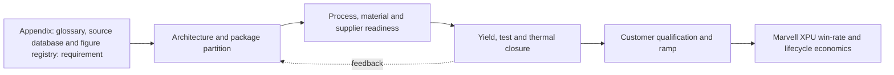

**Figure FIG-MMD-019.** Decision flow for Appendix: glossary, source database and figure registry. Author-created schematic based on cited sources.

**Comparison table - TBL-MAIN-019A**

| Dimension | Near-term decision | 2027-2030 direction | Marvell action |
|---|---|---|---|
| Architecture | Prove a qualified baseline | Increase modularity and package scale | Maintain reusable floorplans and chiplet interfaces |
| Manufacturing | Secure capacity and test coverage | Add process alternatives where credible | Negotiate configuration-specific capacity and learning access |
| Performance | Close HBM, D2D and I/O budgets | Shift bottlenecks toward power and cooling | Co-optimize package, SerDes, memory and optical IP |
| Economics | Model expected good-package cost | Reduce concentration and scrap exposure | Offer hyperscalers transparent cost/yield trade spaces |
| Roadmap status | Confirmed plus announced | Expected scenarios with triggers | Refresh quarterly and at customer architecture changes |

**Marvell implication matrix - TBL-MAIN-019B**

| Question | Leadership interpretation | Trigger to act |
|---|---|---|
| Does it improve XPU PPA? | Count package-enabled system benefit, not isolated die metrics | Material bandwidth, latency or power advantage |
| Does it improve schedule? | Reuse and qualification depth can outweigh theoretical density | Customer design freeze or foundry rule release |
| Does it reduce supply risk? | A second logo is not a second qualified configuration | Demonstrated equivalent package and test flow |
| Is ownership strategic? | Own differentiating interfaces and data; partner for scale manufacturing | Repeated dependency that affects win rate |

> **Marvell implication:** Treat Appendix: glossary, source database and figure registry as a customer-facing architecture capability with quantified PPA, yield, cost and supply options. Do not position it as a backend feature or rely on unqualified roadmap claims.

### Section close

- **Why it matters:** It can change attainable bandwidth, power, package size, schedule and hyperscaler TCO.
- **Current maturity:** Mixed by configuration; see profile and roadmap databases.
- **Key bottlenecks:** taxonomy consistency, source tiers, figure licenses.
- **Leading vendors:** See [vendor database](../data/vendor_roadmaps.yaml).
- **Roadmap:** See [2024-2030 roadmap](../data/vendor_roadmaps.yaml).
- **Marvell implication:** Integrate the capability into custom XPU architecture and commercial planning.
- **Corporate development implication:** Target control points where access, IP or scarce process knowledge changes win probability.
- **Open questions:** Qualification timing, capacity allocation, yield at target body size, and customer-specific reliability.
- **Figures and tables included:** FIG-MMD-019; TBL-MAIN-019A; TBL-MAIN-019B.
- **Next refresh recommendation:** 2026-09-10, or earlier on a material vendor or customer roadmap disclosure.

## 20. Appendix: refresh methodology

> **Section metadata**
> - **Section title:** Appendix: refresh methodology
> - **Owner placeholder:** Advanced Packaging Intelligence Owner
> - **Last refreshed date:** 2026-06-10
> - **Refresh status:** Current baseline
> - **Source count:** 2
> - **Confidence level:** Medium-high; confirmed facts separated from announced and inferred roadmap items
> - **Key changes since last refresh:** Initial repository baseline
> - **Open questions:** Customer qualification timing, package-level yields, commercial terms, and capacity allocation
> - **Links to related sections:** [reports/marvell_xpu_implications.md](../reports/marvell_xpu_implications.md), [data/technology_taxonomy.yaml](../data/technology_taxonomy.yaml), [data/source_database.yaml](../data/source_database.yaml)
> - **Figures included:** FIG-MMD-020
> - **Tables included:** TBL-MAIN-020A, TBL-MAIN-020B
> - **Next suggested refresh date:** 2026-09-10

The refresh system uses section dates, source deltas, explicit change types, confidence updates and validation so the knowledge base remains auditable. This section treats public vendor statements as evidence of direction, not as proof of customer-qualified volume. [[SRC-MRVL-005]](../data/source_database.yaml) [[SRC-IEEE-001]](../data/source_database.yaml)

### Architecture

The architecture should be evaluated as a system partitioning decision, not as a package label. The decisive boundary is where bandwidth-intensive functions sit relative to compute, memory, I/O and power delivery. A package that minimizes one link may worsen another, so floorplanning must jointly optimize HBM escape routing, die-to-die reach, optical or electrical I/O placement, decoupling and coolant access. For **Appendix: refresh methodology**, the practical focal point is 90-day staleness. This is a decision variable because it changes the package contract among the XPU architecture, HBM subsystem, connectivity fabric and manufacturing flow. [[SRC-MRVL-005]](../data/source_database.yaml) [[SRC-IEEE-001]](../data/source_database.yaml)

### Manufacturing flow

The manufacturing sequence determines accumulated yield and cycle time. Wafer sort, thinning, TSV reveal, redistribution, bump or hybrid-bond preparation, die placement, underfill or molding, substrate attach, lid attach and final test each create distinct defect opportunities. The commercially relevant metric is good systems per start and delivery predictability, not the yield of an isolated process module. For **Appendix: refresh methodology**, the practical focal point is new versus revised facts. This is a decision variable because it changes the package contract among the XPU architecture, HBM subsystem, connectivity fabric and manufacturing flow. [[SRC-MRVL-005]](../data/source_database.yaml) [[SRC-IEEE-001]](../data/source_database.yaml)

### Materials and process dependencies

Key dependencies include low-loss dielectrics, copper line and via control, ABF or alternative substrate capacity, temporary bonding materials, underfill, molding compound, thermal interface material and metrology. Material choices couple electrical loss, coefficient-of-thermal-expansion mismatch, moisture sensitivity and warpage; substituting a material therefore requires package requalification rather than a procurement-only change. For **Appendix: refresh methodology**, the practical focal point is contradictory evidence. This is a decision variable because it changes the package contract among the XPU architecture, HBM subsystem, connectivity fabric and manufacturing flow. [[SRC-MRVL-005]](../data/source_database.yaml) [[SRC-IEEE-001]](../data/source_database.yaml)

### Metrics and benchmark discipline

Bandwidth density, energy per bit, latency and pitch are useful only when test conditions are explicit. A short-reach die-to-die demonstration cannot be compared directly with a rack-reach SerDes link, and a bonding-pitch claim does not reveal routable bandwidth after power, keep-out and redundancy are included. The database therefore records ranges and caveats instead of false point precision. For **Appendix: refresh methodology**, the practical focal point is visual refresh. This is a decision variable because it changes the package contract among the XPU architecture, HBM subsystem, connectivity fabric and manufacturing flow. [[SRC-MRVL-005]](../data/source_database.yaml) [[SRC-IEEE-001]](../data/source_database.yaml)

### Economics and yield

Cost is dominated by more than assembly price. Expensive known-good logic and HBM make scrap exposure material; larger interposers and substrates reduce units per panel or wafer; additional test insertions raise cost but can prevent higher downstream loss. The correct model values expected good-package cost, schedule risk and customer revenue exposure from missed ramps. For **Appendix: refresh methodology**, the practical focal point is index rebuild. This is a decision variable because it changes the package contract among the XPU architecture, HBM subsystem, connectivity fabric and manufacturing flow. [[SRC-MRVL-005]](../data/source_database.yaml) [[SRC-IEEE-001]](../data/source_database.yaml)

### Thermal and power

Thermal design is becoming an architecture constraint. HBM, logic, optical engines and voltage conversion compete for package edge, vertical heat paths and coolant temperature budget. Hot spots, lateral gradients and thermo-mechanical cycling can reduce attainable frequency or lifetime even when average package power remains within a cold-plate rating. For **Appendix: refresh methodology**, the practical focal point is 90-day staleness. This is a decision variable because it changes the package contract among the XPU architecture, HBM subsystem, connectivity fabric and manufacturing flow. [[SRC-MRVL-005]](../data/source_database.yaml) [[SRC-IEEE-001]](../data/source_database.yaml)

### Supply chain and adoption

Adoption requires simultaneous readiness across foundry packaging, memory, substrate, OSAT or test, EDA signoff, system cooling and customer qualification. A nominally mature process may still be unavailable at the required body size, HBM count or regional supply path. Supplier concentration should therefore be tracked by qualified configuration, not vendor logo count. For **Appendix: refresh methodology**, the practical focal point is new versus revised facts. This is a decision variable because it changes the package contract among the XPU architecture, HBM subsystem, connectivity fabric and manufacturing flow. [[SRC-MRVL-005]](../data/source_database.yaml) [[SRC-IEEE-001]](../data/source_database.yaml)

### Competitive implications

Control of design rules, characterization data and capacity reservations can create a competitive moat. NVIDIA and Broadcom can optimize around large internal volumes, while merchant custom-silicon providers must convert ecosystem breadth and reusable IP into comparable schedule certainty. Open standards reduce switching friction only after interoperable silicon, test and software are proven. For **Appendix: refresh methodology**, the practical focal point is contradictory evidence. This is a decision variable because it changes the package contract among the XPU architecture, HBM subsystem, connectivity fabric and manufacturing flow. [[SRC-MRVL-005]](../data/source_database.yaml) [[SRC-IEEE-001]](../data/source_database.yaml)

### Marvell implication

Marvell should package this capability as part of an end-to-end XPU platform: architecture exploration, reusable die-to-die and HBM IP, package and board co-design, manufacturing ownership, test strategy and lifecycle telemetry. The differentiation is not ownership of every factory step; it is the ability to give a hyperscaler a credible performance, cost, yield and supply plan before design freeze. For **Appendix: refresh methodology**, the practical focal point is visual refresh. This is a decision variable because it changes the package contract among the XPU architecture, HBM subsystem, connectivity fabric and manufacturing flow. [[SRC-MRVL-005]](../data/source_database.yaml) [[SRC-IEEE-001]](../data/source_database.yaml)

### Corporate development implication

Partnership or investment should target capability gaps that are difficult to reproduce through ordinary sourcing: optical attach, thermal materials and structures, chiplet test, multi-physics automation, advanced substrate process know-how and interoperable die-to-die IP. Acquisitions deserve consideration only where control materially improves XPU win probability or protects a strategic interface. For **Appendix: refresh methodology**, the practical focal point is index rebuild. This is a decision variable because it changes the package contract among the XPU architecture, HBM subsystem, connectivity fabric and manufacturing flow. [[SRC-MRVL-005]](../data/source_database.yaml) [[SRC-IEEE-001]](../data/source_database.yaml)

### Roadmap through 2030

The likely trajectory is larger and more heterogeneous packages, finer vertical connections, more customized memory base dies, greater use of local bridges or RDL to manage cost, and optics moving closer to high-radix switch and selected compute packages. The pace will be gated by yield learning, serviceability and power removal rather than by interconnect demonstrations alone. For **Appendix: refresh methodology**, the practical focal point is 90-day staleness. This is a decision variable because it changes the package contract among the XPU architecture, HBM subsystem, connectivity fabric and manufacturing flow. [[SRC-MRVL-005]](../data/source_database.yaml) [[SRC-IEEE-001]](../data/source_database.yaml)

### Diligence priorities

Leadership should request configuration-specific evidence: qualified dimensions, HBM stack count, power map, thermal resistance, warpage, known-good-die coverage, repair flow, monthly capacity, cycle time, second-source path and cost sensitivity. Claims without these fields should remain announced or expected in the roadmap rather than promoted to confirmed. For **Appendix: refresh methodology**, the practical focal point is new versus revised facts. This is a decision variable because it changes the package contract among the XPU architecture, HBM subsystem, connectivity fabric and manufacturing flow. [[SRC-MRVL-005]](../data/source_database.yaml) [[SRC-IEEE-001]](../data/source_database.yaml)

**Figure FIG-MMD-020.** Decision flow for Appendix: refresh methodology. Author-created schematic based on cited sources.

**Comparison table - TBL-MAIN-020A**

| Dimension | Near-term decision | 2027-2030 direction | Marvell action |
|---|---|---|---|
| Architecture | Prove a qualified baseline | Increase modularity and package scale | Maintain reusable floorplans and chiplet interfaces |
| Manufacturing | Secure capacity and test coverage | Add process alternatives where credible | Negotiate configuration-specific capacity and learning access |
| Performance | Close HBM, D2D and I/O budgets | Shift bottlenecks toward power and cooling | Co-optimize package, SerDes, memory and optical IP |
| Economics | Model expected good-package cost | Reduce concentration and scrap exposure | Offer hyperscalers transparent cost/yield trade spaces |
| Roadmap status | Confirmed plus announced | Expected scenarios with triggers | Refresh quarterly and at customer architecture changes |

**Marvell implication matrix - TBL-MAIN-020B**

| Question | Leadership interpretation | Trigger to act |
|---|---|---|
| Does it improve XPU PPA? | Count package-enabled system benefit, not isolated die metrics | Material bandwidth, latency or power advantage |
| Does it improve schedule? | Reuse and qualification depth can outweigh theoretical density | Customer design freeze or foundry rule release |
| Does it reduce supply risk? | A second logo is not a second qualified configuration | Demonstrated equivalent package and test flow |
| Is ownership strategic? | Own differentiating interfaces and data; partner for scale manufacturing | Repeated dependency that affects win rate |

> **Marvell implication:** Treat Appendix: refresh methodology as a customer-facing architecture capability with quantified PPA, yield, cost and supply options. Do not position it as a backend feature or rely on unqualified roadmap claims.

### Section close

- **Why it matters:** It can change attainable bandwidth, power, package size, schedule and hyperscaler TCO.
- **Current maturity:** Mixed by configuration; see profile and roadmap databases.
- **Key bottlenecks:** 90-day staleness, new versus revised facts, contradictory evidence.
- **Leading vendors:** See [vendor database](../data/vendor_roadmaps.yaml).
- **Roadmap:** See [2024-2030 roadmap](../data/vendor_roadmaps.yaml).
- **Marvell implication:** Integrate the capability into custom XPU architecture and commercial planning.
- **Corporate development implication:** Target control points where access, IP or scarce process knowledge changes win probability.
- **Open questions:** Qualification timing, capacity allocation, yield at target body size, and customer-specific reliability.
- **Figures and tables included:** FIG-MMD-020; TBL-MAIN-020A; TBL-MAIN-020B.
- **Next refresh recommendation:** 2026-09-10, or earlier on a material vendor or customer roadmap disclosure.

## Claim-status legend

| Status | Meaning | Permitted leadership use |
|---|---|---|
| Confirmed | Standard, shipping disclosure, filing or repeatable public product evidence | Baseline planning with normal execution contingency |
| Announced | Vendor target or product announcement without complete qualification evidence | Scenario planning and supplier diligence |
| Expected | Analyst inference supported by multiple technical or ecosystem signals | Architecture option with explicit trigger and downside case |
| Speculative | Long-range concept, rumor or single-source unconfirmed claim | Monitor only; exclude from committed customer plan |

## Linked appendices

- [Technology taxonomy](../data/technology_taxonomy.yaml)
- [Vendor roadmaps](../data/vendor_roadmaps.yaml)
- [Source database](../data/source_database.yaml)
- [Benchmark database](../data/benchmark_database.yaml)
- [Figure registry](../data/figure_registry.yaml)
- [Mermaid catalog](../assets/diagrams/mermaid_catalog.md)
