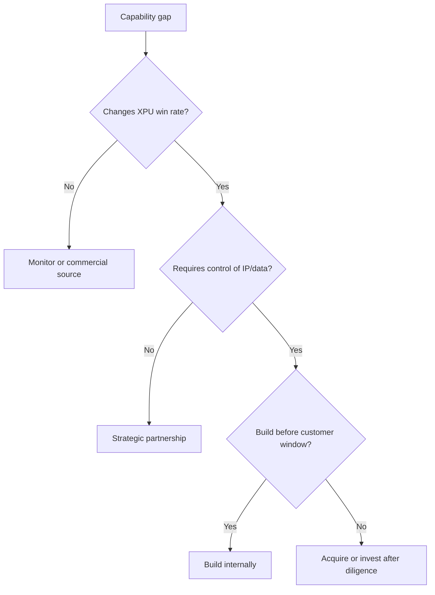

# Corporate Development and Partnership Watchlist

> **Section metadata**
> - **Section title:** Corporate Development and Partnership Watchlist
> - **Owner placeholder:** Advanced Packaging Intelligence Owner
> - **Last refreshed date:** 2026-06-10
> - **Refresh status:** Current baseline
> - **Source count:** 15
> - **Confidence level:** Medium-high; confirmed facts separated from announced and inferred roadmap items
> - **Key changes since last refresh:** Initial repository baseline
> - **Open questions:** Customer qualification timing, package-level yields, commercial terms, and capacity allocation
> - **Links to related sections:** [reports/marvell_xpu_implications.md](../reports/marvell_xpu_implications.md), [companies/README.md](../companies/README.md), [data/company_database.yaml](../data/company_database.yaml)
> - **Figures included:** FIG-MMD-026
> - **Tables included:** TBL-CORP-001, TBL-CORP-002, TBL-CORP-003, TBL-CORP-004, TBL-CORP-005
> - **Next suggested refresh date:** 2026-09-10

The watchlist is capability-led. It does not imply that a company is for sale, affordable, strategically willing to transact or compatible with Marvell's legal and customer constraints. Valuation and revenue are marked unavailable unless a cited public source supports them. The recommendation first asks whether control of the capability can change XPU win rate, schedule, PPA or supply assurance. [[SRC-MRVL-001]](../data/source_database.yaml) [[SRC-IEEE-001]](../data/source_database.yaml)

## Chiplet interconnect IP

### Alphawave Semi

Alphawave Semi is monitored for **SerDes and UCIe IP**. The preliminary posture is **Partner / monitor**, with estimated public maturity **High**. The strategic question is whether privileged access, co-development rights or ownership would shorten qualification or secure a differentiating interface across multiple Marvell franchises. Valuation, revenue and customer concentration are unavailable in this baseline unless disclosed in the cited source database. [[SRC-MRVL-001]](../data/source_database.yaml) [[SRC-IEEE-001]](../data/source_database.yaml)

**Watchlist table - TBL-CORP-001**

| Company | Technology | Recommendation | Public maturity | Core diligence |
|---|---|---|---|---|
| Alphawave Semi | SerDes and UCIe IP | Partner / monitor | High | Production evidence, IP rights, customer conflicts, integration cost |

## EDA and multi-die tools

### Siemens EDA

Siemens EDA is monitored for **3D physical verification**. The preliminary posture is **Partner**, with estimated public maturity **High**. The strategic question is whether privileged access, co-development rights or ownership would shorten qualification or secure a differentiating interface across multiple Marvell franchises. Valuation, revenue and customer concentration are unavailable in this baseline unless disclosed in the cited source database. [[SRC-MRVL-001]](../data/source_database.yaml) [[SRC-IEEE-001]](../data/source_database.yaml)

**Watchlist table - TBL-CORP-002**

| Company | Technology | Recommendation | Public maturity | Core diligence |
|---|---|---|---|---|
| Siemens EDA | 3D physical verification | Partner | High | Production evidence, IP rights, customer conflicts, integration cost |

## Glass and substrate

### 3D Glass Solutions

3D Glass Solutions is monitored for **Glass-core and RF/package structures**. The preliminary posture is **Partner / monitor**, with estimated public maturity **Medium**. The strategic question is whether privileged access, co-development rights or ownership would shorten qualification or secure a differentiating interface across multiple Marvell franchises. Valuation, revenue and customer concentration are unavailable in this baseline unless disclosed in the cited source database. [[SRC-MRVL-001]](../data/source_database.yaml) [[SRC-IEEE-001]](../data/source_database.yaml)

### Absolics

Absolics is monitored for **Glass substrate manufacturing**. The preliminary posture is **Partner / monitor**, with estimated public maturity **Medium**. The strategic question is whether privileged access, co-development rights or ownership would shorten qualification or secure a differentiating interface across multiple Marvell franchises. Valuation, revenue and customer concentration are unavailable in this baseline unless disclosed in the cited source database. [[SRC-MRVL-001]](../data/source_database.yaml) [[SRC-IEEE-001]](../data/source_database.yaml)

**Watchlist table - TBL-CORP-003**

| Company | Technology | Recommendation | Public maturity | Core diligence |
|---|---|---|---|---|
| 3D Glass Solutions | Glass-core and RF/package structures | Partner / monitor | Medium | Production evidence, IP rights, customer conflicts, integration cost |
| Absolics | Glass substrate manufacturing | Partner / monitor | Medium | Production evidence, IP rights, customer conflicts, integration cost |

## OSAT and test

### Amkor

Amkor is monitored for **Advanced package assembly and U.S. regionalization**. The preliminary posture is **Strategic partner**, with estimated public maturity **High**. The strategic question is whether privileged access, co-development rights or ownership would shorten qualification or secure a differentiating interface across multiple Marvell franchises. Valuation, revenue and customer concentration are unavailable in this baseline unless disclosed in the cited source database. [[SRC-MRVL-001]](../data/source_database.yaml) [[SRC-IEEE-001]](../data/source_database.yaml)

### ASE

ASE is monitored for **VIPack, fan-out, bridge and test**. The preliminary posture is **Strategic partner**, with estimated public maturity **High**. The strategic question is whether privileged access, co-development rights or ownership would shorten qualification or secure a differentiating interface across multiple Marvell franchises. Valuation, revenue and customer concentration are unavailable in this baseline unless disclosed in the cited source database. [[SRC-MRVL-001]](../data/source_database.yaml) [[SRC-IEEE-001]](../data/source_database.yaml)

### KYEC

KYEC is monitored for **High-end test capacity**. The preliminary posture is **Partner / monitor**, with estimated public maturity **Medium-high**. The strategic question is whether privileged access, co-development rights or ownership would shorten qualification or secure a differentiating interface across multiple Marvell franchises. Valuation, revenue and customer concentration are unavailable in this baseline unless disclosed in the cited source database. [[SRC-MRVL-001]](../data/source_database.yaml) [[SRC-IEEE-001]](../data/source_database.yaml)

**Watchlist table - TBL-CORP-004**

| Company | Technology | Recommendation | Public maturity | Core diligence |
|---|---|---|---|---|
| Amkor | Advanced package assembly and U.S. regionalization | Strategic partner | High | Production evidence, IP rights, customer conflicts, integration cost |
| ASE | VIPack, fan-out, bridge and test | Strategic partner | High | Production evidence, IP rights, customer conflicts, integration cost |
| KYEC | High-end test capacity | Partner / monitor | Medium-high | Production evidence, IP rights, customer conflicts, integration cost |

## Optical components

### Coherent

Coherent is monitored for **Lasers, transceivers and optical engines**. The preliminary posture is **Strategic partner**, with estimated public maturity **High**. The strategic question is whether privileged access, co-development rights or ownership would shorten qualification or secure a differentiating interface across multiple Marvell franchises. Valuation, revenue and customer concentration are unavailable in this baseline unless disclosed in the cited source database. [[SRC-MRVL-001]](../data/source_database.yaml) [[SRC-IEEE-001]](../data/source_database.yaml)

### Lumentum

Lumentum is monitored for **External laser and optical component supply**. The preliminary posture is **Strategic partner**, with estimated public maturity **High**. The strategic question is whether privileged access, co-development rights or ownership would shorten qualification or secure a differentiating interface across multiple Marvell franchises. Valuation, revenue and customer concentration are unavailable in this baseline unless disclosed in the cited source database. [[SRC-MRVL-001]](../data/source_database.yaml) [[SRC-IEEE-001]](../data/source_database.yaml)

**Watchlist table - TBL-CORP-005**

| Company | Technology | Recommendation | Public maturity | Core diligence |
|---|---|---|---|---|
| Coherent | Lasers, transceivers and optical engines | Strategic partner | High | Production evidence, IP rights, customer conflicts, integration cost |
| Lumentum | External laser and optical component supply | Strategic partner | High | Production evidence, IP rights, customer conflicts, integration cost |

## Power delivery

### Vicor

Vicor is monitored for **High-density power modules**. The preliminary posture is **Partner / monitor**, with estimated public maturity **High**. The strategic question is whether privileged access, co-development rights or ownership would shorten qualification or secure a differentiating interface across multiple Marvell franchises. Valuation, revenue and customer concentration are unavailable in this baseline unless disclosed in the cited source database. [[SRC-MRVL-001]](../data/source_database.yaml) [[SRC-IEEE-001]](../data/source_database.yaml)

### Empower Semiconductor

Empower Semiconductor is monitored for **Integrated voltage regulation**. The preliminary posture is **Partner / monitor**, with estimated public maturity **Medium**. The strategic question is whether privileged access, co-development rights or ownership would shorten qualification or secure a differentiating interface across multiple Marvell franchises. Valuation, revenue and customer concentration are unavailable in this baseline unless disclosed in the cited source database. [[SRC-MRVL-001]](../data/source_database.yaml) [[SRC-IEEE-001]](../data/source_database.yaml)

**Watchlist table - TBL-CORP-006**

| Company | Technology | Recommendation | Public maturity | Core diligence |
|---|---|---|---|---|
| Vicor | High-density power modules | Partner / monitor | High | Production evidence, IP rights, customer conflicts, integration cost |
| Empower Semiconductor | Integrated voltage regulation | Partner / monitor | Medium | Production evidence, IP rights, customer conflicts, integration cost |

## Reliability and inspection

### Onto Innovation

Onto Innovation is monitored for **Advanced packaging inspection**. The preliminary posture is **Partner / monitor**, with estimated public maturity **High**. The strategic question is whether privileged access, co-development rights or ownership would shorten qualification or secure a differentiating interface across multiple Marvell franchises. Valuation, revenue and customer concentration are unavailable in this baseline unless disclosed in the cited source database. [[SRC-MRVL-001]](../data/source_database.yaml) [[SRC-IEEE-001]](../data/source_database.yaml)

**Watchlist table - TBL-CORP-007**

| Company | Technology | Recommendation | Public maturity | Core diligence |
|---|---|---|---|---|
| Onto Innovation | Advanced packaging inspection | Partner / monitor | High | Production evidence, IP rights, customer conflicts, integration cost |

## Silicon photonics and CPO

### Ayar Labs

Ayar Labs is monitored for **Optical I/O chiplet and external laser**. The preliminary posture is **Partner / invest**, with estimated public maturity **High**. The strategic question is whether privileged access, co-development rights or ownership would shorten qualification or secure a differentiating interface across multiple Marvell franchises. Valuation, revenue and customer concentration are unavailable in this baseline unless disclosed in the cited source database. [[SRC-MRVL-001]](../data/source_database.yaml) [[SRC-IEEE-001]](../data/source_database.yaml)

### Lightmatter

Lightmatter is monitored for **Photonic interposer and scale-up fabric**. The preliminary posture is **Partner / monitor**, with estimated public maturity **Medium-high**. The strategic question is whether privileged access, co-development rights or ownership would shorten qualification or secure a differentiating interface across multiple Marvell franchises. Valuation, revenue and customer concentration are unavailable in this baseline unless disclosed in the cited source database. [[SRC-MRVL-001]](../data/source_database.yaml) [[SRC-IEEE-001]](../data/source_database.yaml)

### Ranovus

Ranovus is monitored for **CPO optical engine**. The preliminary posture is **Partner / consider investment**, with estimated public maturity **Medium**. The strategic question is whether privileged access, co-development rights or ownership would shorten qualification or secure a differentiating interface across multiple Marvell franchises. Valuation, revenue and customer concentration are unavailable in this baseline unless disclosed in the cited source database. [[SRC-MRVL-001]](../data/source_database.yaml) [[SRC-IEEE-001]](../data/source_database.yaml)

**Watchlist table - TBL-CORP-008**

| Company | Technology | Recommendation | Public maturity | Core diligence |
|---|---|---|---|---|
| Ayar Labs | Optical I/O chiplet and external laser | Partner / invest | High | Production evidence, IP rights, customer conflicts, integration cost |
| Lightmatter | Photonic interposer and scale-up fabric | Partner / monitor | Medium-high | Production evidence, IP rights, customer conflicts, integration cost |
| Ranovus | CPO optical engine | Partner / consider investment | Medium | Production evidence, IP rights, customer conflicts, integration cost |

## Thermal and multi-physics

### Ansys

Ansys is monitored for **Package-system simulation**. The preliminary posture is **Partner**, with estimated public maturity **High**. The strategic question is whether privileged access, co-development rights or ownership would shorten qualification or secure a differentiating interface across multiple Marvell franchises. Valuation, revenue and customer concentration are unavailable in this baseline unless disclosed in the cited source database. [[SRC-MRVL-001]](../data/source_database.yaml) [[SRC-IEEE-001]](../data/source_database.yaml)

**Watchlist table - TBL-CORP-009**

| Company | Technology | Recommendation | Public maturity | Core diligence |
|---|---|---|---|---|
| Ansys | Package-system simulation | Partner | High | Production evidence, IP rights, customer conflicts, integration cost |

## Thermal management

### Carbice

Carbice is monitored for **Advanced thermal interface materials**. The preliminary posture is **Pilot / invest**, with estimated public maturity **Medium**. The strategic question is whether privileged access, co-development rights or ownership would shorten qualification or secure a differentiating interface across multiple Marvell franchises. Valuation, revenue and customer concentration are unavailable in this baseline unless disclosed in the cited source database. [[SRC-MRVL-001]](../data/source_database.yaml) [[SRC-IEEE-001]](../data/source_database.yaml)

**Watchlist table - TBL-CORP-010**

| Company | Technology | Recommendation | Public maturity | Core diligence |
|---|---|---|---|---|
| Carbice | Advanced thermal interface materials | Pilot / invest | Medium | Production evidence, IP rights, customer conflicts, integration cost |

## Yield analytics

### PDF Solutions

PDF Solutions is monitored for **Manufacturing data analytics**. The preliminary posture is **Partner / acquire capability**, with estimated public maturity **High**. The strategic question is whether privileged access, co-development rights or ownership would shorten qualification or secure a differentiating interface across multiple Marvell franchises. Valuation, revenue and customer concentration are unavailable in this baseline unless disclosed in the cited source database. [[SRC-MRVL-001]](../data/source_database.yaml) [[SRC-IEEE-001]](../data/source_database.yaml)

**Watchlist table - TBL-CORP-011**

| Company | Technology | Recommendation | Public maturity | Core diligence |
|---|---|---|---|---|
| PDF Solutions | Manufacturing data analytics | Partner / acquire capability | High | Production evidence, IP rights, customer conflicts, integration cost |

## Portfolio decision rules

| Decision | Use when | Avoid when |
|---|---|---|
| Build | Capability differentiates multiple products and requires deep architecture integration | Capability is manufacturing-scale dominated |
| Partner | Supplier scale and shared roadmap outweigh ownership | Access can be withdrawn or data rights are inadequate |
| Acquire / invest | Scarce IP, team or process knowledge materially changes win probability | Thesis depends on unsourced TAM, valuation or customer claims |
| Monitor | Technology is pre-qualification or timing is uncertain | Delay would forfeit a near-term customer architecture slot |

## Diligence playbooks

### Optical I/O and CPO

Optical targets should be diligenced as manufacturing and service platforms, not only photonic devices. Marvell needs evidence for laser source strategy, coupling loss, fiber attach automation, optical and electrical test time, thermal isolation, redundancy, field replacement, firmware telemetry and the interface to XPU or switch protocols. A compelling laboratory bandwidth result can still fail the system business case if assembly yield or field service creates excessive downtime. The strongest partnership candidate is one that complements Marvell's DSP, SerDes, switching and silicon-photonics assets while preserving architectural choice across foundries and customers. [[SRC-MRVL-003]](../data/source_database.yaml) [[SRC-OIF-001]](../data/source_database.yaml) [[SRC-AYAR-001]](../data/source_database.yaml)

### HBM controller, base-die and memory enablement

HBM-related targets require careful boundary diligence because the memory vendor, JEDEC interface, foundry logic process and XPU controller each own different portions of the solution. Marvell should identify what can be customized without compromising memory qualification, who owns verification collateral, how failure analysis crosses company boundaries, and whether base-die logic creates durable differentiation or customer-specific engineering burden. The acquisition thesis should not rest on generic HBM demand; it should rest on a controlled interface or team that improves multiple XPU generations. [[SRC-JEDEC-001]](../data/source_database.yaml) [[SRC-MRVL-001]](../data/source_database.yaml)

### Chiplet interconnect and test

Interconnect IP should be evaluated together with DFT, bring-up and interoperability. Physical-layer efficiency matters, but so do training time, repair, sideband management, security, performance counters, compliance and package-level fault isolation. A target with a strong PHY but weak test and software may add integration burden. Marvell should prefer assets that shorten the path from package simulation to known-good-die screening and system telemetry, and that can support proprietary low-overhead modes alongside standards where customers require them. [[SRC-UCIE-001]](../data/source_database.yaml) [[SRC-UCIE-002]](../data/source_database.yaml)

### Thermal, power and reliability

Thermal and power targets are attractive when they provide a defensible material, structure, model or control loop that scales across XPU, switch and optical packages. Diligence must include accelerated life data, pump-out or delamination behavior, contamination, supply scalability, compatibility with foundry and OSAT materials, and correlation between simulation and measured systems. A small materials company may have high technical leverage but difficult qualification and customer concentration, making staged investment or joint development preferable to immediate acquisition. [[SRC-ANSYS-001]](../data/source_database.yaml) [[SRC-ECTC-001]](../data/source_database.yaml)

### Glass substrates and inspection

Glass-related assets should be treated as options on late-decade package scaling until high-end customer qualification is visible. Important evidence includes through-glass-via yield, panel handling, metallization adhesion, large-body flatness, mechanical shock, thermal cycling, repair and compatibility with existing assembly tools. Inspection and metrology may offer earlier value than owning substrate manufacturing because every denser process requires defect detection and process control. [[SRC-INTEL-002]](../data/source_database.yaml) [[SRC-IEEE-001]](../data/source_database.yaml)

### EDA, analytics and data rights

The central diligence question for EDA and analytics is whether the asset converts fragmented supplier data into earlier architecture decisions or faster yield learning. Marvell should seek automated die-package-board co-optimization, thermal and mechanical model calibration, test-data fusion, anomaly detection and traceability while confirming that customer and supplier contracts permit the required data use. An acquisition that cannot access production data will not deliver the expected learning advantage. [[SRC-CADENCE-001]](../data/source_database.yaml) [[SRC-SIEMENS-001]](../data/source_database.yaml) [[SRC-ANSYS-001]](../data/source_database.yaml)

## Transaction and partnership gates

**Gate 1: strategic mechanism.** The sponsor must identify the exact mechanism by which the target changes a Marvell customer outcome. Acceptable mechanisms include a measurable improvement in package bandwidth or power, earlier customer qualification, reduced compound scrap, protected access to a scarce interface, improved multi-source resilience or a new XPU-attach revenue stream. Generic exposure to AI, HBM or advanced packaging is not sufficient. [[SRC-MRVL-001]](../data/source_database.yaml)

**Gate 2: evidence quality.** Technical diligence should separate simulation, test vehicle, customer sample, qualified product and volume production. Reliability evidence must state sample size, stress condition and failure criteria. Commercial diligence should distinguish signed revenue, non-binding design engagement and ecosystem partnership. Any claim that cannot be tied to a source or data-room artifact remains an assumption in the investment case. [[SRC-ECTC-001]](../data/source_database.yaml) [[SRC-IEEE-001]](../data/source_database.yaml)

**Gate 3: integration path.** The operating plan must specify where the team, IP, design flow, manufacturing relationship and customer obligations will reside after a transaction. Photonics and packaging assets often span foundry process design kits, supplier agreements and customer-specific data that may not transfer automatically. Marvell should price the time needed to requalify a process or migrate a design, not only the purchase consideration. [[SRC-TSMC-004]](../data/source_database.yaml) [[SRC-CADENCE-001]](../data/source_database.yaml)

**Gate 4: option value versus ownership.** A minority investment, joint development agreement, preferred-supply arrangement or IP license may preserve access while the market proves maturity. Full acquisition is more defensible when Marvell needs exclusive control, the capability serves multiple product lines, integration can meet a customer window and the team or data cannot be recreated through hiring and partnership. [[SRC-MRVL-003]](../data/source_database.yaml)

**Gate 5: downside case.** The investment committee should model delayed qualification, lower customer adoption, foundry incompatibility, competitor response and key-person loss. For private targets, valuation and fundraising claims remain unavailable unless documented. The downside plan should identify standalone value to Marvell's existing optical, switching or custom-silicon portfolio if the original packaging roadmap slips. [[SRC-MRVL-001]](../data/source_database.yaml)

## Priority sequence

Near-term priority should go to partnerships that strengthen HBM4 package execution, TSMC and OSAT capacity visibility, optical attach, external laser supply and multi-physics signoff. The next tier is investment or acquisition of analytics, test and telemetry capabilities that improve learning across programs. Glass substrates, panel-level advanced fan-out and more speculative optical-memory architectures should remain monitored with defined technical triggers. This sequence aligns capital with customer design windows while preserving exposure to technologies that may become important later in the decade. [[SRC-JEDEC-001]](../data/source_database.yaml) [[SRC-INTEL-002]](../data/source_database.yaml) [[SRC-OIF-001]](../data/source_database.yaml)

The watchlist owner should maintain a one-page evidence card for every priority target. The card should record technical maturity, customer evidence, manufacturing path, key-person dependence, intellectual-property ownership, foundry portability, data rights, partnership history, transaction constraints and the next event that could change the recommendation. Corporate development, engineering and business leadership should review the same card so technical excitement, customer urgency and transaction feasibility are reconciled before resources are committed. This common record also prevents unsourced valuation, revenue or fundraising assumptions from migrating into the strategic thesis. [[SRC-MRVL-001]](../data/source_database.yaml) [[SRC-IEEE-001]](../data/source_database.yaml)

## Quarterly watchlist triggers

- Customer adoption of optical scale-up or proprietary/open fabric changes.
- HBM base-die ownership and qualification model changes.
- Foundry or OSAT release of new package body size, pitch or regional capacity.
- Demonstrated field reliability for CPO optical engines and external lasers.
- New inspection, test or repair method that materially lowers compound scrap.
- Glass substrate qualification with high-end logic and HBM.
- Material changes in target ownership, funding, customer concentration or strategic partnerships.
