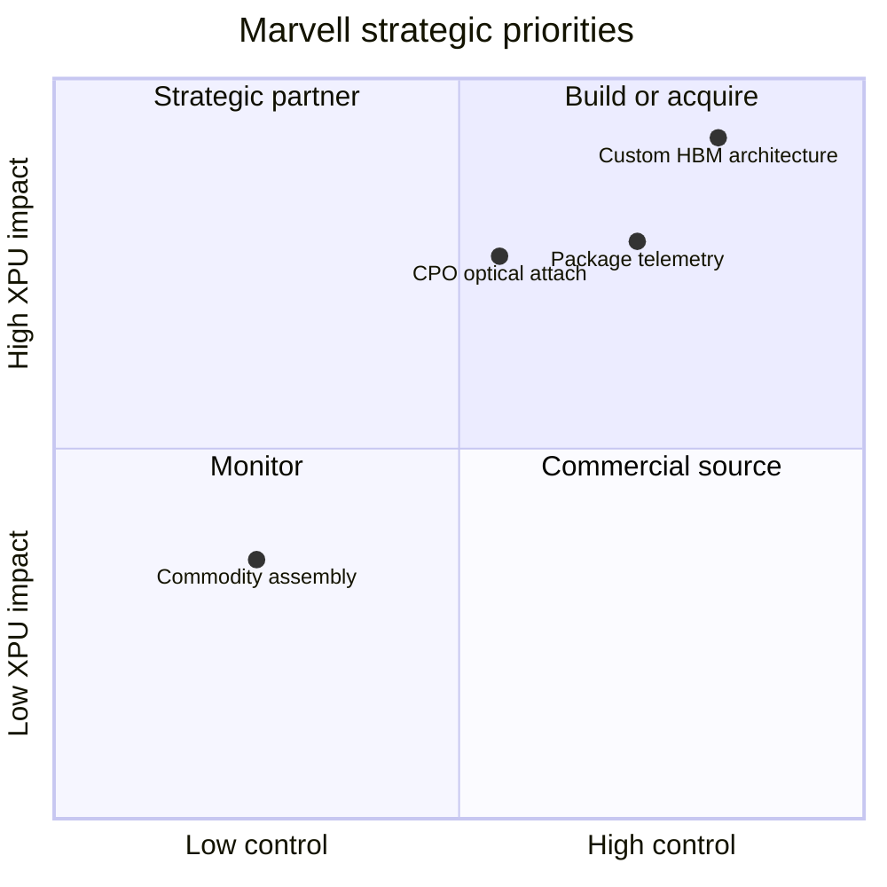

# Executive Summary for Marvell Leadership

> **Section metadata**
> - **Section title:** Executive Summary for Marvell Leadership
> - **Owner placeholder:** Advanced Packaging Intelligence Owner
> - **Last refreshed date:** 2026-06-10
> - **Refresh status:** Current baseline
> - **Source count:** 14
> - **Confidence level:** Medium-high; confirmed facts separated from announced and inferred roadmap items
> - **Key changes since last refresh:** Initial repository baseline
> - **Open questions:** Customer qualification timing, package-level yields, commercial terms, and capacity allocation
> - **Links to related sections:** [reports/advanced_packaging_main_report.md](../reports/advanced_packaging_main_report.md), [reports/marvell_xpu_implications.md](../reports/marvell_xpu_implications.md), [reports/corp_dev_and_partnership_watchlist.md](../reports/corp_dev_and_partnership_watchlist.md)
> - **Figures included:** FIG-MMD-023, FIG-MMD-025
> - **Tables included:** TBL-EXEC-001, TBL-EXEC-002
> - **Next suggested refresh date:** 2026-09-10

Advanced packaging should be managed as a strategic control plane for Marvell's custom XPU business. Hyperscalers do not buy an interposer or bonding flow in isolation; they buy an accelerator platform that must reach a workload target, fit a rack power and cooling envelope, ramp on time, yield predictably and remain serviceable for years. Marvell can differentiate when its package architecture and supplier orchestration make those outcomes more credible than a competitor's offer. The central recommendation is to productize package co-design, custom HBM and scale-up connectivity as a reusable platform with quantified configuration choices rather than a bespoke backend service. [[SRC-MRVL-001]](../data/source_database.yaml) [[SRC-TSMC-001]](../data/source_database.yaml)

## Ten key takeaways

**1. Packaging is now a product architecture and supply-assurance capability; it is differentiating when it changes delivered XPU performance, power, schedule, yield or TCO.**

The leadership implication is to require a named owner, measurable gate and source-backed confidence level. A roadmap item should not enter a customer commitment until architecture, manufacturing, test, thermal and capacity evidence agree. [[SRC-MRVL-001]](../data/source_database.yaml) [[SRC-IEEE-001]](../data/source_database.yaml)

**2. HBM4 shifts value into the logic base die and package co-design, creating a credible Marvell differentiation point if memory-vendor interfaces and commercial ownership are secured.**

The leadership implication is to require a named owner, measurable gate and source-backed confidence level. A roadmap item should not enter a customer commitment until architecture, manufacturing, test, thermal and capacity evidence agree. [[SRC-MRVL-001]](../data/source_database.yaml) [[SRC-IEEE-001]](../data/source_database.yaml)

**3. TSMC CoWoS remains the reference path for leading AI accelerators, but concentration in a qualified configuration is more important than generic vendor concentration.**

The leadership implication is to require a named owner, measurable gate and source-backed confidence level. A roadmap item should not enter a customer commitment until architecture, manufacturing, test, thermal and capacity evidence agree. [[SRC-MRVL-001]](../data/source_database.yaml) [[SRC-IEEE-001]](../data/source_database.yaml)

**4. CoWoS-L, RDL interposers and local bridges are strategic cost and capacity alternatives, but none is a drop-in substitute for a validated silicon-interposer design.**

The leadership implication is to require a named owner, measurable gate and source-backed confidence level. A roadmap item should not enter a customer commitment until architecture, manufacturing, test, thermal and capacity evidence agree. [[SRC-MRVL-001]](../data/source_database.yaml) [[SRC-IEEE-001]](../data/source_database.yaml)

**5. Hybrid bonding expands vertical bandwidth density and cache or logic partitioning options while increasing known-good-die, thermal and irreparability risk.**

The leadership implication is to require a named owner, measurable gate and source-backed confidence level. A roadmap item should not enter a customer commitment until architecture, manufacturing, test, thermal and capacity evidence agree. [[SRC-MRVL-001]](../data/source_database.yaml) [[SRC-IEEE-001]](../data/source_database.yaml)

**6. CPO first becomes compelling at high-radix switches; XPU optical I/O follows where copper reach and package-edge bandwidth constrain rack-scale fabrics.**

The leadership implication is to require a named owner, measurable gate and source-backed confidence level. A roadmap item should not enter a customer commitment until architecture, manufacturing, test, thermal and capacity evidence agree. [[SRC-MRVL-001]](../data/source_database.yaml) [[SRC-IEEE-001]](../data/source_database.yaml)

**7. Marvell's advantage is portfolio adjacency: custom compute, SerDes, Ethernet switching, optical DSP, silicon photonics and system architecture can be co-optimized.**

The leadership implication is to require a named owner, measurable gate and source-backed confidence level. A roadmap item should not enter a customer commitment until architecture, manufacturing, test, thermal and capacity evidence agree. [[SRC-MRVL-001]](../data/source_database.yaml) [[SRC-IEEE-001]](../data/source_database.yaml)

**8. Broadcom's custom ASIC scale and customer incumbency are the closest direct threat; NVIDIA's full-stack model is the strongest platform threat.**

The leadership implication is to require a named owner, measurable gate and source-backed confidence level. A roadmap item should not enter a customer commitment until architecture, manufacturing, test, thermal and capacity evidence agree. [[SRC-MRVL-001]](../data/source_database.yaml) [[SRC-IEEE-001]](../data/source_database.yaml)

**9. Test, yield and thermal telemetry should become reusable Marvell IP and a customer deliverable, not remain fragmented supplier data.**

The leadership implication is to require a named owner, measurable gate and source-backed confidence level. A roadmap item should not enter a customer commitment until architecture, manufacturing, test, thermal and capacity evidence agree. [[SRC-MRVL-001]](../data/source_database.yaml) [[SRC-IEEE-001]](../data/source_database.yaml)

**10. The winning 2030 platform will combine advanced packaging, memory customization and optical or electrical scale-up under a credible manufacturing and lifecycle plan.**

The leadership implication is to require a named owner, measurable gate and source-backed confidence level. A roadmap item should not enter a customer commitment until architecture, manufacturing, test, thermal and capacity evidence agree. [[SRC-MRVL-001]](../data/source_database.yaml) [[SRC-IEEE-001]](../data/source_database.yaml)

## Five packaging roadmaps Marvell must monitor

| Roadmap | Why it changes competition | Primary trigger | Confidence |
|---|---|---|---|
| CoWoS-S/L/R and large-package capacity | Determines feasible HBM count, package size and customer schedule | Qualified body size, capacity and cycle-time disclosure | High for direction; medium for configuration |
| HBM4/HBM4E and custom base die | Changes bandwidth, power, control partition and supplier relationship | JEDEC update plus memory-vendor customer qualification | High for HBM4; medium for custom implementation |
| SoIC / hybrid bonding | Enables cache and logic stacking with new thermal and yield risks | Production product evidence at relevant die area | Medium |
| CPO and optical I/O | Can change scale-up topology and Marvell attach opportunity | Field-deployed reliability and service model | Medium |
| Substrate, power and cooling | Sets the practical package and rack envelope | Large-body warpage, glass qualification, coolant and IVR milestones | Medium-low beyond 2028 |

## Five potential strategic moves

| Move | Category | XPU win-rate impact | Timing | Principal dependency |
|---|---|---:|---|---|
| Productize two reusable HBM4 package reference architectures | Build | 5/5 | Immediate | TSMC and memory-vendor co-design |
| Establish multi-year configuration-specific packaging capacity agreements | Partner | 5/5 | Immediate | Customer forecast quality |
| Build a package telemetry and yield analytics layer | Build / acquire | 4/5 | 12-24 months | Supplier data access |
| Secure optical attach and external-laser ecosystem options | Partner / invest | 4/5 | 12-36 months | CPO customer roadmap |
| Invest in chiplet test and multi-physics automation | Acquire / partner | 3/5 | 12-36 months | Integration into design flow |

## Five key risks

| Risk | Exposure | Mitigation |
|---|---|---|
| TSMC advanced-package concentration | Schedule and pricing leverage | Configuration-specific reservations and credible RDL/bridge alternatives |
| HBM qualification or supply miss | XPU ramp and performance | Multi-vendor design planning, base-die governance and early test vehicles |
| Package power and thermal closure failure | Frequency, reliability and rack density | Joint die-package-cold-plate optimization before floorplan freeze |
| CPO serviceability shortfall | Field availability and customer resistance | External lasers, replaceable optical assemblies and telemetry |
| Broadcom or NVIDIA platform lock-in | Reduced Marvell sockets | Open plus proprietary fabric options and full XPU-attach portfolio |

## Leadership decision framework

**Architecture control.** Marvell should define which package interfaces are strategic and reusable across customers: compute-to-I/O die links, HBM PHY and base-die boundaries, management and security chiplets, scale-up ports, optical-engine attachment, telemetry and power-management hooks. Owning these contracts allows Marvell to change a supplier or process generation without reopening the full accelerator architecture. It also creates a more credible multi-generation proposal because the customer can see which investments are reusable and which remain program-specific. [[SRC-MRVL-001]](../data/source_database.yaml) [[SRC-UCIE-001]](../data/source_database.yaml)

**Capacity as a design input.** A package is not viable merely because a foundry design manual supports it. The required combination of interposer size, HBM count, substrate body, assembly line, test flow and delivery window must have reserved and qualified capacity. Marvell should bring sourcing and operations into architecture selection before floorplan freeze, model downside allocations and maintain a capacity ledger by configuration. This is particularly important for leading TSMC flows and for HBM, where logic-package and memory qualification schedules are tightly coupled. [[SRC-TSMC-002]](../data/source_database.yaml) [[SRC-JEDEC-001]](../data/source_database.yaml)

**Yield ownership.** Suppliers own process steps, but Marvell should own the system yield model and the customer explanation. That model should include incoming known-good-die quality, interposer or bridge yield, substrate yield, placement and bonding yield, HBM attach, final test coverage, burn-in, repair or salvage options and cycle-time impact. The purpose is not to challenge supplier accounting; it is to make architecture tradeoffs before an expensive combination creates nonlinear scrap exposure. [[SRC-ASE-001]](../data/source_database.yaml) [[SRC-AMKOR-001]](../data/source_database.yaml)

**Thermal closure.** Package thermal analysis should start from workload transients and coolant conditions rather than a single nominal TDP. Marvell needs correlated models for logic hot spots, HBM temperature, optical-engine isolation, voltage-conversion loss, lid and TIM behavior, cold-plate pressure and long-term pump or coolant variation. A package with higher theoretical bandwidth can deliver lower fleet value if thermal throttling, aging margin or service complexity reduces sustained utilization. [[SRC-ANSYS-001]](../data/source_database.yaml) [[SRC-IEEE-001]](../data/source_database.yaml)

**Commercial packaging.** Hyperscalers should receive a small set of explicit package choices with PPA, cost, yield, schedule and supply implications. A premium architecture may use more HBM and denser interconnect; a balanced architecture may use local bridges or RDL to reduce silicon area; an inference architecture may trade HBM for alternative memory. This approach makes packaging part of the customer value proposition and prevents the program from defaulting to the technically densest option without a fleet-economic case. [[SRC-MRVL-001]](../data/source_database.yaml)

**Evidence governance.** A cross-functional packaging council should review each roadmap item and assign confirmed, announced, expected or speculative status. Promotion requires evidence: a standard, a qualified design rule, a product ramp, customer qualification, measured reliability or contracted capacity. This discipline matters because vendor roadmaps often describe a platform family while the customer needs a specific body size, pitch, HBM stack count and regional path. [[SRC-IEEE-001]](../data/source_database.yaml) [[SRC-TSMC-003]](../data/source_database.yaml)

**Customer proposal design.** Every strategic custom XPU pursuit should include a package architecture appendix at the same maturity as the compute architecture. It should show the baseline and alternative package, HBM assumptions, die partition, power map, cooling interface, test strategy, capacity path and explicit items that remain subject to supplier qualification. This creates an auditable contract between engineering, operations and the customer and reduces the risk that packaging constraints surface after logic floorplan or software commitments are difficult to change. [[SRC-MRVL-001]](../data/source_database.yaml) [[SRC-TSMC-001]](../data/source_database.yaml)

**Portfolio leverage.** Marvell should measure packaging investments across custom compute, Ethernet switching, coherent and PAM DSP, CXL, retimers and silicon photonics. Shared SerDes, optical attach, thermal characterization, chiplet test and manufacturing analytics can improve several franchises, which raises the return on internal development and selected acquisitions. Conversely, a capability that serves one speculative customer configuration should remain a co-development or sourcing project until repeatability is demonstrated. [[SRC-MRVL-002]](../data/source_database.yaml) [[SRC-MRVL-003]](../data/source_database.yaml)

**Operating cadence.** The quarterly review should track leading indicators rather than wait for product announcements: foundry design-rule releases, substrate lead time, HBM sample and qualification status, interposer and assembly cycle time, package test escapes, customer fabric selection, optical field trials, thermal margin and competitor socket evidence. Each indicator needs an owner, threshold and pre-agreed response so the database drives action rather than becoming a static research archive. [[SRC-MRVL-005]](../data/source_database.yaml) [[SRC-IEEE-001]](../data/source_database.yaml)

## Engineering leadership diligence questions

1. What package configurations are fully characterized at the customer's target HBM count and power?
2. Which yield losses can be detected before expensive HBM and logic are irreversibly combined?
3. What thermal margin remains after workload transients, aging and coolant variation?
4. Which die-to-die and optical interfaces are reusable across at least two customer generations?
5. What second-source claim survives full design-rule, test and qualification comparison?

## Corporate development diligence questions

1. Which scarce capabilities materially shorten XPU qualification rather than merely add technology breadth?
2. Where does Marvell lack rights to critical optical, HBM, test or substrate data?
3. Which targets have production evidence rather than only conference demonstrations?
4. Can partnership provide equivalent strategic control with lower integration risk?
5. Does a target improve multiple Marvell franchises: custom XPU, switching, optical DSP and silicon photonics?

## Leadership conclusion

Marvell should not attempt to own advanced packaging manufacturing. It should own the architecture contract, reusable interfaces, reference package designs, qualification data model and customer trade-space. Foundries, memory vendors and OSATs remain essential scale partners. The strategic test is whether Marvell can commit a customer program with higher confidence on PPA, schedule, supply and lifecycle cost than Broadcom, while offering more customization and platform openness than NVIDIA. [[SRC-MRVL-001]](../data/source_database.yaml) [[SRC-NVIDIA-001]](../data/source_database.yaml) [[SRC-BRCM-001]](../data/source_database.yaml)
