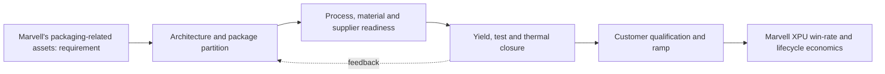
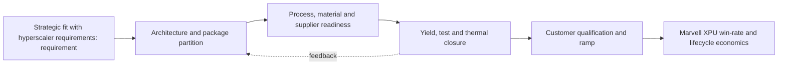
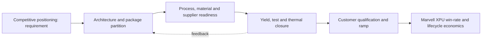
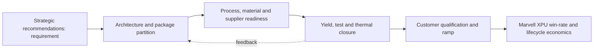

# Marvell Custom XPU Packaging Implications

> **Section metadata**
> - **Section title:** Marvell Custom XPU Packaging Implications
> - **Owner placeholder:** Advanced Packaging Intelligence Owner
> - **Last refreshed date:** 2026-06-10
> - **Refresh status:** Current baseline
> - **Source count:** 12
> - **Confidence level:** Medium-high; confirmed facts separated from announced and inferred roadmap items
> - **Key changes since last refresh:** Initial repository baseline
> - **Open questions:** Customer qualification timing, package-level yields, commercial terms, and capacity allocation
> - **Links to related sections:** [reports/advanced_packaging_main_report.md](../reports/advanced_packaging_main_report.md), [reports/executive_summary_for_marvell_leadership.md](../reports/executive_summary_for_marvell_leadership.md), [marvell_strategy/README.md](../marvell_strategy/README.md)
> - **Figures included:** FIG-MMD-023, FIG-MMD-024, FIG-MMD-025
> - **Tables included:** TBL-MRVL-001, TBL-MRVL-002, TBL-MRVL-003
> - **Next suggested refresh date:** 2026-09-10

## 21. Marvell's custom XPU opportunity

> **Section metadata**
> - **Section title:** Marvell's custom XPU opportunity
> - **Owner placeholder:** Advanced Packaging Intelligence Owner
> - **Last refreshed date:** 2026-06-10
> - **Refresh status:** Current baseline
> - **Source count:** 4
> - **Confidence level:** Medium-high; confirmed facts separated from announced and inferred roadmap items
> - **Key changes since last refresh:** Initial repository baseline
> - **Open questions:** Customer qualification timing, package-level yields, commercial terms, and capacity allocation
> - **Links to related sections:** [reports/marvell_xpu_implications.md](../reports/marvell_xpu_implications.md), [data/technology_taxonomy.yaml](../data/technology_taxonomy.yaml), [data/source_database.yaml](../data/source_database.yaml)
> - **Figures included:** FIG-MMD-021
> - **Tables included:** TBL-MAIN-021A, TBL-MAIN-021B
> - **Next suggested refresh date:** 2026-09-10

A custom XPU package determines HBM bandwidth, compute partitioning, die yield exposure, I/O reach, rack density and the manufacturing critical path. This section treats public vendor statements as evidence of direction, not as proof of customer-qualified volume. [[SRC-MRVL-001]](../data/source_database.yaml) [[SRC-MRVL-002]](../data/source_database.yaml) [[SRC-MRVL-003]](../data/source_database.yaml) [[SRC-TSMC-001]](../data/source_database.yaml)

### Architecture

The architecture should be evaluated as a system partitioning decision, not as a package label. The decisive boundary is where bandwidth-intensive functions sit relative to compute, memory, I/O and power delivery. A package that minimizes one link may worsen another, so floorplanning must jointly optimize HBM escape routing, die-to-die reach, optical or electrical I/O placement, decoupling and coolant access. For **Marvell's custom XPU opportunity**, the practical focal point is performance per watt. This is a decision variable because it changes the package contract among the XPU architecture, HBM subsystem, connectivity fabric and manufacturing flow. [[SRC-MRVL-001]](../data/source_database.yaml) [[SRC-MRVL-002]](../data/source_database.yaml) [[SRC-MRVL-003]](../data/source_database.yaml) [[SRC-TSMC-001]](../data/source_database.yaml)

### Manufacturing flow

The manufacturing sequence determines accumulated yield and cycle time. Wafer sort, thinning, TSV reveal, redistribution, bump or hybrid-bond preparation, die placement, underfill or molding, substrate attach, lid attach and final test each create distinct defect opportunities. The commercially relevant metric is good systems per start and delivery predictability, not the yield of an isolated process module. For **Marvell's custom XPU opportunity**, the practical focal point is cost per token. This is a decision variable because it changes the package contract among the XPU architecture, HBM subsystem, connectivity fabric and manufacturing flow. [[SRC-MRVL-001]](../data/source_database.yaml) [[SRC-MRVL-002]](../data/source_database.yaml) [[SRC-MRVL-003]](../data/source_database.yaml) [[SRC-TSMC-001]](../data/source_database.yaml)

### Materials and process dependencies

Key dependencies include low-loss dielectrics, copper line and via control, ABF or alternative substrate capacity, temporary bonding materials, underfill, molding compound, thermal interface material and metrology. Material choices couple electrical loss, coefficient-of-thermal-expansion mismatch, moisture sensitivity and warpage; substituting a material therefore requires package requalification rather than a procurement-only change. For **Marvell's custom XPU opportunity**, the practical focal point is time-to-market. This is a decision variable because it changes the package contract among the XPU architecture, HBM subsystem, connectivity fabric and manufacturing flow. [[SRC-MRVL-001]](../data/source_database.yaml) [[SRC-MRVL-002]](../data/source_database.yaml) [[SRC-MRVL-003]](../data/source_database.yaml) [[SRC-TSMC-001]](../data/source_database.yaml)

### Metrics and benchmark discipline

Bandwidth density, energy per bit, latency and pitch are useful only when test conditions are explicit. A short-reach die-to-die demonstration cannot be compared directly with a rack-reach SerDes link, and a bonding-pitch claim does not reveal routable bandwidth after power, keep-out and redundancy are included. The database therefore records ranges and caveats instead of false point precision. For **Marvell's custom XPU opportunity**, the practical focal point is supply assurance. This is a decision variable because it changes the package contract among the XPU architecture, HBM subsystem, connectivity fabric and manufacturing flow. [[SRC-MRVL-001]](../data/source_database.yaml) [[SRC-MRVL-002]](../data/source_database.yaml) [[SRC-MRVL-003]](../data/source_database.yaml) [[SRC-TSMC-001]](../data/source_database.yaml)

### Economics and yield

Cost is dominated by more than assembly price. Expensive known-good logic and HBM make scrap exposure material; larger interposers and substrates reduce units per panel or wafer; additional test insertions raise cost but can prevent higher downstream loss. The correct model values expected good-package cost, schedule risk and customer revenue exposure from missed ramps. For **Marvell's custom XPU opportunity**, the practical focal point is performance per watt. This is a decision variable because it changes the package contract among the XPU architecture, HBM subsystem, connectivity fabric and manufacturing flow. [[SRC-MRVL-001]](../data/source_database.yaml) [[SRC-MRVL-002]](../data/source_database.yaml) [[SRC-MRVL-003]](../data/source_database.yaml) [[SRC-TSMC-001]](../data/source_database.yaml)

### Thermal and power

Thermal design is becoming an architecture constraint. HBM, logic, optical engines and voltage conversion compete for package edge, vertical heat paths and coolant temperature budget. Hot spots, lateral gradients and thermo-mechanical cycling can reduce attainable frequency or lifetime even when average package power remains within a cold-plate rating. For **Marvell's custom XPU opportunity**, the practical focal point is cost per token. This is a decision variable because it changes the package contract among the XPU architecture, HBM subsystem, connectivity fabric and manufacturing flow. [[SRC-MRVL-001]](../data/source_database.yaml) [[SRC-MRVL-002]](../data/source_database.yaml) [[SRC-MRVL-003]](../data/source_database.yaml) [[SRC-TSMC-001]](../data/source_database.yaml)

### Supply chain and adoption

Adoption requires simultaneous readiness across foundry packaging, memory, substrate, OSAT or test, EDA signoff, system cooling and customer qualification. A nominally mature process may still be unavailable at the required body size, HBM count or regional supply path. Supplier concentration should therefore be tracked by qualified configuration, not vendor logo count. For **Marvell's custom XPU opportunity**, the practical focal point is time-to-market. This is a decision variable because it changes the package contract among the XPU architecture, HBM subsystem, connectivity fabric and manufacturing flow. [[SRC-MRVL-001]](../data/source_database.yaml) [[SRC-MRVL-002]](../data/source_database.yaml) [[SRC-MRVL-003]](../data/source_database.yaml) [[SRC-TSMC-001]](../data/source_database.yaml)

### Competitive implications

Control of design rules, characterization data and capacity reservations can create a competitive moat. NVIDIA and Broadcom can optimize around large internal volumes, while merchant custom-silicon providers must convert ecosystem breadth and reusable IP into comparable schedule certainty. Open standards reduce switching friction only after interoperable silicon, test and software are proven. For **Marvell's custom XPU opportunity**, the practical focal point is supply assurance. This is a decision variable because it changes the package contract among the XPU architecture, HBM subsystem, connectivity fabric and manufacturing flow. [[SRC-MRVL-001]](../data/source_database.yaml) [[SRC-MRVL-002]](../data/source_database.yaml) [[SRC-MRVL-003]](../data/source_database.yaml) [[SRC-TSMC-001]](../data/source_database.yaml)

### Marvell implication

Marvell should package this capability as part of an end-to-end XPU platform: architecture exploration, reusable die-to-die and HBM IP, package and board co-design, manufacturing ownership, test strategy and lifecycle telemetry. The differentiation is not ownership of every factory step; it is the ability to give a hyperscaler a credible performance, cost, yield and supply plan before design freeze. For **Marvell's custom XPU opportunity**, the practical focal point is performance per watt. This is a decision variable because it changes the package contract among the XPU architecture, HBM subsystem, connectivity fabric and manufacturing flow. [[SRC-MRVL-001]](../data/source_database.yaml) [[SRC-MRVL-002]](../data/source_database.yaml) [[SRC-MRVL-003]](../data/source_database.yaml) [[SRC-TSMC-001]](../data/source_database.yaml)

### Corporate development implication

Partnership or investment should target capability gaps that are difficult to reproduce through ordinary sourcing: optical attach, thermal materials and structures, chiplet test, multi-physics automation, advanced substrate process know-how and interoperable die-to-die IP. Acquisitions deserve consideration only where control materially improves XPU win probability or protects a strategic interface. For **Marvell's custom XPU opportunity**, the practical focal point is cost per token. This is a decision variable because it changes the package contract among the XPU architecture, HBM subsystem, connectivity fabric and manufacturing flow. [[SRC-MRVL-001]](../data/source_database.yaml) [[SRC-MRVL-002]](../data/source_database.yaml) [[SRC-MRVL-003]](../data/source_database.yaml) [[SRC-TSMC-001]](../data/source_database.yaml)

### Roadmap through 2030

The likely trajectory is larger and more heterogeneous packages, finer vertical connections, more customized memory base dies, greater use of local bridges or RDL to manage cost, and optics moving closer to high-radix switch and selected compute packages. The pace will be gated by yield learning, serviceability and power removal rather than by interconnect demonstrations alone. For **Marvell's custom XPU opportunity**, the practical focal point is time-to-market. This is a decision variable because it changes the package contract among the XPU architecture, HBM subsystem, connectivity fabric and manufacturing flow. [[SRC-MRVL-001]](../data/source_database.yaml) [[SRC-MRVL-002]](../data/source_database.yaml) [[SRC-MRVL-003]](../data/source_database.yaml) [[SRC-TSMC-001]](../data/source_database.yaml)

### Diligence priorities

Leadership should request configuration-specific evidence: qualified dimensions, HBM stack count, power map, thermal resistance, warpage, known-good-die coverage, repair flow, monthly capacity, cycle time, second-source path and cost sensitivity. Claims without these fields should remain announced or expected in the roadmap rather than promoted to confirmed. For **Marvell's custom XPU opportunity**, the practical focal point is supply assurance. This is a decision variable because it changes the package contract among the XPU architecture, HBM subsystem, connectivity fabric and manufacturing flow. [[SRC-MRVL-001]](../data/source_database.yaml) [[SRC-MRVL-002]](../data/source_database.yaml) [[SRC-MRVL-003]](../data/source_database.yaml) [[SRC-TSMC-001]](../data/source_database.yaml)

**Figure FIG-MMD-021.** Decision flow for Marvell's custom XPU opportunity. Author-created schematic based on cited sources.

**Comparison table - TBL-MAIN-021A**

| Dimension | Near-term decision | 2027-2030 direction | Marvell action |
|---|---|---|---|
| Architecture | Prove a qualified baseline | Increase modularity and package scale | Maintain reusable floorplans and chiplet interfaces |
| Manufacturing | Secure capacity and test coverage | Add process alternatives where credible | Negotiate configuration-specific capacity and learning access |
| Performance | Close HBM, D2D and I/O budgets | Shift bottlenecks toward power and cooling | Co-optimize package, SerDes, memory and optical IP |
| Economics | Model expected good-package cost | Reduce concentration and scrap exposure | Offer hyperscalers transparent cost/yield trade spaces |
| Roadmap status | Confirmed plus announced | Expected scenarios with triggers | Refresh quarterly and at customer architecture changes |

**Marvell implication matrix - TBL-MAIN-021B**

| Question | Leadership interpretation | Trigger to act |
|---|---|---|
| Does it improve XPU PPA? | Count package-enabled system benefit, not isolated die metrics | Material bandwidth, latency or power advantage |
| Does it improve schedule? | Reuse and qualification depth can outweigh theoretical density | Customer design freeze or foundry rule release |
| Does it reduce supply risk? | A second logo is not a second qualified configuration | Demonstrated equivalent package and test flow |
| Is ownership strategic? | Own differentiating interfaces and data; partner for scale manufacturing | Repeated dependency that affects win rate |

> **Marvell implication:** Treat Marvell's custom XPU opportunity as a customer-facing architecture capability with quantified PPA, yield, cost and supply options. Do not position it as a backend feature or rely on unqualified roadmap claims.

### Section close

- **Why it matters:** It can change attainable bandwidth, power, package size, schedule and hyperscaler TCO.
- **Current maturity:** Mixed by configuration; see profile and roadmap databases.
- **Key bottlenecks:** performance per watt, cost per token, time-to-market.
- **Leading vendors:** See [vendor database](../data/vendor_roadmaps.yaml).
- **Roadmap:** See [2024-2030 roadmap](../data/vendor_roadmaps.yaml).
- **Marvell implication:** Integrate the capability into custom XPU architecture and commercial planning.
- **Corporate development implication:** Target control points where access, IP or scarce process knowledge changes win probability.
- **Open questions:** Qualification timing, capacity allocation, yield at target body size, and customer-specific reliability.
- **Figures and tables included:** FIG-MMD-021; TBL-MAIN-021A; TBL-MAIN-021B.
- **Next refresh recommendation:** 2026-09-10, or earlier on a material vendor or customer roadmap disclosure.

## 22. Marvell's packaging-related assets

> **Section metadata**
> - **Section title:** Marvell's packaging-related assets
> - **Owner placeholder:** Advanced Packaging Intelligence Owner
> - **Last refreshed date:** 2026-06-10
> - **Refresh status:** Current baseline
> - **Source count:** 4
> - **Confidence level:** Medium-high; confirmed facts separated from announced and inferred roadmap items
> - **Key changes since last refresh:** Initial repository baseline
> - **Open questions:** Customer qualification timing, package-level yields, commercial terms, and capacity allocation
> - **Links to related sections:** [reports/marvell_xpu_implications.md](../reports/marvell_xpu_implications.md), [data/technology_taxonomy.yaml](../data/technology_taxonomy.yaml), [data/source_database.yaml](../data/source_database.yaml)
> - **Figures included:** FIG-MMD-022
> - **Tables included:** TBL-MAIN-022A, TBL-MAIN-022B
> - **Next suggested refresh date:** 2026-09-10

Marvell publicly positions custom silicon, advanced packaging, HBM attach, SerDes, switching, optical DSP and silicon photonics as an integrated platform. This section treats public vendor statements as evidence of direction, not as proof of customer-qualified volume. [[SRC-MRVL-001]](../data/source_database.yaml) [[SRC-MRVL-002]](../data/source_database.yaml) [[SRC-MRVL-003]](../data/source_database.yaml) [[SRC-TSMC-001]](../data/source_database.yaml)

### Architecture

The architecture should be evaluated as a system partitioning decision, not as a package label. The decisive boundary is where bandwidth-intensive functions sit relative to compute, memory, I/O and power delivery. A package that minimizes one link may worsen another, so floorplanning must jointly optimize HBM escape routing, die-to-die reach, optical or electrical I/O placement, decoupling and coolant access. For **Marvell's packaging-related assets**, the practical focal point is custom HBM. This is a decision variable because it changes the package contract among the XPU architecture, HBM subsystem, connectivity fabric and manufacturing flow. [[SRC-MRVL-001]](../data/source_database.yaml) [[SRC-MRVL-002]](../data/source_database.yaml) [[SRC-MRVL-003]](../data/source_database.yaml) [[SRC-TSMC-001]](../data/source_database.yaml)

### Manufacturing flow

The manufacturing sequence determines accumulated yield and cycle time. Wafer sort, thinning, TSV reveal, redistribution, bump or hybrid-bond preparation, die placement, underfill or molding, substrate attach, lid attach and final test each create distinct defect opportunities. The commercially relevant metric is good systems per start and delivery predictability, not the yield of an isolated process module. For **Marvell's packaging-related assets**, the practical focal point is 2nm platform. This is a decision variable because it changes the package contract among the XPU architecture, HBM subsystem, connectivity fabric and manufacturing flow. [[SRC-MRVL-001]](../data/source_database.yaml) [[SRC-MRVL-002]](../data/source_database.yaml) [[SRC-MRVL-003]](../data/source_database.yaml) [[SRC-TSMC-001]](../data/source_database.yaml)

### Materials and process dependencies

Key dependencies include low-loss dielectrics, copper line and via control, ABF or alternative substrate capacity, temporary bonding materials, underfill, molding compound, thermal interface material and metrology. Material choices couple electrical loss, coefficient-of-thermal-expansion mismatch, moisture sensitivity and warpage; substituting a material therefore requires package requalification rather than a procurement-only change. For **Marvell's packaging-related assets**, the practical focal point is 224G/448G SerDes. This is a decision variable because it changes the package contract among the XPU architecture, HBM subsystem, connectivity fabric and manufacturing flow. [[SRC-MRVL-001]](../data/source_database.yaml) [[SRC-MRVL-002]](../data/source_database.yaml) [[SRC-MRVL-003]](../data/source_database.yaml) [[SRC-TSMC-001]](../data/source_database.yaml)

### Metrics and benchmark discipline

Bandwidth density, energy per bit, latency and pitch are useful only when test conditions are explicit. A short-reach die-to-die demonstration cannot be compared directly with a rack-reach SerDes link, and a bonding-pitch claim does not reveal routable bandwidth after power, keep-out and redundancy are included. The database therefore records ranges and caveats instead of false point precision. For **Marvell's packaging-related assets**, the practical focal point is CPO and photonic fabric. This is a decision variable because it changes the package contract among the XPU architecture, HBM subsystem, connectivity fabric and manufacturing flow. [[SRC-MRVL-001]](../data/source_database.yaml) [[SRC-MRVL-002]](../data/source_database.yaml) [[SRC-MRVL-003]](../data/source_database.yaml) [[SRC-TSMC-001]](../data/source_database.yaml)

### Economics and yield

Cost is dominated by more than assembly price. Expensive known-good logic and HBM make scrap exposure material; larger interposers and substrates reduce units per panel or wafer; additional test insertions raise cost but can prevent higher downstream loss. The correct model values expected good-package cost, schedule risk and customer revenue exposure from missed ramps. For **Marvell's packaging-related assets**, the practical focal point is custom HBM. This is a decision variable because it changes the package contract among the XPU architecture, HBM subsystem, connectivity fabric and manufacturing flow. [[SRC-MRVL-001]](../data/source_database.yaml) [[SRC-MRVL-002]](../data/source_database.yaml) [[SRC-MRVL-003]](../data/source_database.yaml) [[SRC-TSMC-001]](../data/source_database.yaml)

### Thermal and power

Thermal design is becoming an architecture constraint. HBM, logic, optical engines and voltage conversion compete for package edge, vertical heat paths and coolant temperature budget. Hot spots, lateral gradients and thermo-mechanical cycling can reduce attainable frequency or lifetime even when average package power remains within a cold-plate rating. For **Marvell's packaging-related assets**, the practical focal point is 2nm platform. This is a decision variable because it changes the package contract among the XPU architecture, HBM subsystem, connectivity fabric and manufacturing flow. [[SRC-MRVL-001]](../data/source_database.yaml) [[SRC-MRVL-002]](../data/source_database.yaml) [[SRC-MRVL-003]](../data/source_database.yaml) [[SRC-TSMC-001]](../data/source_database.yaml)

### Supply chain and adoption

Adoption requires simultaneous readiness across foundry packaging, memory, substrate, OSAT or test, EDA signoff, system cooling and customer qualification. A nominally mature process may still be unavailable at the required body size, HBM count or regional supply path. Supplier concentration should therefore be tracked by qualified configuration, not vendor logo count. For **Marvell's packaging-related assets**, the practical focal point is 224G/448G SerDes. This is a decision variable because it changes the package contract among the XPU architecture, HBM subsystem, connectivity fabric and manufacturing flow. [[SRC-MRVL-001]](../data/source_database.yaml) [[SRC-MRVL-002]](../data/source_database.yaml) [[SRC-MRVL-003]](../data/source_database.yaml) [[SRC-TSMC-001]](../data/source_database.yaml)

### Competitive implications

Control of design rules, characterization data and capacity reservations can create a competitive moat. NVIDIA and Broadcom can optimize around large internal volumes, while merchant custom-silicon providers must convert ecosystem breadth and reusable IP into comparable schedule certainty. Open standards reduce switching friction only after interoperable silicon, test and software are proven. For **Marvell's packaging-related assets**, the practical focal point is CPO and photonic fabric. This is a decision variable because it changes the package contract among the XPU architecture, HBM subsystem, connectivity fabric and manufacturing flow. [[SRC-MRVL-001]](../data/source_database.yaml) [[SRC-MRVL-002]](../data/source_database.yaml) [[SRC-MRVL-003]](../data/source_database.yaml) [[SRC-TSMC-001]](../data/source_database.yaml)

### Marvell implication

Marvell should package this capability as part of an end-to-end XPU platform: architecture exploration, reusable die-to-die and HBM IP, package and board co-design, manufacturing ownership, test strategy and lifecycle telemetry. The differentiation is not ownership of every factory step; it is the ability to give a hyperscaler a credible performance, cost, yield and supply plan before design freeze. For **Marvell's packaging-related assets**, the practical focal point is custom HBM. This is a decision variable because it changes the package contract among the XPU architecture, HBM subsystem, connectivity fabric and manufacturing flow. [[SRC-MRVL-001]](../data/source_database.yaml) [[SRC-MRVL-002]](../data/source_database.yaml) [[SRC-MRVL-003]](../data/source_database.yaml) [[SRC-TSMC-001]](../data/source_database.yaml)

### Corporate development implication

Partnership or investment should target capability gaps that are difficult to reproduce through ordinary sourcing: optical attach, thermal materials and structures, chiplet test, multi-physics automation, advanced substrate process know-how and interoperable die-to-die IP. Acquisitions deserve consideration only where control materially improves XPU win probability or protects a strategic interface. For **Marvell's packaging-related assets**, the practical focal point is 2nm platform. This is a decision variable because it changes the package contract among the XPU architecture, HBM subsystem, connectivity fabric and manufacturing flow. [[SRC-MRVL-001]](../data/source_database.yaml) [[SRC-MRVL-002]](../data/source_database.yaml) [[SRC-MRVL-003]](../data/source_database.yaml) [[SRC-TSMC-001]](../data/source_database.yaml)

### Roadmap through 2030

The likely trajectory is larger and more heterogeneous packages, finer vertical connections, more customized memory base dies, greater use of local bridges or RDL to manage cost, and optics moving closer to high-radix switch and selected compute packages. The pace will be gated by yield learning, serviceability and power removal rather than by interconnect demonstrations alone. For **Marvell's packaging-related assets**, the practical focal point is 224G/448G SerDes. This is a decision variable because it changes the package contract among the XPU architecture, HBM subsystem, connectivity fabric and manufacturing flow. [[SRC-MRVL-001]](../data/source_database.yaml) [[SRC-MRVL-002]](../data/source_database.yaml) [[SRC-MRVL-003]](../data/source_database.yaml) [[SRC-TSMC-001]](../data/source_database.yaml)

### Diligence priorities

Leadership should request configuration-specific evidence: qualified dimensions, HBM stack count, power map, thermal resistance, warpage, known-good-die coverage, repair flow, monthly capacity, cycle time, second-source path and cost sensitivity. Claims without these fields should remain announced or expected in the roadmap rather than promoted to confirmed. For **Marvell's packaging-related assets**, the practical focal point is CPO and photonic fabric. This is a decision variable because it changes the package contract among the XPU architecture, HBM subsystem, connectivity fabric and manufacturing flow. [[SRC-MRVL-001]](../data/source_database.yaml) [[SRC-MRVL-002]](../data/source_database.yaml) [[SRC-MRVL-003]](../data/source_database.yaml) [[SRC-TSMC-001]](../data/source_database.yaml)

**Figure FIG-MMD-022.** Decision flow for Marvell's packaging-related assets. Author-created schematic based on cited sources.

**Comparison table - TBL-MAIN-022A**

| Dimension | Near-term decision | 2027-2030 direction | Marvell action |
|---|---|---|---|
| Architecture | Prove a qualified baseline | Increase modularity and package scale | Maintain reusable floorplans and chiplet interfaces |
| Manufacturing | Secure capacity and test coverage | Add process alternatives where credible | Negotiate configuration-specific capacity and learning access |
| Performance | Close HBM, D2D and I/O budgets | Shift bottlenecks toward power and cooling | Co-optimize package, SerDes, memory and optical IP |
| Economics | Model expected good-package cost | Reduce concentration and scrap exposure | Offer hyperscalers transparent cost/yield trade spaces |
| Roadmap status | Confirmed plus announced | Expected scenarios with triggers | Refresh quarterly and at customer architecture changes |

**Marvell implication matrix - TBL-MAIN-022B**

| Question | Leadership interpretation | Trigger to act |
|---|---|---|
| Does it improve XPU PPA? | Count package-enabled system benefit, not isolated die metrics | Material bandwidth, latency or power advantage |
| Does it improve schedule? | Reuse and qualification depth can outweigh theoretical density | Customer design freeze or foundry rule release |
| Does it reduce supply risk? | A second logo is not a second qualified configuration | Demonstrated equivalent package and test flow |
| Is ownership strategic? | Own differentiating interfaces and data; partner for scale manufacturing | Repeated dependency that affects win rate |

> **Marvell implication:** Treat Marvell's packaging-related assets as a customer-facing architecture capability with quantified PPA, yield, cost and supply options. Do not position it as a backend feature or rely on unqualified roadmap claims.

### Section close

- **Why it matters:** It can change attainable bandwidth, power, package size, schedule and hyperscaler TCO.
- **Current maturity:** Mixed by configuration; see profile and roadmap databases.
- **Key bottlenecks:** custom HBM, 2nm platform, 224G/448G SerDes.
- **Leading vendors:** See [vendor database](../data/vendor_roadmaps.yaml).
- **Roadmap:** See [2024-2030 roadmap](../data/vendor_roadmaps.yaml).
- **Marvell implication:** Integrate the capability into custom XPU architecture and commercial planning.
- **Corporate development implication:** Target control points where access, IP or scarce process knowledge changes win probability.
- **Open questions:** Qualification timing, capacity allocation, yield at target body size, and customer-specific reliability.
- **Figures and tables included:** FIG-MMD-022; TBL-MAIN-022A; TBL-MAIN-022B.
- **Next refresh recommendation:** 2026-09-10, or earlier on a material vendor or customer roadmap disclosure.

## 23. Strategic fit with hyperscaler requirements

> **Section metadata**
> - **Section title:** Strategic fit with hyperscaler requirements
> - **Owner placeholder:** Advanced Packaging Intelligence Owner
> - **Last refreshed date:** 2026-06-10
> - **Refresh status:** Current baseline
> - **Source count:** 4
> - **Confidence level:** Medium-high; confirmed facts separated from announced and inferred roadmap items
> - **Key changes since last refresh:** Initial repository baseline
> - **Open questions:** Customer qualification timing, package-level yields, commercial terms, and capacity allocation
> - **Links to related sections:** [reports/marvell_xpu_implications.md](../reports/marvell_xpu_implications.md), [data/technology_taxonomy.yaml](../data/technology_taxonomy.yaml), [data/source_database.yaml](../data/source_database.yaml)
> - **Figures included:** FIG-MMD-023
> - **Tables included:** TBL-MAIN-023A, TBL-MAIN-023B
> - **Next suggested refresh date:** 2026-09-10

Customer value functions differ materially across training, inference, neocloud and internal-ASIC archetypes. This section treats public vendor statements as evidence of direction, not as proof of customer-qualified volume. [[SRC-MRVL-001]](../data/source_database.yaml) [[SRC-MRVL-002]](../data/source_database.yaml) [[SRC-MRVL-003]](../data/source_database.yaml) [[SRC-TSMC-001]](../data/source_database.yaml)

### Architecture

The architecture should be evaluated as a system partitioning decision, not as a package label. The decisive boundary is where bandwidth-intensive functions sit relative to compute, memory, I/O and power delivery. A package that minimizes one link may worsen another, so floorplanning must jointly optimize HBM escape routing, die-to-die reach, optical or electrical I/O placement, decoupling and coolant access. For **Strategic fit with hyperscaler requirements**, the practical focal point is HBM capacity. This is a decision variable because it changes the package contract among the XPU architecture, HBM subsystem, connectivity fabric and manufacturing flow. [[SRC-MRVL-001]](../data/source_database.yaml) [[SRC-MRVL-002]](../data/source_database.yaml) [[SRC-MRVL-003]](../data/source_database.yaml) [[SRC-TSMC-001]](../data/source_database.yaml)

### Manufacturing flow

The manufacturing sequence determines accumulated yield and cycle time. Wafer sort, thinning, TSV reveal, redistribution, bump or hybrid-bond preparation, die placement, underfill or molding, substrate attach, lid attach and final test each create distinct defect opportunities. The commercially relevant metric is good systems per start and delivery predictability, not the yield of an isolated process module. For **Strategic fit with hyperscaler requirements**, the practical focal point is rack power. This is a decision variable because it changes the package contract among the XPU architecture, HBM subsystem, connectivity fabric and manufacturing flow. [[SRC-MRVL-001]](../data/source_database.yaml) [[SRC-MRVL-002]](../data/source_database.yaml) [[SRC-MRVL-003]](../data/source_database.yaml) [[SRC-TSMC-001]](../data/source_database.yaml)

### Materials and process dependencies

Key dependencies include low-loss dielectrics, copper line and via control, ABF or alternative substrate capacity, temporary bonding materials, underfill, molding compound, thermal interface material and metrology. Material choices couple electrical loss, coefficient-of-thermal-expansion mismatch, moisture sensitivity and warpage; substituting a material therefore requires package requalification rather than a procurement-only change. For **Strategic fit with hyperscaler requirements**, the practical focal point is software coupling. This is a decision variable because it changes the package contract among the XPU architecture, HBM subsystem, connectivity fabric and manufacturing flow. [[SRC-MRVL-001]](../data/source_database.yaml) [[SRC-MRVL-002]](../data/source_database.yaml) [[SRC-MRVL-003]](../data/source_database.yaml) [[SRC-TSMC-001]](../data/source_database.yaml)

### Metrics and benchmark discipline

Bandwidth density, energy per bit, latency and pitch are useful only when test conditions are explicit. A short-reach die-to-die demonstration cannot be compared directly with a rack-reach SerDes link, and a bonding-pitch claim does not reveal routable bandwidth after power, keep-out and redundancy are included. The database therefore records ranges and caveats instead of false point precision. For **Strategic fit with hyperscaler requirements**, the practical focal point is multi-source resilience. This is a decision variable because it changes the package contract among the XPU architecture, HBM subsystem, connectivity fabric and manufacturing flow. [[SRC-MRVL-001]](../data/source_database.yaml) [[SRC-MRVL-002]](../data/source_database.yaml) [[SRC-MRVL-003]](../data/source_database.yaml) [[SRC-TSMC-001]](../data/source_database.yaml)

### Economics and yield

Cost is dominated by more than assembly price. Expensive known-good logic and HBM make scrap exposure material; larger interposers and substrates reduce units per panel or wafer; additional test insertions raise cost but can prevent higher downstream loss. The correct model values expected good-package cost, schedule risk and customer revenue exposure from missed ramps. For **Strategic fit with hyperscaler requirements**, the practical focal point is HBM capacity. This is a decision variable because it changes the package contract among the XPU architecture, HBM subsystem, connectivity fabric and manufacturing flow. [[SRC-MRVL-001]](../data/source_database.yaml) [[SRC-MRVL-002]](../data/source_database.yaml) [[SRC-MRVL-003]](../data/source_database.yaml) [[SRC-TSMC-001]](../data/source_database.yaml)

### Thermal and power

Thermal design is becoming an architecture constraint. HBM, logic, optical engines and voltage conversion compete for package edge, vertical heat paths and coolant temperature budget. Hot spots, lateral gradients and thermo-mechanical cycling can reduce attainable frequency or lifetime even when average package power remains within a cold-plate rating. For **Strategic fit with hyperscaler requirements**, the practical focal point is rack power. This is a decision variable because it changes the package contract among the XPU architecture, HBM subsystem, connectivity fabric and manufacturing flow. [[SRC-MRVL-001]](../data/source_database.yaml) [[SRC-MRVL-002]](../data/source_database.yaml) [[SRC-MRVL-003]](../data/source_database.yaml) [[SRC-TSMC-001]](../data/source_database.yaml)

### Supply chain and adoption

Adoption requires simultaneous readiness across foundry packaging, memory, substrate, OSAT or test, EDA signoff, system cooling and customer qualification. A nominally mature process may still be unavailable at the required body size, HBM count or regional supply path. Supplier concentration should therefore be tracked by qualified configuration, not vendor logo count. For **Strategic fit with hyperscaler requirements**, the practical focal point is software coupling. This is a decision variable because it changes the package contract among the XPU architecture, HBM subsystem, connectivity fabric and manufacturing flow. [[SRC-MRVL-001]](../data/source_database.yaml) [[SRC-MRVL-002]](../data/source_database.yaml) [[SRC-MRVL-003]](../data/source_database.yaml) [[SRC-TSMC-001]](../data/source_database.yaml)

### Competitive implications

Control of design rules, characterization data and capacity reservations can create a competitive moat. NVIDIA and Broadcom can optimize around large internal volumes, while merchant custom-silicon providers must convert ecosystem breadth and reusable IP into comparable schedule certainty. Open standards reduce switching friction only after interoperable silicon, test and software are proven. For **Strategic fit with hyperscaler requirements**, the practical focal point is multi-source resilience. This is a decision variable because it changes the package contract among the XPU architecture, HBM subsystem, connectivity fabric and manufacturing flow. [[SRC-MRVL-001]](../data/source_database.yaml) [[SRC-MRVL-002]](../data/source_database.yaml) [[SRC-MRVL-003]](../data/source_database.yaml) [[SRC-TSMC-001]](../data/source_database.yaml)

### Marvell implication

Marvell should package this capability as part of an end-to-end XPU platform: architecture exploration, reusable die-to-die and HBM IP, package and board co-design, manufacturing ownership, test strategy and lifecycle telemetry. The differentiation is not ownership of every factory step; it is the ability to give a hyperscaler a credible performance, cost, yield and supply plan before design freeze. For **Strategic fit with hyperscaler requirements**, the practical focal point is HBM capacity. This is a decision variable because it changes the package contract among the XPU architecture, HBM subsystem, connectivity fabric and manufacturing flow. [[SRC-MRVL-001]](../data/source_database.yaml) [[SRC-MRVL-002]](../data/source_database.yaml) [[SRC-MRVL-003]](../data/source_database.yaml) [[SRC-TSMC-001]](../data/source_database.yaml)

### Corporate development implication

Partnership or investment should target capability gaps that are difficult to reproduce through ordinary sourcing: optical attach, thermal materials and structures, chiplet test, multi-physics automation, advanced substrate process know-how and interoperable die-to-die IP. Acquisitions deserve consideration only where control materially improves XPU win probability or protects a strategic interface. For **Strategic fit with hyperscaler requirements**, the practical focal point is rack power. This is a decision variable because it changes the package contract among the XPU architecture, HBM subsystem, connectivity fabric and manufacturing flow. [[SRC-MRVL-001]](../data/source_database.yaml) [[SRC-MRVL-002]](../data/source_database.yaml) [[SRC-MRVL-003]](../data/source_database.yaml) [[SRC-TSMC-001]](../data/source_database.yaml)

### Roadmap through 2030

The likely trajectory is larger and more heterogeneous packages, finer vertical connections, more customized memory base dies, greater use of local bridges or RDL to manage cost, and optics moving closer to high-radix switch and selected compute packages. The pace will be gated by yield learning, serviceability and power removal rather than by interconnect demonstrations alone. For **Strategic fit with hyperscaler requirements**, the practical focal point is software coupling. This is a decision variable because it changes the package contract among the XPU architecture, HBM subsystem, connectivity fabric and manufacturing flow. [[SRC-MRVL-001]](../data/source_database.yaml) [[SRC-MRVL-002]](../data/source_database.yaml) [[SRC-MRVL-003]](../data/source_database.yaml) [[SRC-TSMC-001]](../data/source_database.yaml)

### Diligence priorities

Leadership should request configuration-specific evidence: qualified dimensions, HBM stack count, power map, thermal resistance, warpage, known-good-die coverage, repair flow, monthly capacity, cycle time, second-source path and cost sensitivity. Claims without these fields should remain announced or expected in the roadmap rather than promoted to confirmed. For **Strategic fit with hyperscaler requirements**, the practical focal point is multi-source resilience. This is a decision variable because it changes the package contract among the XPU architecture, HBM subsystem, connectivity fabric and manufacturing flow. [[SRC-MRVL-001]](../data/source_database.yaml) [[SRC-MRVL-002]](../data/source_database.yaml) [[SRC-MRVL-003]](../data/source_database.yaml) [[SRC-TSMC-001]](../data/source_database.yaml)

**Figure FIG-MMD-023.** Decision flow for Strategic fit with hyperscaler requirements. Author-created schematic based on cited sources.

**Comparison table - TBL-MAIN-023A**

| Dimension | Near-term decision | 2027-2030 direction | Marvell action |
|---|---|---|---|
| Architecture | Prove a qualified baseline | Increase modularity and package scale | Maintain reusable floorplans and chiplet interfaces |
| Manufacturing | Secure capacity and test coverage | Add process alternatives where credible | Negotiate configuration-specific capacity and learning access |
| Performance | Close HBM, D2D and I/O budgets | Shift bottlenecks toward power and cooling | Co-optimize package, SerDes, memory and optical IP |
| Economics | Model expected good-package cost | Reduce concentration and scrap exposure | Offer hyperscalers transparent cost/yield trade spaces |
| Roadmap status | Confirmed plus announced | Expected scenarios with triggers | Refresh quarterly and at customer architecture changes |

**Marvell implication matrix - TBL-MAIN-023B**

| Question | Leadership interpretation | Trigger to act |
|---|---|---|
| Does it improve XPU PPA? | Count package-enabled system benefit, not isolated die metrics | Material bandwidth, latency or power advantage |
| Does it improve schedule? | Reuse and qualification depth can outweigh theoretical density | Customer design freeze or foundry rule release |
| Does it reduce supply risk? | A second logo is not a second qualified configuration | Demonstrated equivalent package and test flow |
| Is ownership strategic? | Own differentiating interfaces and data; partner for scale manufacturing | Repeated dependency that affects win rate |

> **Marvell implication:** Treat Strategic fit with hyperscaler requirements as a customer-facing architecture capability with quantified PPA, yield, cost and supply options. Do not position it as a backend feature or rely on unqualified roadmap claims.

### Section close

- **Why it matters:** It can change attainable bandwidth, power, package size, schedule and hyperscaler TCO.
- **Current maturity:** Mixed by configuration; see profile and roadmap databases.
- **Key bottlenecks:** HBM capacity, rack power, software coupling.
- **Leading vendors:** See [vendor database](../data/vendor_roadmaps.yaml).
- **Roadmap:** See [2024-2030 roadmap](../data/vendor_roadmaps.yaml).
- **Marvell implication:** Integrate the capability into custom XPU architecture and commercial planning.
- **Corporate development implication:** Target control points where access, IP or scarce process knowledge changes win probability.
- **Open questions:** Qualification timing, capacity allocation, yield at target body size, and customer-specific reliability.
- **Figures and tables included:** FIG-MMD-023; TBL-MAIN-023A; TBL-MAIN-023B.
- **Next refresh recommendation:** 2026-09-10, or earlier on a material vendor or customer roadmap disclosure.

## 24. Competitive positioning

> **Section metadata**
> - **Section title:** Competitive positioning
> - **Owner placeholder:** Advanced Packaging Intelligence Owner
> - **Last refreshed date:** 2026-06-10
> - **Refresh status:** Current baseline
> - **Source count:** 4
> - **Confidence level:** Medium-high; confirmed facts separated from announced and inferred roadmap items
> - **Key changes since last refresh:** Initial repository baseline
> - **Open questions:** Customer qualification timing, package-level yields, commercial terms, and capacity allocation
> - **Links to related sections:** [reports/marvell_xpu_implications.md](../reports/marvell_xpu_implications.md), [data/technology_taxonomy.yaml](../data/technology_taxonomy.yaml), [data/source_database.yaml](../data/source_database.yaml)
> - **Figures included:** FIG-MMD-024
> - **Tables included:** TBL-MAIN-024A, TBL-MAIN-024B
> - **Next suggested refresh date:** 2026-09-10

The relevant comparison is business-model and system capability, not a single package technology. This section treats public vendor statements as evidence of direction, not as proof of customer-qualified volume. [[SRC-MRVL-001]](../data/source_database.yaml) [[SRC-MRVL-002]](../data/source_database.yaml) [[SRC-MRVL-003]](../data/source_database.yaml) [[SRC-TSMC-001]](../data/source_database.yaml)

### Architecture

The architecture should be evaluated as a system partitioning decision, not as a package label. The decisive boundary is where bandwidth-intensive functions sit relative to compute, memory, I/O and power delivery. A package that minimizes one link may worsen another, so floorplanning must jointly optimize HBM escape routing, die-to-die reach, optical or electrical I/O placement, decoupling and coolant access. For **Competitive positioning**, the practical focal point is Broadcom incumbency. This is a decision variable because it changes the package contract among the XPU architecture, HBM subsystem, connectivity fabric and manufacturing flow. [[SRC-MRVL-001]](../data/source_database.yaml) [[SRC-MRVL-002]](../data/source_database.yaml) [[SRC-MRVL-003]](../data/source_database.yaml) [[SRC-TSMC-001]](../data/source_database.yaml)

### Manufacturing flow

The manufacturing sequence determines accumulated yield and cycle time. Wafer sort, thinning, TSV reveal, redistribution, bump or hybrid-bond preparation, die placement, underfill or molding, substrate attach, lid attach and final test each create distinct defect opportunities. The commercially relevant metric is good systems per start and delivery predictability, not the yield of an isolated process module. For **Competitive positioning**, the practical focal point is NVIDIA full stack. This is a decision variable because it changes the package contract among the XPU architecture, HBM subsystem, connectivity fabric and manufacturing flow. [[SRC-MRVL-001]](../data/source_database.yaml) [[SRC-MRVL-002]](../data/source_database.yaml) [[SRC-MRVL-003]](../data/source_database.yaml) [[SRC-TSMC-001]](../data/source_database.yaml)

### Materials and process dependencies

Key dependencies include low-loss dielectrics, copper line and via control, ABF or alternative substrate capacity, temporary bonding materials, underfill, molding compound, thermal interface material and metrology. Material choices couple electrical loss, coefficient-of-thermal-expansion mismatch, moisture sensitivity and warpage; substituting a material therefore requires package requalification rather than a procurement-only change. For **Competitive positioning**, the practical focal point is AMD semi-custom. This is a decision variable because it changes the package contract among the XPU architecture, HBM subsystem, connectivity fabric and manufacturing flow. [[SRC-MRVL-001]](../data/source_database.yaml) [[SRC-MRVL-002]](../data/source_database.yaml) [[SRC-MRVL-003]](../data/source_database.yaml) [[SRC-TSMC-001]](../data/source_database.yaml)

### Metrics and benchmark discipline

Bandwidth density, energy per bit, latency and pitch are useful only when test conditions are explicit. A short-reach die-to-die demonstration cannot be compared directly with a rack-reach SerDes link, and a bonding-pitch claim does not reveal routable bandwidth after power, keep-out and redundancy are included. The database therefore records ranges and caveats instead of false point precision. For **Competitive positioning**, the practical focal point is Intel packaging. This is a decision variable because it changes the package contract among the XPU architecture, HBM subsystem, connectivity fabric and manufacturing flow. [[SRC-MRVL-001]](../data/source_database.yaml) [[SRC-MRVL-002]](../data/source_database.yaml) [[SRC-MRVL-003]](../data/source_database.yaml) [[SRC-TSMC-001]](../data/source_database.yaml)

### Economics and yield

Cost is dominated by more than assembly price. Expensive known-good logic and HBM make scrap exposure material; larger interposers and substrates reduce units per panel or wafer; additional test insertions raise cost but can prevent higher downstream loss. The correct model values expected good-package cost, schedule risk and customer revenue exposure from missed ramps. For **Competitive positioning**, the practical focal point is Alchip and GUC service. This is a decision variable because it changes the package contract among the XPU architecture, HBM subsystem, connectivity fabric and manufacturing flow. [[SRC-MRVL-001]](../data/source_database.yaml) [[SRC-MRVL-002]](../data/source_database.yaml) [[SRC-MRVL-003]](../data/source_database.yaml) [[SRC-TSMC-001]](../data/source_database.yaml)

### Thermal and power

Thermal design is becoming an architecture constraint. HBM, logic, optical engines and voltage conversion compete for package edge, vertical heat paths and coolant temperature budget. Hot spots, lateral gradients and thermo-mechanical cycling can reduce attainable frequency or lifetime even when average package power remains within a cold-plate rating. For **Competitive positioning**, the practical focal point is Broadcom incumbency. This is a decision variable because it changes the package contract among the XPU architecture, HBM subsystem, connectivity fabric and manufacturing flow. [[SRC-MRVL-001]](../data/source_database.yaml) [[SRC-MRVL-002]](../data/source_database.yaml) [[SRC-MRVL-003]](../data/source_database.yaml) [[SRC-TSMC-001]](../data/source_database.yaml)

### Supply chain and adoption

Adoption requires simultaneous readiness across foundry packaging, memory, substrate, OSAT or test, EDA signoff, system cooling and customer qualification. A nominally mature process may still be unavailable at the required body size, HBM count or regional supply path. Supplier concentration should therefore be tracked by qualified configuration, not vendor logo count. For **Competitive positioning**, the practical focal point is NVIDIA full stack. This is a decision variable because it changes the package contract among the XPU architecture, HBM subsystem, connectivity fabric and manufacturing flow. [[SRC-MRVL-001]](../data/source_database.yaml) [[SRC-MRVL-002]](../data/source_database.yaml) [[SRC-MRVL-003]](../data/source_database.yaml) [[SRC-TSMC-001]](../data/source_database.yaml)

### Competitive implications

Control of design rules, characterization data and capacity reservations can create a competitive moat. NVIDIA and Broadcom can optimize around large internal volumes, while merchant custom-silicon providers must convert ecosystem breadth and reusable IP into comparable schedule certainty. Open standards reduce switching friction only after interoperable silicon, test and software are proven. For **Competitive positioning**, the practical focal point is AMD semi-custom. This is a decision variable because it changes the package contract among the XPU architecture, HBM subsystem, connectivity fabric and manufacturing flow. [[SRC-MRVL-001]](../data/source_database.yaml) [[SRC-MRVL-002]](../data/source_database.yaml) [[SRC-MRVL-003]](../data/source_database.yaml) [[SRC-TSMC-001]](../data/source_database.yaml)

### Marvell implication

Marvell should package this capability as part of an end-to-end XPU platform: architecture exploration, reusable die-to-die and HBM IP, package and board co-design, manufacturing ownership, test strategy and lifecycle telemetry. The differentiation is not ownership of every factory step; it is the ability to give a hyperscaler a credible performance, cost, yield and supply plan before design freeze. For **Competitive positioning**, the practical focal point is Intel packaging. This is a decision variable because it changes the package contract among the XPU architecture, HBM subsystem, connectivity fabric and manufacturing flow. [[SRC-MRVL-001]](../data/source_database.yaml) [[SRC-MRVL-002]](../data/source_database.yaml) [[SRC-MRVL-003]](../data/source_database.yaml) [[SRC-TSMC-001]](../data/source_database.yaml)

### Corporate development implication

Partnership or investment should target capability gaps that are difficult to reproduce through ordinary sourcing: optical attach, thermal materials and structures, chiplet test, multi-physics automation, advanced substrate process know-how and interoperable die-to-die IP. Acquisitions deserve consideration only where control materially improves XPU win probability or protects a strategic interface. For **Competitive positioning**, the practical focal point is Alchip and GUC service. This is a decision variable because it changes the package contract among the XPU architecture, HBM subsystem, connectivity fabric and manufacturing flow. [[SRC-MRVL-001]](../data/source_database.yaml) [[SRC-MRVL-002]](../data/source_database.yaml) [[SRC-MRVL-003]](../data/source_database.yaml) [[SRC-TSMC-001]](../data/source_database.yaml)

### Roadmap through 2030

The likely trajectory is larger and more heterogeneous packages, finer vertical connections, more customized memory base dies, greater use of local bridges or RDL to manage cost, and optics moving closer to high-radix switch and selected compute packages. The pace will be gated by yield learning, serviceability and power removal rather than by interconnect demonstrations alone. For **Competitive positioning**, the practical focal point is Broadcom incumbency. This is a decision variable because it changes the package contract among the XPU architecture, HBM subsystem, connectivity fabric and manufacturing flow. [[SRC-MRVL-001]](../data/source_database.yaml) [[SRC-MRVL-002]](../data/source_database.yaml) [[SRC-MRVL-003]](../data/source_database.yaml) [[SRC-TSMC-001]](../data/source_database.yaml)

### Diligence priorities

Leadership should request configuration-specific evidence: qualified dimensions, HBM stack count, power map, thermal resistance, warpage, known-good-die coverage, repair flow, monthly capacity, cycle time, second-source path and cost sensitivity. Claims without these fields should remain announced or expected in the roadmap rather than promoted to confirmed. For **Competitive positioning**, the practical focal point is NVIDIA full stack. This is a decision variable because it changes the package contract among the XPU architecture, HBM subsystem, connectivity fabric and manufacturing flow. [[SRC-MRVL-001]](../data/source_database.yaml) [[SRC-MRVL-002]](../data/source_database.yaml) [[SRC-MRVL-003]](../data/source_database.yaml) [[SRC-TSMC-001]](../data/source_database.yaml)

**Figure FIG-MMD-024.** Decision flow for Competitive positioning. Author-created schematic based on cited sources.

**Comparison table - TBL-MAIN-024A**

| Dimension | Near-term decision | 2027-2030 direction | Marvell action |
|---|---|---|---|
| Architecture | Prove a qualified baseline | Increase modularity and package scale | Maintain reusable floorplans and chiplet interfaces |
| Manufacturing | Secure capacity and test coverage | Add process alternatives where credible | Negotiate configuration-specific capacity and learning access |
| Performance | Close HBM, D2D and I/O budgets | Shift bottlenecks toward power and cooling | Co-optimize package, SerDes, memory and optical IP |
| Economics | Model expected good-package cost | Reduce concentration and scrap exposure | Offer hyperscalers transparent cost/yield trade spaces |
| Roadmap status | Confirmed plus announced | Expected scenarios with triggers | Refresh quarterly and at customer architecture changes |

**Marvell implication matrix - TBL-MAIN-024B**

| Question | Leadership interpretation | Trigger to act |
|---|---|---|
| Does it improve XPU PPA? | Count package-enabled system benefit, not isolated die metrics | Material bandwidth, latency or power advantage |
| Does it improve schedule? | Reuse and qualification depth can outweigh theoretical density | Customer design freeze or foundry rule release |
| Does it reduce supply risk? | A second logo is not a second qualified configuration | Demonstrated equivalent package and test flow |
| Is ownership strategic? | Own differentiating interfaces and data; partner for scale manufacturing | Repeated dependency that affects win rate |

> **Marvell implication:** Treat Competitive positioning as a customer-facing architecture capability with quantified PPA, yield, cost and supply options. Do not position it as a backend feature or rely on unqualified roadmap claims.

### Section close

- **Why it matters:** It can change attainable bandwidth, power, package size, schedule and hyperscaler TCO.
- **Current maturity:** Mixed by configuration; see profile and roadmap databases.
- **Key bottlenecks:** Broadcom incumbency, NVIDIA full stack, AMD semi-custom.
- **Leading vendors:** See [vendor database](../data/vendor_roadmaps.yaml).
- **Roadmap:** See [2024-2030 roadmap](../data/vendor_roadmaps.yaml).
- **Marvell implication:** Integrate the capability into custom XPU architecture and commercial planning.
- **Corporate development implication:** Target control points where access, IP or scarce process knowledge changes win probability.
- **Open questions:** Qualification timing, capacity allocation, yield at target body size, and customer-specific reliability.
- **Figures and tables included:** FIG-MMD-024; TBL-MAIN-024A; TBL-MAIN-024B.
- **Next refresh recommendation:** 2026-09-10, or earlier on a material vendor or customer roadmap disclosure.

## 25. Strategic recommendations

> **Section metadata**
> - **Section title:** Strategic recommendations
> - **Owner placeholder:** Advanced Packaging Intelligence Owner
> - **Last refreshed date:** 2026-06-10
> - **Refresh status:** Current baseline
> - **Source count:** 4
> - **Confidence level:** Medium-high; confirmed facts separated from announced and inferred roadmap items
> - **Key changes since last refresh:** Initial repository baseline
> - **Open questions:** Customer qualification timing, package-level yields, commercial terms, and capacity allocation
> - **Links to related sections:** [reports/marvell_xpu_implications.md](../reports/marvell_xpu_implications.md), [data/technology_taxonomy.yaml](../data/technology_taxonomy.yaml), [data/source_database.yaml](../data/source_database.yaml)
> - **Figures included:** FIG-MMD-025
> - **Tables included:** TBL-MAIN-025A, TBL-MAIN-025B
> - **Next suggested refresh date:** 2026-09-10

Marvell should build differentiating architecture and data assets, partner for manufacturing scale, acquire scarce interfaces or tools, and monitor immature materials. This section treats public vendor statements as evidence of direction, not as proof of customer-qualified volume. [[SRC-MRVL-001]](../data/source_database.yaml) [[SRC-MRVL-002]](../data/source_database.yaml) [[SRC-MRVL-003]](../data/source_database.yaml) [[SRC-TSMC-001]](../data/source_database.yaml)

### Architecture

The architecture should be evaluated as a system partitioning decision, not as a package label. The decisive boundary is where bandwidth-intensive functions sit relative to compute, memory, I/O and power delivery. A package that minimizes one link may worsen another, so floorplanning must jointly optimize HBM escape routing, die-to-die reach, optical or electrical I/O placement, decoupling and coolant access. For **Strategic recommendations**, the practical focal point is reference packages. This is a decision variable because it changes the package contract among the XPU architecture, HBM subsystem, connectivity fabric and manufacturing flow. [[SRC-MRVL-001]](../data/source_database.yaml) [[SRC-MRVL-002]](../data/source_database.yaml) [[SRC-MRVL-003]](../data/source_database.yaml) [[SRC-TSMC-001]](../data/source_database.yaml)

### Manufacturing flow

The manufacturing sequence determines accumulated yield and cycle time. Wafer sort, thinning, TSV reveal, redistribution, bump or hybrid-bond preparation, die placement, underfill or molding, substrate attach, lid attach and final test each create distinct defect opportunities. The commercially relevant metric is good systems per start and delivery predictability, not the yield of an isolated process module. For **Strategic recommendations**, the practical focal point is capacity agreements. This is a decision variable because it changes the package contract among the XPU architecture, HBM subsystem, connectivity fabric and manufacturing flow. [[SRC-MRVL-001]](../data/source_database.yaml) [[SRC-MRVL-002]](../data/source_database.yaml) [[SRC-MRVL-003]](../data/source_database.yaml) [[SRC-TSMC-001]](../data/source_database.yaml)

### Materials and process dependencies

Key dependencies include low-loss dielectrics, copper line and via control, ABF or alternative substrate capacity, temporary bonding materials, underfill, molding compound, thermal interface material and metrology. Material choices couple electrical loss, coefficient-of-thermal-expansion mismatch, moisture sensitivity and warpage; substituting a material therefore requires package requalification rather than a procurement-only change. For **Strategic recommendations**, the practical focal point is optical attach. This is a decision variable because it changes the package contract among the XPU architecture, HBM subsystem, connectivity fabric and manufacturing flow. [[SRC-MRVL-001]](../data/source_database.yaml) [[SRC-MRVL-002]](../data/source_database.yaml) [[SRC-MRVL-003]](../data/source_database.yaml) [[SRC-TSMC-001]](../data/source_database.yaml)

### Metrics and benchmark discipline

Bandwidth density, energy per bit, latency and pitch are useful only when test conditions are explicit. A short-reach die-to-die demonstration cannot be compared directly with a rack-reach SerDes link, and a bonding-pitch claim does not reveal routable bandwidth after power, keep-out and redundancy are included. The database therefore records ranges and caveats instead of false point precision. For **Strategic recommendations**, the practical focal point is test analytics. This is a decision variable because it changes the package contract among the XPU architecture, HBM subsystem, connectivity fabric and manufacturing flow. [[SRC-MRVL-001]](../data/source_database.yaml) [[SRC-MRVL-002]](../data/source_database.yaml) [[SRC-MRVL-003]](../data/source_database.yaml) [[SRC-TSMC-001]](../data/source_database.yaml)

### Economics and yield

Cost is dominated by more than assembly price. Expensive known-good logic and HBM make scrap exposure material; larger interposers and substrates reduce units per panel or wafer; additional test insertions raise cost but can prevent higher downstream loss. The correct model values expected good-package cost, schedule risk and customer revenue exposure from missed ramps. For **Strategic recommendations**, the practical focal point is reference packages. This is a decision variable because it changes the package contract among the XPU architecture, HBM subsystem, connectivity fabric and manufacturing flow. [[SRC-MRVL-001]](../data/source_database.yaml) [[SRC-MRVL-002]](../data/source_database.yaml) [[SRC-MRVL-003]](../data/source_database.yaml) [[SRC-TSMC-001]](../data/source_database.yaml)

### Thermal and power

Thermal design is becoming an architecture constraint. HBM, logic, optical engines and voltage conversion compete for package edge, vertical heat paths and coolant temperature budget. Hot spots, lateral gradients and thermo-mechanical cycling can reduce attainable frequency or lifetime even when average package power remains within a cold-plate rating. For **Strategic recommendations**, the practical focal point is capacity agreements. This is a decision variable because it changes the package contract among the XPU architecture, HBM subsystem, connectivity fabric and manufacturing flow. [[SRC-MRVL-001]](../data/source_database.yaml) [[SRC-MRVL-002]](../data/source_database.yaml) [[SRC-MRVL-003]](../data/source_database.yaml) [[SRC-TSMC-001]](../data/source_database.yaml)

### Supply chain and adoption

Adoption requires simultaneous readiness across foundry packaging, memory, substrate, OSAT or test, EDA signoff, system cooling and customer qualification. A nominally mature process may still be unavailable at the required body size, HBM count or regional supply path. Supplier concentration should therefore be tracked by qualified configuration, not vendor logo count. For **Strategic recommendations**, the practical focal point is optical attach. This is a decision variable because it changes the package contract among the XPU architecture, HBM subsystem, connectivity fabric and manufacturing flow. [[SRC-MRVL-001]](../data/source_database.yaml) [[SRC-MRVL-002]](../data/source_database.yaml) [[SRC-MRVL-003]](../data/source_database.yaml) [[SRC-TSMC-001]](../data/source_database.yaml)

### Competitive implications

Control of design rules, characterization data and capacity reservations can create a competitive moat. NVIDIA and Broadcom can optimize around large internal volumes, while merchant custom-silicon providers must convert ecosystem breadth and reusable IP into comparable schedule certainty. Open standards reduce switching friction only after interoperable silicon, test and software are proven. For **Strategic recommendations**, the practical focal point is test analytics. This is a decision variable because it changes the package contract among the XPU architecture, HBM subsystem, connectivity fabric and manufacturing flow. [[SRC-MRVL-001]](../data/source_database.yaml) [[SRC-MRVL-002]](../data/source_database.yaml) [[SRC-MRVL-003]](../data/source_database.yaml) [[SRC-TSMC-001]](../data/source_database.yaml)

### Marvell implication

Marvell should package this capability as part of an end-to-end XPU platform: architecture exploration, reusable die-to-die and HBM IP, package and board co-design, manufacturing ownership, test strategy and lifecycle telemetry. The differentiation is not ownership of every factory step; it is the ability to give a hyperscaler a credible performance, cost, yield and supply plan before design freeze. For **Strategic recommendations**, the practical focal point is reference packages. This is a decision variable because it changes the package contract among the XPU architecture, HBM subsystem, connectivity fabric and manufacturing flow. [[SRC-MRVL-001]](../data/source_database.yaml) [[SRC-MRVL-002]](../data/source_database.yaml) [[SRC-MRVL-003]](../data/source_database.yaml) [[SRC-TSMC-001]](../data/source_database.yaml)

### Corporate development implication

Partnership or investment should target capability gaps that are difficult to reproduce through ordinary sourcing: optical attach, thermal materials and structures, chiplet test, multi-physics automation, advanced substrate process know-how and interoperable die-to-die IP. Acquisitions deserve consideration only where control materially improves XPU win probability or protects a strategic interface. For **Strategic recommendations**, the practical focal point is capacity agreements. This is a decision variable because it changes the package contract among the XPU architecture, HBM subsystem, connectivity fabric and manufacturing flow. [[SRC-MRVL-001]](../data/source_database.yaml) [[SRC-MRVL-002]](../data/source_database.yaml) [[SRC-MRVL-003]](../data/source_database.yaml) [[SRC-TSMC-001]](../data/source_database.yaml)

### Roadmap through 2030

The likely trajectory is larger and more heterogeneous packages, finer vertical connections, more customized memory base dies, greater use of local bridges or RDL to manage cost, and optics moving closer to high-radix switch and selected compute packages. The pace will be gated by yield learning, serviceability and power removal rather than by interconnect demonstrations alone. For **Strategic recommendations**, the practical focal point is optical attach. This is a decision variable because it changes the package contract among the XPU architecture, HBM subsystem, connectivity fabric and manufacturing flow. [[SRC-MRVL-001]](../data/source_database.yaml) [[SRC-MRVL-002]](../data/source_database.yaml) [[SRC-MRVL-003]](../data/source_database.yaml) [[SRC-TSMC-001]](../data/source_database.yaml)

### Diligence priorities

Leadership should request configuration-specific evidence: qualified dimensions, HBM stack count, power map, thermal resistance, warpage, known-good-die coverage, repair flow, monthly capacity, cycle time, second-source path and cost sensitivity. Claims without these fields should remain announced or expected in the roadmap rather than promoted to confirmed. For **Strategic recommendations**, the practical focal point is test analytics. This is a decision variable because it changes the package contract among the XPU architecture, HBM subsystem, connectivity fabric and manufacturing flow. [[SRC-MRVL-001]](../data/source_database.yaml) [[SRC-MRVL-002]](../data/source_database.yaml) [[SRC-MRVL-003]](../data/source_database.yaml) [[SRC-TSMC-001]](../data/source_database.yaml)

**Figure FIG-MMD-025.** Decision flow for Strategic recommendations. Author-created schematic based on cited sources.

**Comparison table - TBL-MAIN-025A**

| Dimension | Near-term decision | 2027-2030 direction | Marvell action |
|---|---|---|---|
| Architecture | Prove a qualified baseline | Increase modularity and package scale | Maintain reusable floorplans and chiplet interfaces |
| Manufacturing | Secure capacity and test coverage | Add process alternatives where credible | Negotiate configuration-specific capacity and learning access |
| Performance | Close HBM, D2D and I/O budgets | Shift bottlenecks toward power and cooling | Co-optimize package, SerDes, memory and optical IP |
| Economics | Model expected good-package cost | Reduce concentration and scrap exposure | Offer hyperscalers transparent cost/yield trade spaces |
| Roadmap status | Confirmed plus announced | Expected scenarios with triggers | Refresh quarterly and at customer architecture changes |

**Marvell implication matrix - TBL-MAIN-025B**

| Question | Leadership interpretation | Trigger to act |
|---|---|---|
| Does it improve XPU PPA? | Count package-enabled system benefit, not isolated die metrics | Material bandwidth, latency or power advantage |
| Does it improve schedule? | Reuse and qualification depth can outweigh theoretical density | Customer design freeze or foundry rule release |
| Does it reduce supply risk? | A second logo is not a second qualified configuration | Demonstrated equivalent package and test flow |
| Is ownership strategic? | Own differentiating interfaces and data; partner for scale manufacturing | Repeated dependency that affects win rate |

> **Marvell implication:** Treat Strategic recommendations as a customer-facing architecture capability with quantified PPA, yield, cost and supply options. Do not position it as a backend feature or rely on unqualified roadmap claims.

### Section close

- **Why it matters:** It can change attainable bandwidth, power, package size, schedule and hyperscaler TCO.
- **Current maturity:** Mixed by configuration; see profile and roadmap databases.
- **Key bottlenecks:** reference packages, capacity agreements, optical attach.
- **Leading vendors:** See [vendor database](../data/vendor_roadmaps.yaml).
- **Roadmap:** See [2024-2030 roadmap](../data/vendor_roadmaps.yaml).
- **Marvell implication:** Integrate the capability into custom XPU architecture and commercial planning.
- **Corporate development implication:** Target control points where access, IP or scarce process knowledge changes win probability.
- **Open questions:** Qualification timing, capacity allocation, yield at target body size, and customer-specific reliability.
- **Figures and tables included:** FIG-MMD-025; TBL-MAIN-025A; TBL-MAIN-025B.
- **Next refresh recommendation:** 2026-09-10, or earlier on a material vendor or customer roadmap disclosure.

## Direct answers to the strategic questions

| Strategic question | Answer | Confidence |
|---|---|---|
| Is packaging differentiation or dependency? | Both. It differentiates when architecture, reusable IP, capacity and yield data improve a customer outcome; otherwise it is a concentrated dependency. | High |
| Can custom HBM improve PPA and cost? | Credibly yes through base-die and interface partitioning, but the benefit is program-specific and depends on memory-vendor governance and verification. | Medium-high |
| Can CPO differentiate scale-up? | Potentially, especially where package-edge bandwidth and copper reach bind; field service and optical test remain gating. | Medium |
| How does Marvell compare with Broadcom? | Marvell has broader optical and attach adjacency; Broadcom has stronger custom ASIC scale and incumbency. Execution and package-supply certainty decide wins. | Medium-high |
| How dependent is Marvell on TSMC? | Highly dependent for leading-edge logic and reference advanced packaging; risk should be measured by qualified configuration and capacity allocation. | High |
| Credible CoWoS alternatives? | CoWoS-L/R, embedded bridges, RDL interposers and selected OSAT flows; all require architecture and qualification changes. | Medium-high |
| When could glass matter? | Most plausibly late decade for large-body substrate scaling, first as an organic-core alternative rather than a universal silicon-interposer replacement. | Medium-low |
| What bottlenecks limit ramps? | HBM supply/qualification, interposer and substrate capacity, large-body warpage, thermal closure, test coverage and long cycle times. | High |
| What should Marvell buy or partner for? | Optical attach, chiplet test analytics, package telemetry, thermal structures and select die-to-die or HBM enablement where control is strategic. | Medium |
| What should Marvell monitor quarterly? | Qualified capacity, HBM yields, package sizes, CPO field evidence, substrate lead time, customer fabric choices and competitor socket wins. | High |
