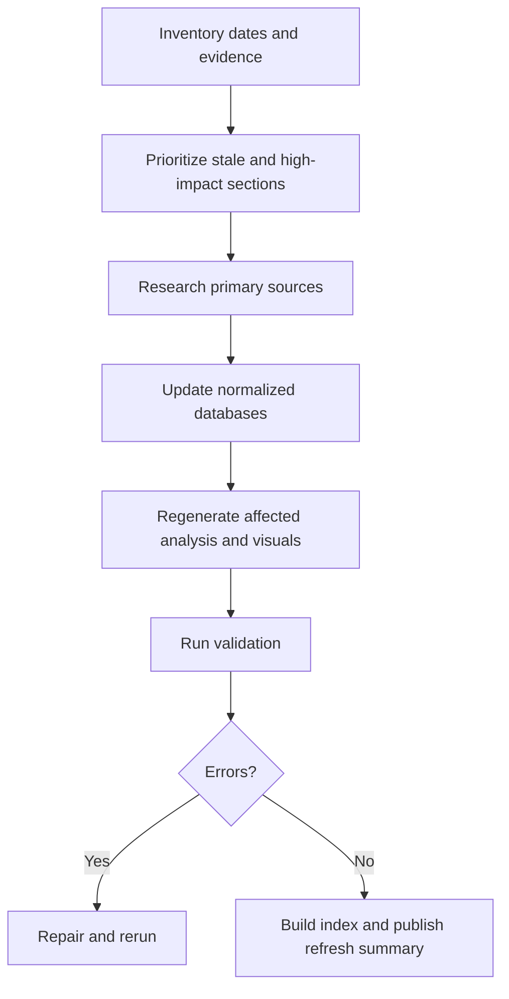

# Full Database Refresh Workflow

1. Review all `last_refreshed` fields across the repository.
2. Identify stale sections older than 90 days.
3. Search for new sources across all covered technologies and vendors.
4. Update `source_database.yaml`.
5. Update all affected technology profiles.
6. Update all affected vendor profiles.
7. Update Marvell strategy sections.
8. Update `benchmark_database.yaml`.
9. Update `figure_registry.yaml`.
10. Add or refresh visuals where necessary.
11. Update roadmap tables and confidence levels.
12. Add a full-database refresh entry to `refresh_log.yaml`.
13. Run validation.
14. Rebuild index.
15. Produce a full refresh summary.

