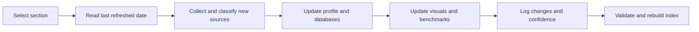

# Section Refresh Workflow

1. Identify section to refresh.
2. Review `last_refreshed` date.
3. Pull new sources since last refresh.
4. Add new sources to `source_database.yaml`.
5. Update technology/vendor/company profile.
6. Update benchmark metrics if changed.
7. Update figures, diagrams, and tables if changed.
8. Add refresh note to `refresh_log.yaml`.
9. Mark changes as:
   - New fact
   - Revised fact
   - Roadmap change
   - Contradictory source
   - Removed/deprecated information
   - New figure
   - Updated figure
   - Removed figure
10. Update confidence level.
11. Rebuild index.

